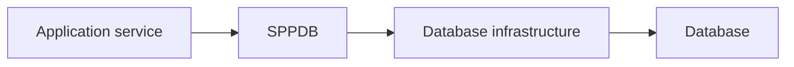

# Book 3 Chapter 1 — SPPDB from the Application Developer's View

## Start with the problem

An application needs persistent information. The application developer should care about the domain operation:

```text
find tasks
save task
update status
```

The developer should not need every caller to know how connection reuse, SQL dialect selection, and driver-specific compilation work.

## SPPDB boundary



SPPDB is the application-facing data infrastructure. Book 3 later opens the lower layers.

## Good application boundary

```text
Controller
  ↓
Service
  ↓
Repository / data operation
  ↓
SPPDB
```

Avoid putting SQL compiler or connection-pool decisions into controllers.

## Hands-on lab

Implement TaskRepository operations through the current SPPDB application API.

Then document which parts are:

- application logic;
- data access;
- framework infrastructure.

## Failure lab

Break database configuration and distinguish application-level failure from connection/driver failure.

## Checkpoint

> **SPPDB lets application code ask for data operations while the framework owns much of the underlying database infrastructure.**
