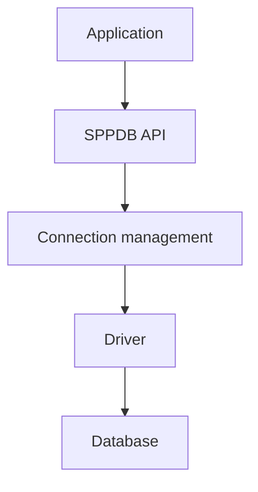

# Book 3 Chapter 2 — Connections, Drivers, and Connection Reuse

## 1. Why a connection layer exists

A database connection is an infrastructure resource. Creating one repeatedly can be expensive, and different backends may require different drivers or connection behavior.

## 2. The layered model



The changed SPPDB implementation includes explicit driver/connection concerns. Where the implementation provides reusable connection management, the application should use the framework boundary instead of opening unmanaged connections in every repository.

## 3. Driver abstraction

A driver translates the framework's database expectations into backend-specific behavior.

Do not confuse:

```text
Database engine
Driver
Compiler/dialect
Connection
```

They are related but different layers.

## 4. Connection reuse

When the implementation shares/reuses database connections, that is an infrastructure optimization and lifecycle concern. It should not become application state that business code assumes is always globally shared.

## 5. Hands-on lab

Run two repository operations in one request and trace connection acquisition/reuse using the current SPPDB diagnostics/source.

Record whether the implementation creates a new connection or reuses one and under what scope.

## 6. Failure lab

Break the connection configuration and then the driver selection separately.

Compare the diagnostics.

## Checkpoint

> **The connection layer manages access to a database resource; the driver determines backend-specific behavior; the application should remain above those details.**
