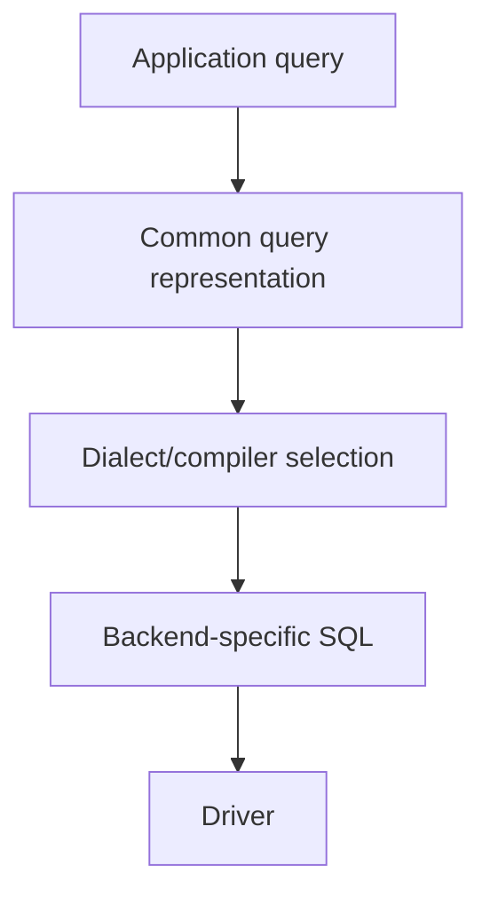

# Book 3 Chapter 4 — Dialects and Driver-Specific Compilation

## 1. Why dialects exist

Different database engines do not always accept identical SQL syntax or support identical features.

A framework that targets multiple database backends therefore needs a place to express those differences.

## 2. Common compiler, specific dialect

The purpose is to keep backend differences below application code.

## 3. What a dialect may decide

Depending on the implementation, dialect-specific compilation can affect:

- identifier quoting;
- pagination syntax;
- insert/update syntax;
- type expressions;
- functions;
- locking constructs;
- generated-key behavior.

Do not assume a particular feature is portable merely because the framework exposes a common API. Verify the selected compiler implementation.

## 4. Hands-on lab

Run the same supported query against two configured backends, where the repository provides both dialect paths.

Compare the compiled SQL and identify which differences are expected.

## 5. Failure lab

Use an operation supported by one backend but not another. Record whether SPP rejects it during compilation or whether the database rejects the generated SQL.

## 6. Kernel Hacker

Trace the compiler/dialect dispatch for one backend-specific operation.

## Checkpoint

> **A database abstraction is only genuinely portable where the compiler and driver layers can express the requested operation for the selected backend.**
