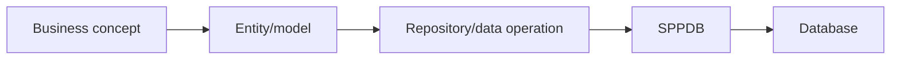

# Book 3 Chapter 5 — Entities, Queries, and Repositories

## 1. Data concepts before SQL

An application deals with concepts such as `Task`, `Student`, or `Purchase`.

A database deals with tables, rows, columns, and SQL.

A framework data layer helps keep those representations connected without requiring every application class to speak raw SQL.

## 2. Entity mental model



The exact SPP entity model is implementation-specific, but the architectural boundary is reusable.

## 3. Repositories

A repository should represent meaningful application data operations rather than becoming a dumping ground for unrelated business rules.

Good:

```text
findTask(id)
findOpenTasksForUser(user)
```

Less useful:

```text
repositoryContainsEveryBusinessOperationInTheSystem()
```

## 4. Hands-on lab

Build TaskRepository operations and expose them through TaskService.

Then add one query that supports the task list and one query for a detail page.

## 5. Failure lab

Put permission logic into the repository, then move it to the appropriate authorization/service boundary and explain the difference.

## 6. Kernel Hacker

Trace an entity/query operation into SPPDB and identify where query compilation begins.

## Checkpoint

> **Entities represent application concepts; repositories coordinate data access; business rules should remain in the appropriate application/domain boundary.**
