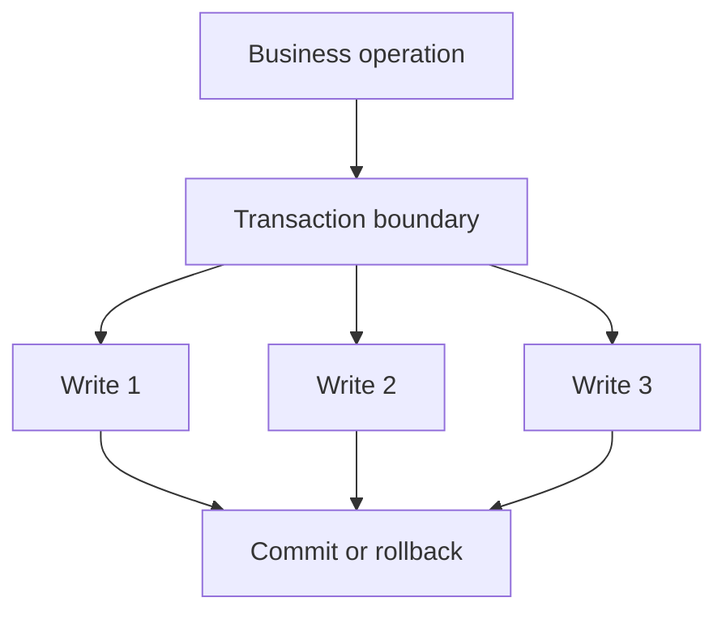

# Book 3 Chapter 6 — Transactions and Error Boundaries

## 1. Why transaction boundaries matter

Some application operations contain several persistence changes that should succeed or fail together.

The application question is:

> Which set of changes must have one consistency boundary?

Do not begin with the database API. Begin with the business operation.

## 2. Conceptual model

## 3. Important caution

Do not infer transaction guarantees from the existence of a database wrapper. The actual SPPDB implementation and selected driver determine the available semantics.

## 4. Hands-on lab

Choose a Task Desk operation that modifies more than one persistent record.

Document whether the operation requires a shared transaction and where that boundary should live.

## 5. Failure lab

Inject an error after the first write and observe the actual behavior of the configured database layer.

## Checkpoint

> **A transaction is a consistency boundary chosen for a business operation; the framework and database implementation determine the exact guarantees available.**
