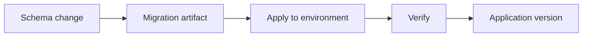

# Book 3 Chapter 7 — Schema Evolution and Migrations

## 1. Why schema changes need discipline

A database schema is part of an application's runtime contract. Changing a table manually on one machine creates drift.

A migration turns a schema change into a repeatable artifact.

## 2. Conceptual lifecycle

## 3. Migration is not content promotion

A schema migration changes structural data definitions.

The separate SPP transfer/promotion architecture concerns moving application/content state between environments.

They can participate in one deployment process but should not be conceptually collapsed.

## 4. Hands-on lab

Add a field to the Task Desk data model using the current repository migration mechanism. Apply it to a development database and verify the resulting schema.

## 5. Failure lab

Break the migration order or create an invalid change and observe where SPP/database tooling detects the problem.

## Checkpoint

> **Migration is a versioned description of schema evolution; transfer/promotion is a broader environment/content lifecycle.**
