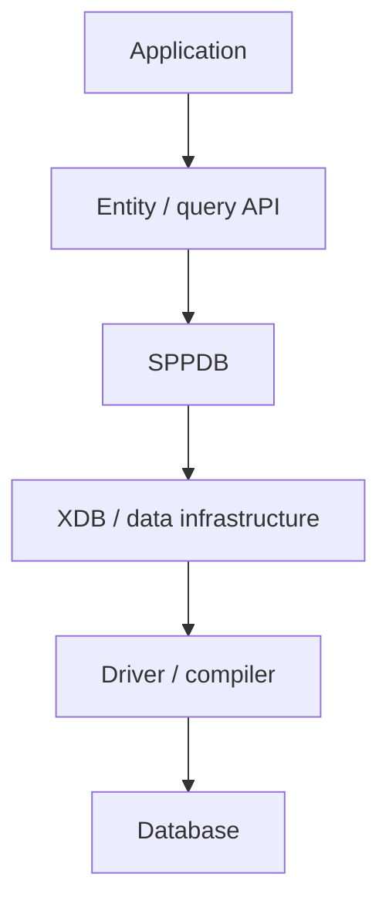

# Book 3 Chapter 8 — XDB Architecture

## 1. Why XDB is a separate concept

SPPDB provides application-facing data infrastructure. XDB represents a richer data-access architecture that deserves its own mental model.

## 2. Layered model



The exact XDB capabilities are implementation-specific and should be learned from the current XDB source/docs.

## 3. Why not expose XDB internals everywhere?

A framework can evolve its database internals more safely when application code uses stable higher-level contracts.

## 4. Hands-on lab

Take one Task Desk data operation and identify which layer it uses:

```text
application
entity/query
SPPDB
XDB
compiler/driver
```

Then inspect the source path for that operation.

## 5. Failure lab

Break a lower-level data operation and identify the boundary at which the failure becomes visible to application code.

## Checkpoint

> **XDB is a deeper data architecture; application code should only depend on the level of data abstraction it actually needs.**
