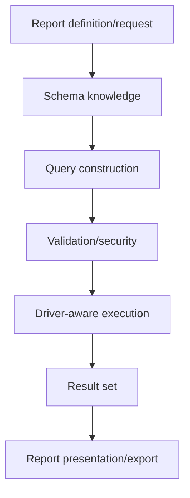

# Book 3 Chapter 9 — SPPReport as a Reporting Pipeline

## 1. Why reporting is more than rendering a table

A reporting system may need to:

- understand source schemas;
- select and validate data sources;
- construct a query safely;
- execute against a database;
- transform rows into report structures;
- present or export the result.

Treating reporting as `SELECT ...` plus HTML is too narrow.

## 2. The SPPReport mental model



The changed SPPReport implementation is documented around this pipeline rather than as a simple template renderer.

## 3. Why schema introspection matters

A report engine may need to understand the available tables, columns, types, and relationships before it can safely build or validate a report.

Schema knowledge should be treated as input to report design, not as an invitation to expose arbitrary database internals to users.

## 4. External databases

A reporting system can be especially useful when the report source is not the application's primary database.

Keep the boundary explicit:

```text
application database
       ≠
reporting source database
```

The current SPPReport implementation contains explicit external connection/reporting data-source concerns.

## 5. Hands-on lab

Build a Task Desk report that summarizes overdue tasks.

Document:

- data source;
- schema information used;
- filtering rules;
- validation;
- generated/executed query;
- final report representation.

## 6. Failure lab

Test:

- missing column;
- invalid source;
- unsupported operation;
- malformed query input;
- database connection failure.

Identify whether each is a schema, validation, query, connection, or execution problem.

## Checkpoint

> **SPPReport is best understood as a reporting data pipeline: inspect → construct → validate → execute → present.**
