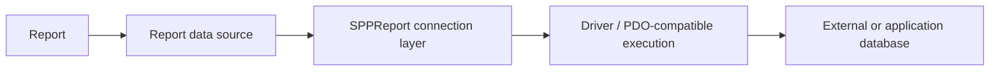

# Book 3 Chapter 10 — SPPReport Drivers and External Databases

## 1. Reporting sources need a boundary

A reporting engine may use the application's primary database or another database. That choice should be represented as infrastructure configuration rather than hidden inside report definitions.

## 2. Conceptual source model



The current SPPReport implementation contains driver-aware/external database connection behavior and a PDO-wrapper-compatible path around the data source.

## 3. Why reuse a data access contract?

A reporting connection should still have explicit boundaries for:

- connection lifecycle;
- credentials/configuration;
- driver behavior;
- query construction;
- validation;
- failure handling.

Do not bypass reporting safeguards by opening arbitrary database connections inside report templates.

## 4. Hands-on lab

Configure a report against a second supported data source in a development environment and trace:

```text
report definition
→ source selection
→ SPPReport driver/connection
→ query execution
→ result
```

## 5. Failure lab

Use an invalid external connection and verify that report generation fails at the source/connection boundary rather than producing misleading empty output.

## Checkpoint

> **SPPReport treats the reporting data source as an explicit runtime concern, allowing reports to be separated from the primary application database where appropriate.**
