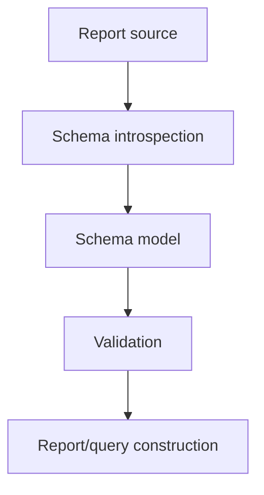

# Book 3 Chapter 11 — Schema Introspection and Validation

## 1. Why a report engine needs schema knowledge

A report builder cannot safely reason about a table or column that it has never discovered.

Schema introspection lets infrastructure ask:

- what sources exist?
- what tables/structures exist?
- which columns are available?
- what types and relationships are exposed?

## 2. Introspection pipeline



The current SPPReport implementation contains explicit schema-introspection and SchemaValidator concerns.

## 3. Validation is a security boundary

Validation should reject unsupported structures before query execution where the implementation can safely do so.

It should not be treated as a substitute for database permissions or application authorization.

## 4. Hands-on lab

Use the reporting infrastructure to inspect the schema of a development data source and build one validated report definition from it.

Record:

```text
source
schema metadata
validation rules
accepted report definition
```

## 5. Failure lab

Attempt to reference a missing column or unsupported structure and identify the validation stage at which the request is rejected.

## Checkpoint

> **Schema introspection tells the reporting engine what exists; schema validation constrains what the report is allowed to request.**
