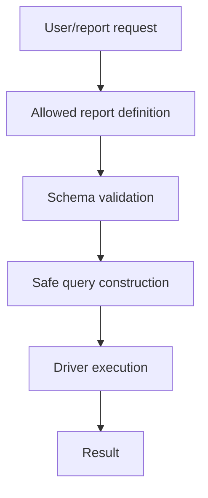

# Book 3 Chapter 12 — Report Security, Query Construction, and Operations

## 1. Reporting is an attack surface

A report request may influence:

- which data is visible;
- which source is queried;
- which filters are applied;
- how much data is returned.

Therefore reporting must be treated as a controlled application operation, not as arbitrary SQL entry.

## 2. Separate user intent from SQL

The safe conceptual pipeline is:



The exact protections supplied by SPPReport must be tied to current implementation/tests.

## 3. Authorization still matters

Even a structurally valid report can expose data the user is not allowed to see.

Therefore:

```text
Schema validation
    ≠
Authorization
```

## 4. Operational design

Production reporting may require:

- limits/pagination;
- asynchronous execution;
- caching where safe;
- audit logging;
- timeouts;
- database resource controls.

Do not infer that every one of these guarantees is automatic. Configure and test the actual implementation.

## 5. Hands-on lab

Create a role-restricted report for Task Desk administrators and test it with an unauthorized account.

Then introduce a deliberately expensive report and decide whether it should become a background job.

## 6. Final data-platform exercise

Trace one report from browser/API request through:

```text
route
→ authorization
→ report definition
→ schema validation
→ query construction
→ SPPReport connection
→ driver/compiler
→ database
→ result
→ presentation
```

## Checkpoint

> **A reporting system must control not only whether a query is valid, but whether the caller is allowed to obtain its result.**
