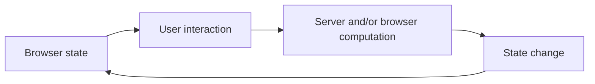

# Book 4 Chapter 1 — Reactive UI: Why It Exists

## 1. The limitation of full page navigation

A traditional server-rendered page can work well:

```text
request
→ server
→ HTML
→ browser renders page
```

But repeated small interactions can cause unnecessary navigation and state reconstruction.

Examples include:

- filtering a worklist;
- changing a status;
- expanding a detail section;
- updating a progress indicator.

## 2. Reactive UI changes the interaction model

A reactive interaction can instead look like:



The key question becomes:

> Which state belongs on the server, which belongs in the browser, and how do they synchronize?

## 3. SPP has multiple reactive layers

The SPP ecosystem discussed in this book separates:

```text
LiveComponent → component/state model
SPPLive       → client/server transport/orchestration
SPPUX         → browser runtime
```

These are related but not interchangeable concepts.

## 4. Hands-on lab

Take the ordinary Task Desk list and identify three interactions:

- one that can remain a normal page navigation;
- one that benefits from server-side reactive state;
- one that should remain local browser state.

Explain why.

## Checkpoint

> **Reactive architecture is about managing changing state over time, not merely making HTML update without a page reload.**
