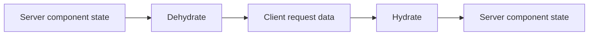

# Book 4 Chapter 3 — LiveComponent State, Hydration, and Dehydration

## 1. Why state must travel safely

A server-side component may need to continue working after the first HTTP request.

The server must therefore reconstruct enough component state for the next interaction.

Conceptually:



## 2. Hydration

Hydration means rebuilding the component's server-side state from the incoming interaction data according to the framework's rules.

## 3. Dehydration

Dehydration means preparing component state to be carried between interactions.

The implementation decides which public properties are serialized and how they are represented.

## 4. Integrity protection

The changed LiveComponent implementation contains HMAC SHA-256 checksum behavior associated with component state integrity.

The important security lesson is:

> **Client-carried state must not be trusted simply because the server serialized it previously.**

A checksum can detect tampering, but it does not automatically authorize an operation or validate business data.

## 5. Public property serialization

Not every internal object should be serialized.

A component should expose only state that the framework's lifecycle contract intends to persist across interactions.

## 6. Hands-on lab

Create a component with:

- one scalar public property;
- one collection/list property where supported;
- one derived/computed value if the implementation supports it.

Observe what survives the next interaction.

## 7. Failure lab

Change client-carried state without producing a valid integrity value and observe the implementation's response.

Then test an invalid business value that has valid transport integrity. The learner should see why **integrity** and **validation** are different concepts.

## 8. Kernel Hacker

Trace:

```text
incoming payload
→ integrity check
→ property hydration
→ lifecycle hooks
→ action/update
→ render
→ dehydration
```

## Checkpoint

> **Hydration restores component state for an interaction; dehydration prepares state to cross the interaction boundary; integrity protects the serialized state from undetected modification.**
