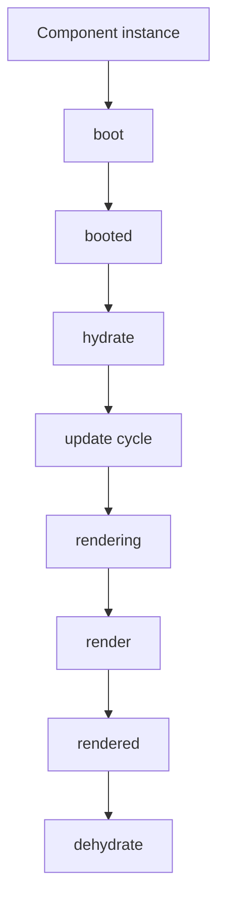

# Book 4 Chapter 4 — LiveComponent Lifecycle Hooks

## 1. Why lifecycle hooks exist

A stateful component passes through recognizable phases. Hooks let application code participate without replacing the framework's entire lifecycle.

The changed LiveComponent implementation exposes explicit lifecycle methods around boot, hydration, update, rendering, and dehydration.

## 2. Lifecycle mental model

The exact call conditions matter. Do not assume every hook fires on every possible path without tracing the current source.

## 3. Boot hooks

Boot hooks are useful for initialization that belongs to the component lifecycle rather than an individual action.

Do not put expensive unrelated application-wide work into component boot hooks.

## 4. Updating and updated

These hooks surround state/property updates where the implementation invokes them.

They are useful for:

- normalization;
- dependent state changes;
- validation triggers;
- diagnostics.

They are not a substitute for the application's core business service.

## 5. Rendering hooks

The implementation includes rendering hooks before and after the render operation.

Use these for presentation-lifecycle concerns, not for hidden domain transactions.

## 6. Hands-on lab

Instrument the Task Desk LiveComponent and record the observed hook sequence for:

1. initial render;
2. one property update;
3. one action;
4. one validation failure.

## 7. Failure lab

Throw a controlled exception from a lifecycle hook and identify how the component request fails.

## Checkpoint

> **Lifecycle hooks let application code participate in the framework's component lifecycle without taking ownership of the lifecycle itself.**
