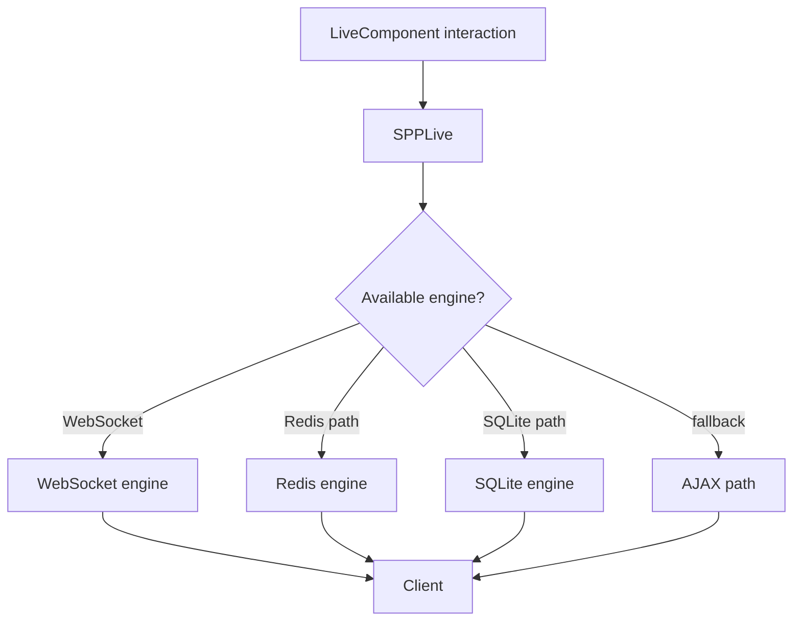

# Book 4 Chapter 7 — SPPLive Architecture and Engine Selection

## 1. Transport is a separate layer

LiveComponent defines server-side component behavior. A client still needs a way to communicate with that component.

That is the role of SPPLive.

## 2. The current mental model



The changed SPPLive implementation is better documented as an **engine orchestrator/selection layer** rather than simply “a transport API”.

## 3. Why engine selection exists

Different deployments have different infrastructure:

- a browser/server pair may support WebSockets;
- another environment may have a Redis-backed mechanism;
- a lightweight deployment may use SQLite-backed state/transport where the implementation supports it;
- an AJAX fallback may be available.

The application component should not have to duplicate all of these transport decisions.

## 4. Important distinction

```text
Component model → what the component does
Transport        → how interaction reaches it
Engine selection → which transport implementation is used
```

## 5. Hands-on lab

Use one LiveComponent and observe which SPPLive engine the current runtime selects under two different supported configurations.

Record:

```text
configuration
available engines
selected engine
fallback behavior
```

## 6. Failure lab

Disable one supported engine and verify the actual fallback behavior. Do not infer fallback order; read it from the current implementation.

## 7. Operational lesson

A transport architecture introduces infrastructure dependencies and failure modes. The component should remain as independent as the framework design allows.

## Checkpoint

> **SPPLive is the runtime coordination layer that connects reactive component interactions to an available transport engine.**
