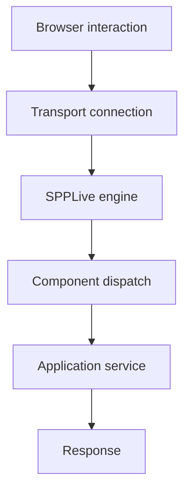

# Book 4 Chapter 8 — SPPLive Transports and Failure Boundaries

## 1. One component, several transport possibilities

A useful reactive architecture keeps the component model independent from the transport where practical.

```text
LiveComponent
     ↓
SPPLive
     ↓
selected engine
     ↓
client
```

## 2. Transport choices are operational choices

Each transport can have different:

- infrastructure dependencies;
- connection behavior;
- failure modes;
- scaling characteristics;
- observability needs.

Do not choose a transport only because it is technically available.

## 3. Failure boundary

A reactive request can fail at several stages:



This layered diagnosis is more useful than treating every failure as a “WebSocket problem”.

## 4. Hands-on lab

Take the Support Desk component and test at least two supported transport scenarios from the current source.

Record:

- connection/setup;
- selected engine;
- request/response path;
- failure symptom;
- recovery/fallback where implemented.

## 5. Failure lab

Force a transport failure and distinguish it from:

- component integrity rejection;
- authorization failure;
- application exception;
- rendering failure.

## Checkpoint

> **Transport failure is only one possible failure layer in a reactive application.**
