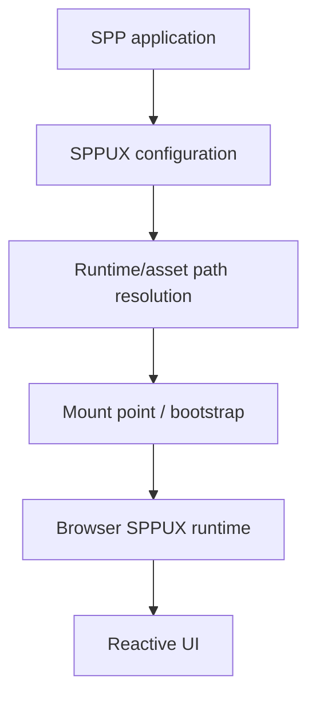

# Book 4 Chapter 9 — SPPUX Runtime Bootstrap, Mounting, and Assets

## 1. SPPUX is more than a JavaScript helper

The current SPPUX implementation is a browser-runtime bootstrap/facade layer. It coordinates how the reactive runtime is made available to an application and where browser-side resources are mounted.

## 2. Runtime model



## 3. Application-aware resource resolution

The changed implementation contains runtime-path, UI-asset-path, and application-aware URI resolution concerns.

This matters in multi-application deployments because frontend resources cannot always assume one global document root or application path.

## 4. Mounting

A reactive runtime needs a predictable place to initialize itself.

The mount concept separates:

```text
server application
       ↓
HTML/asset bootstrap
       ↓
SPPUX mount
       ↓
browser runtime
```

## 5. Hands-on lab

Take the Task Desk reactive screen and identify:

- the runtime asset path;
- the application-aware URI;
- the mount point;
- the browser runtime entry.

## 6. Failure lab

Break one runtime path and determine whether the failure is:

- asset resolution;
- application URI generation;
- mount/bootstrap;
- browser runtime initialization.

## 7. Kernel Hacker

Trace the SPPUX facade from application configuration through URI/path resolution and runtime loading.

## Checkpoint

> **SPPUX is the browser-side runtime bootstrap and mounting layer, not simply a collection of client-side utility functions.**
