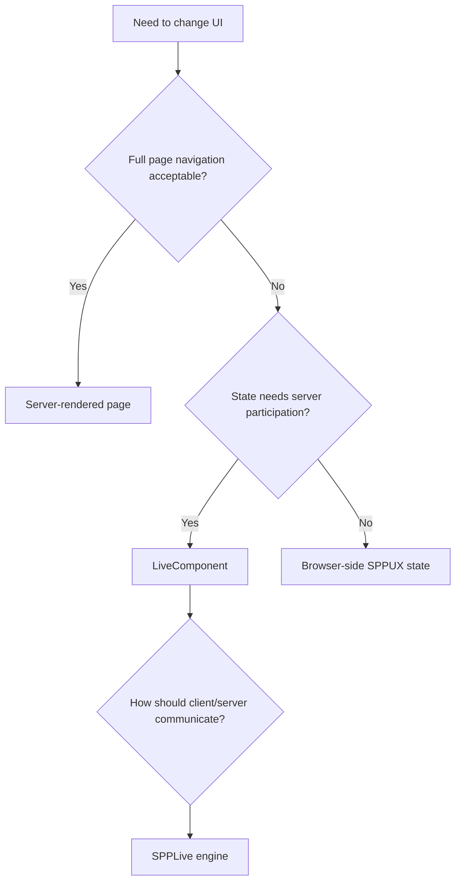

# Book 4 Chapter 10 — Choosing Between Pages, LiveComponent, SPPLive, and SPPUX

## 1. Not everything should be reactive

A good framework gives developers choices. A good developer chooses the simplest architecture that solves the requirement.

## 2. Decision map

The exact choice depends on the application requirement and current SPP implementation.

## 3. Use a normal page when

- the interaction naturally changes the page;
- no frequent server interaction is required;
- simplicity is more valuable than live state.

## 4. Use LiveComponent when

- server-side state is central to the interaction;
- application rules must execute on the server;
- incremental updates are useful.

## 5. Use SPPUX browser state when

- the state is local to the browser;
- server round trips add no value;
- the interaction is primarily presentation/client behavior.

## 6. Use SPPLive when

A LiveComponent or other reactive server interaction needs a transport/runtime mechanism.

SPPLive is not a replacement for LiveComponent; it is a distinct layer.

## 7. Hands-on comparison

Implement one small Task Desk interaction in three ways:

1. full page request;
2. LiveComponent action;
3. browser-local SPPUX state.

Compare:

- complexity;
- state ownership;
- network traffic;
- failure modes;
- security boundary;
- testability.

## 8. Architecture rule

> **Use reactivity because the problem benefits from it, not because the framework makes it available.**

## Checkpoint

You should now be able to explain why SPP's multiple UI paradigms are complementary rather than competing implementations of the same feature.
