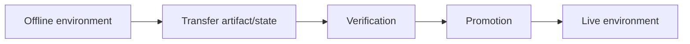

# Book 5 Chapter 2 — Storage, Transfer, and Offline-to-Live Promotion

## 1. Deployment is not always source-code-only

Some systems need to move application/content state between environments.

A useful model is:

## 2. Separate concerns

Schema migration, file/storage transfer, content promotion, and application deployment are related but not identical.

## 3. Hands-on lab

Create a small content change in a development environment, identify what must be transferred, promote it to a test environment, and verify the live representation.

## 4. Failure lab

Introduce a conflicting or incomplete transfer and document the repository's actual validation and recovery behavior.

Do not assume atomicity or rollback unless the current implementation proves it.

## Checkpoint

> **Promotion is an environment lifecycle concern; it should be treated as an explicit controlled operation rather than an accidental side effect of deployment.**
