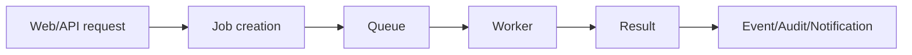

# Book 5 Chapter 4 — Queue, Workers, and Long-Running Jobs

Use background execution when an operation should not block the request lifecycle.

## Enterprise pattern

## Design questions

- What is the job's idempotency boundary?
- What happens when processing fails?
- What data is safe to serialize?
- How is progress reported?
- Who retries?

Only document retry/idempotency guarantees that the current implementation provides.

## Lab

Turn an expensive Task Desk report into a background operation and expose status through the existing reactive stack.
