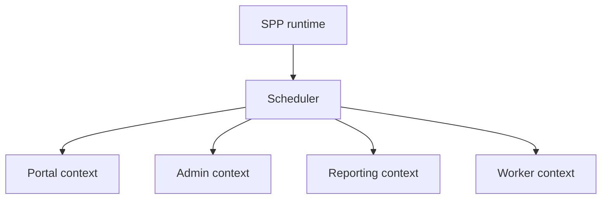

# Book 5 Chapter 8 — Multiple Application Contexts

## 1. Why multiple applications?

A large organization may prefer separate applications for different responsibilities:

```text
portal
admin
reporting
operations
```

Each can still use the same SPP framework runtime model while maintaining its own application boundary.

## 2. Context architecture



## 3. Shared versus local

For every service ask:

> Should this be framework/shared infrastructure, application-local capability, or an external service?

Do not share mutable application state merely because contexts share a PHP runtime.

## 4. Lab

Split the Task Desk enterprise capstone into:

- Operations;
- Reporting;
- Administration.

Document ownership of routes, modules, data access, and user roles.

## 5. Failure lab

Intentionally select the wrong application context and trace how configuration/module/service resolution changes.

## Checkpoint

> **A multi-application installation is useful when there is a meaningful application boundary; separate contexts should not be created only to make a diagram look complex.**
