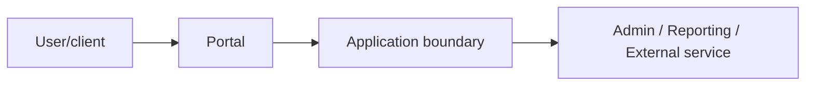

# Book 5 Chapter 9 — Security Boundaries Across Applications

## 1. One authenticated user does not imply universal trust

When several applications participate in one system, each boundary should define what it trusts.

## 2. Questions to answer

- Which identity is accepted?
- How is authorization evaluated?
- Which application owns the data?
- Which actions are exposed across the boundary?
- What happens when the downstream application is unavailable?

## 3. Do not infer trust from proximity

Two applications on the same server are not automatically a secure trust domain.

Use explicit authentication, authorization, and integration contracts.

## 4. Lab

Expose one reporting operation from the operations application and restrict it to an explicitly authorized caller.

Test both a valid and unauthorized cross-application request.

## Checkpoint

> **Application boundaries are security boundaries when the architecture treats them as such; proximity is not authorization.**
