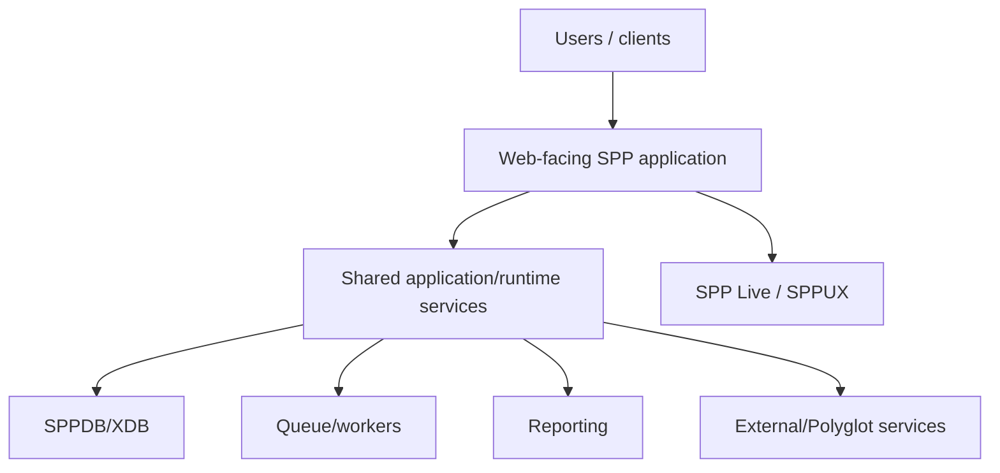

# Book 5 Chapter 10 — Deployment Topology and Production Readiness

## 1. Production is an architecture, not a checkbox

A production system needs more than working PHP code. It needs explicit decisions about:

- application topology;
- configuration;
- data;
- workers;
- queues;
- transport infrastructure;
- security;
- logging and observability;
- backups/recovery;
- upgrades.

## 2. Typical SPP enterprise topology

The exact topology must follow the actual infrastructure and SPP deployment contract.

## 3. Production checklist

For every application, verify:

- configuration separation;
- secure credentials;
- authorized endpoints;
- database connectivity;
- queue/worker health;
- logs and diagnostics;
- backups;
- migration/promotion process;
- rollback strategy;
- capacity assumptions.

## 4. Lab

Take the Task Desk enterprise capstone from development to staging and record every environment-specific change.

## Checkpoint

> **Production readiness is the proof that an architecture can be operated safely, not merely that the application can start.**
