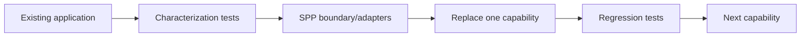

# Book 5 Chapter 12 — Porting from Other Frameworks

## 1. Do not translate class names

A migration should start from responsibility:

```text
Existing framework responsibility
        ↓
General framework concept
        ↓
SPP concept
        ↓
Native SPP implementation
```

## 2. Common mappings

| Existing concept | SPP destination to investigate |
|---|---|
| Route | pages/attribute/API/live routing paradigms |
| Middleware | Middleware Pipeline / MiddlewareKernel |
| Container | Registry/Application DI |
| Event bus | SPPEvent/EventHandler |
| Plugin/package | Module |
| ORM/data layer | SPPDB/XDB |
| Template | SPPView/BladeOne/Drishyam |
| Server-side reactive component | LiveComponent |
| Transport | SPPLive |
| Browser reactive runtime | SPPUX |
| Test framework | Parikshak branch |
| Scheduled work | Scheduler/Cron/Queue |

These are conceptual mappings, not claims of API compatibility.

## 3. Incremental migration

A practical strategy is:



## 4. Lab

Take one small module from an existing framework and rewrite it in SPP without copying its internal architecture blindly.

Record which responsibilities moved to native SPP mechanisms and which compatibility adapters remained temporary.

## Checkpoint

> **A framework migration succeeds when application intent is preserved while the implementation becomes native to the target framework.**
