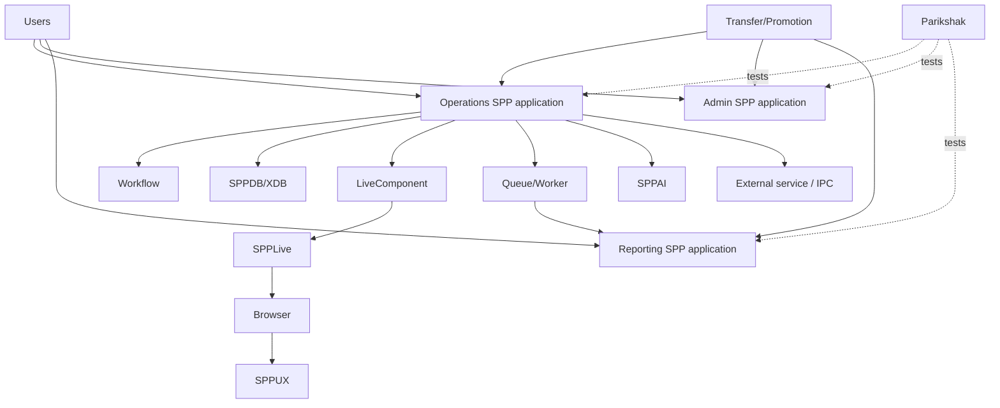

# Book 5 Chapter 14 — Enterprise Reference Case Study

## The system

Build a fictional but realistic **Operations and Reporting Platform** with:

- operations application;
- administration application;
- reporting application;
- workflow/approval;
- database/XDB;
- report engine;
- background jobs;
- LiveComponent worklists;
- SPPLive transport;
- SPPUX dashboard state;
- AI-assisted classification;
- one external service;
- transfer/promotion between environments.

## Architecture

## Why each subsystem exists

Every capability must map to a real requirement:

- workflow because approvals exist;
- XDB/data architecture because persistence is substantial;
- reporting because operators need structured analysis;
- queues because heavy operations cannot block users;
- LiveComponent because operators need interactive worklists;
- SPPUX because dashboards require client-local state;
- AI because classification is assistance, not authority;
- external integration because a specialized capability exists elsewhere;
- multiple contexts because applications have different boundaries;
- transfer/promotion because content/configuration moves between environments.

## Capstone exercise

Build the platform incrementally through the books and finish with:

1. architecture diagram;
2. application/context map;
3. security model;
4. route map;
5. data map;
6. workflow diagram;
7. background job map;
8. reactive UI map;
9. integration map;
10. deployment/promotion plan;
11. Parikshak test suite;
12. ADRs for major choices.

## Final rule

The capstone succeeds only when the learner can explain not only **how** SPP features are used, but **why each feature belongs at that boundary**.