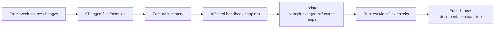

# Book 6 Chapter 12 — Source-Driven Documentation and Upgrade Auditing

## 1. Why documentation must track source

Framework documentation becomes dangerous when it quietly describes an older runtime.

V3 therefore treats source synchronization as an engineering process.

## 2. Change-audit workflow



## 3. Evidence hierarchy

Prefer, in order:

1. executable source;
2. tests/fixtures;
3. consumed configuration/manifests;
4. current repository documentation;
5. architectural interpretation.

## 4. Lab

Take a changed SPP subsystem and produce a documentation impact report:

```text
source change
→ behavior change
→ affected chapter
→ affected lab
→ affected diagram
→ affected migration guidance
```

## 5. Completion rule

Never call a documentation branch source-synchronized merely because its prose was reviewed. The source baseline, affected implementation, examples, diagrams, and links must all be checked.

## Checkpoint

> **A source-synchronized handbook is maintained like code: changes are traced, tested, reviewed, and recorded against a known baseline.**
