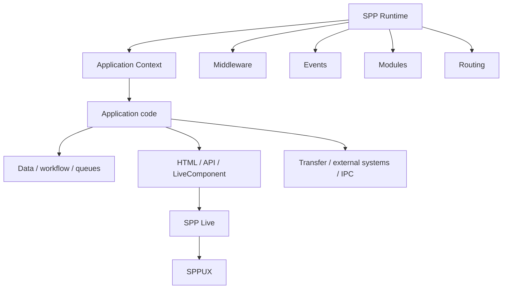

# SPP in the Framework Landscape

## Why this chapter exists

A developer who has learned one framework already has many useful mental models. The productive approach is to reuse those concepts while learning how SPP extends them.

This chapter answers:

> **What kind of framework is SPP, and what architectural strengths make it stand out?**

The comparison is deliberately architectural. Routing, middleware, dependency injection, events, data access, testing, and views are common framework concerns. SPP's distinction comes from how broadly these concerns participate in one runtime and application model.

The goal is not to diminish other frameworks. Established frameworks provide excellent solutions to many workloads. The goal is to understand where SPP's integrated architecture is especially compelling.

---

## 1. First principle: PHP is the language; SPP is the framework

Laravel, Symfony, and SPP are different ways of organizing PHP applications.

```text
PHP
 ↓
framework/runtime
 ↓
application code
```

A framework establishes conventions, runtime services, extension mechanisms, development tools, and boundaries that would otherwise be rebuilt from project to project.

SPP builds on these familiar ideas and extends them into a broader application platform.

---

## 2. A high-level comparison

| Concern | Laravel | Symfony | Django | SPP |
|---|---|---|---|---|
| MVC/web application structure | Core | Core | Core concepts | Supported, and extended beyond MVC |
| Dependency injection | Strong service container | Strong DI container | Convention/service patterns | Registry/container model |
| Middleware | Core | Core | Middleware stack | Middleware pipeline/kernel |
| Events | Core | Core | Signals/events | Event architecture with richer lifecycle semantics |
| Routing | Code/attributes/conventions | Config/code/attributes | URL configuration | Multiple paradigms including `pages.yml`, attributes, API/live routes, and CLI generation |
| CLI | Artisan | Console | `manage.py` | Broad CLI plus interactive SPP command environment |
| Data layer | Eloquent ecosystem | Doctrine ecosystem | Django ORM | SPPDB + XDB/data abstractions |
| Testing | PHPUnit/Pest ecosystem | PHPUnit ecosystem | Python testing ecosystem | Parikshak plus repository test infrastructure |
| Server-side reactive UI | Livewire ecosystem | Symfony UX ecosystem | HTMX/other ecosystem | LiveComponent + SPP Live |
| Browser reactive runtime | Additional tooling | Additional tooling | Additional tooling | SPPUX provides a dedicated runtime layer |
| Reporting | Strong ecosystem options | Strong ecosystem options | Strong ecosystem options | SPPReport is a framework subsystem |
| Workflow | Strong package/ecosystem options | Strong component/ecosystem options | Strong ecosystem options | Dedicated workflow architecture |
| Offline/content promotion | Usually deployment/tooling concern | Usually deployment/tooling concern | Usually deployment/tooling concern | Dedicated migration/transfer architecture |
| Multiple application contexts | Achievable through architecture | Achievable through architecture | Achievable through architecture | Explicit application-context/runtime model |
| Polyglot/IPC | Integration ecosystem | Integration ecosystem | Integration ecosystem | Explicit polyglot/IPC architecture |
| AI | Rapidly growing ecosystem | Rapidly growing ecosystem | Rapidly growing ecosystem | SPPAI subsystem |

This table is a conceptual map, not a claim that competing frameworks cannot provide a capability through packages or additional tooling.

---

## 3. What makes SPP stand out

SPP's strongest proposition is the combination of:

**breadth + integration + multiple application paradigms + an explicit runtime/application-context model.**

That gives SPP a platform-oriented character.

A useful mental model is:



The distinction is therefore architectural integration rather than a contest over feature counts.

---

## 4. SPP versus a conventional MVC mental model

A conventional MVC mental model is:

```text
HTTP request
 ↓
route
 ↓
controller
 ↓
model/domain
 ↓
view
 ↓
response
```

That is a useful starting point. SPP keeps that model available while expanding the surrounding runtime:

```text
Execution context
 ↓
framework runtime
 ↓
middleware / modules / events / routing
 ↓
application services and business behavior
 ↓
data / workflow / background work
 ↓
HTML / API / reactive UI / external integration
```

MVC is therefore one application organization pattern inside a larger SPP platform.

---

## 5. Multi-paradigm routing is an SPP strength

SPP does not require every application concern to use one routing syntax.

It can express entry points through multiple coordinated paradigms, including:

- centralized page configuration such as `pages.yml`;
- attribute/code-oriented routes;
- API routes;
- live-oriented entry points;
- CLI/scaffold generation.

This flexibility is useful because different parts of one enterprise platform may benefit from different declaration styles.

The right question is:

> **Which routing paradigm best communicates the responsibility being expressed?**

---

## 6. Application contexts create a platform-level model

SPP's Scheduler/application-context architecture makes application boundaries explicit inside the framework runtime.

```text
SPP runtime
   ↓
Scheduler
   ↓
application context
   ├── web execution
   ├── CLI execution
   └── background/worker execution where configured
```

This is especially valuable when an organization wants several related applications to share framework infrastructure while preserving application-level boundaries.

---

## 7. The layered reactive stack is a major SPP strength

SPP separates reactive concerns into understandable layers:

```text
Application state/behavior
        ↓
LiveComponent
        ↓
SPP Live
        ↓
transport/runtime boundary
        ↓
SPPUX / browser
```

That separation makes architecture and debugging clearer:

1. **Component layer:** Is server-side state and lifecycle correct?
2. **Transport layer:** Is the chosen SPPLive engine and communication path correct?
3. **Browser layer:** Is SPPUX mounting and executing the client-side behavior correctly?

This layered model is one of the clearest examples of SPP treating the whole interactive application as a coordinated platform.

---

## 8. Transfer and promotion broaden the application lifecycle

SPP treats application lifecycle as more than source-code deployment.

A useful model is:

```text
offline environment
      ↓
content/configuration/application state
      ↓
transfer
      ↓
verification
      ↓
promotion
      ↓
live environment
```

This is particularly compelling for organizations where application content and operational configuration have a managed lifecycle of their own.

The documentation distinguishes this architectural capability from stronger guarantees such as atomicity or distributed consistency, which require separate evidence.

---

## 9. The CLI is a framework interface

Established ecosystems such as Artisan and Symfony Console demonstrate how valuable a framework-aware CLI can be. SPP builds on the same idea with a broad command surface, scaffolding, inspection, administration, and an interactive SPP command environment.

The important lesson is:

> **The CLI is part of the SPP developer experience, not just a collection of shell shortcuts.**

This gives developers a consistent way to create, inspect, operate, and learn SPP applications.

---

## 10. SPP's platform subsystems are a strategic strength

SPP brings several concerns together that are often solved as separate packages or organizational layers:

- workflow;
- reporting;
- Parikshak testing;
- queue/Cron/background execution;
- migration/transfer;
- reactive UI;
- AI integration;
- polyglot/IPC;
- multiple application contexts;
- observability and operational tooling.

The benefit is not simply “more features.” The benefit is the possibility of maintaining a common framework vocabulary and lifecycle across these concerns.

For an enterprise platform, that coherence can reduce architectural fragmentation and make cross-cutting concerns easier to standardize.

---

## 11. Ecosystem maturity is a different kind of strength

Established frameworks have enormous communities and mature package ecosystems. That is a real advantage when selecting a framework.

SPP should therefore be positioned positively without pretending ecosystem size is irrelevant:

> **SPP's differentiation is architectural integration; established ecosystems provide breadth of third-party choices and long public operational history.**

The two strengths are not mutually exclusive.

For an SPP project, the right response to ecosystem limitations is to make the framework itself especially coherent, well documented, testable, and source-transparent.

That is one reason this handbook emphasizes source tracing, runnable labs, and explicit evidence status.

---

## 12. How to compare SPP fairly

Use workload-oriented questions rather than generic feature counts:

| Question | What to investigate |
|---|---|
| Runtime model | How does a request, command, or worker execution travel through the framework? |
| Composition | How do middleware, events, modules, services and applications cooperate? |
| Routing | Which declaration paradigms are available and what problem does each solve? |
| Data | Does the data architecture fit the target workload? |
| UI | Which server-rendered and reactive patterns are native? |
| Background work | How are queues, workers and schedules modeled? |
| Operations | What diagnostics, logging, observability and deployment facilities exist? |
| Integration | How are APIs, IPC, external applications and polyglot components represented? |
| Testing | Can framework-native behavior be tested directly? |
| Ecosystem | What package, community, documentation and hiring resources are available? |
| Performance | What do measurements show for the actual workload? |
| Maintainability | How understandable are the runtime and source? |

This gives SPP a fair comparison while keeping the focus on where its architecture can be especially valuable.

---

## 13. What SPP should confidently emphasize

The handbook should emphasize these strengths:

- **Integrated application runtime** rather than isolated libraries;
- **multiple application paradigms** rather than one rigid development style;
- **explicit application contexts** for larger application estates;
- **layered reactive architecture** with component, transport, and browser runtime concerns separated;
- **declarative and code-oriented routing choices**;
- **framework-native workflow, reporting, testing, background processing and transfer capabilities**;
- **polyglot and external-application boundaries**;
- **strong source transparency and architecture documentation**;
- **a coherent CLI and developer-tooling model**.

These are meaningful differentiators without requiring unsupported claims of universal superiority.

---

## 14. Practical positioning

A strong and positive description is:

> **SPP is a PHP application framework/platform designed to provide a coherent runtime for conventional web applications as well as larger systems involving multiple application contexts, APIs, workflows, reports, background execution, reactive interfaces, AI, transfer/promotion, and integration with other applications and runtimes.**

That makes SPP particularly compelling when the application is more than a conventional CRUD website and the organization benefits from a common platform vocabulary.

For a small application, SPP can still provide the same core framework concepts without requiring the advanced enterprise subsystems.

---

## 15. What to study next

After this chapter:

- return to **Book 1 — Foundations** to understand the framework concepts in depth;
- study **Book 2 — Core SPP** to see how SPP implements them;
- use **Book 3 — Data Platform** for SPPDB/XDB/SPPReport;
- use **Book 4 — Reactive Platform** for LiveComponent/SPP Live/SPPUX;
- use **Book 5 — Enterprise SPP** for migration, transfer, multi-application, AI, and production architecture;
- use **Book 6 — Kernel Hacker** when you want to trace the actual implementation.
