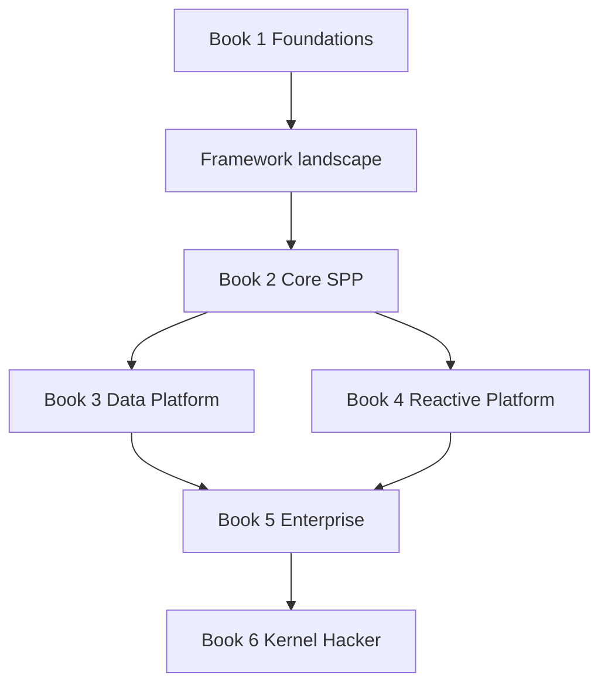

# SPP Framework Handbook V3

**Source-Synchronized Edition**

This branch is the next-generation SPP handbook. It is written as a beginner-first textbook, implementation guide, architecture manual, and Kernel Hacker source-tracing guide.

## Source baseline

The V3 handbook is aligned to the SPP codebase supplied for the August 2026 documentation rewrite. When implementation and older documentation disagree, current executable source/tests take precedence.

## Learning paths

### Explorer

Start with **Book 1 — Foundations**.

It assumes you may know PHP but have never used a framework.

### Builder

Complete Books 1 and 2, then choose the Data and Reactive books needed by your application.

### Architect

Complete Books 1–5, paying particular attention to application contexts, integration boundaries, queues, security, transfer/promotion, and deployment.

### Migrator

Read Book 1 concepts first, then use Book 5 migration material when porting an existing framework application.

### Kernel Hacker

Complete Book 6 after understanding the public programming model.

## Books

### [Book 1 — Foundations](../book-1-foundations/README.md)

Frameworks, HTTP, MVC, containers, DI, routing, `pages.yml`, attributes, CLI generation, API/live routing, configuration, and application contexts.

**15 chapters — complete**

### [Book 2 — Core SPP Runtime](../book-2-core-spp/README.md)

Scheduler, Registry, Middleware, Events, Modules, CLI, forms, presentation, authentication, web security, workflow, Parikshak, queues, debugging, and developer tooling.

**18 chapters — complete**

### [Book 3 — Data and Reporting Platform](../book-3-data-platform/README.md)

SPPDB, connection/driver architecture, SQL compilers, dialects, entities, migrations, XDB, SPPReport, schema introspection, validation, and report security.

**12 chapters — complete**

### [Book 4 — Reactive Platform](../book-4-reactive-platform/README.md)

LiveComponent, hydration/dehydration, lifecycle, integrity, SPPLive engine selection and transport boundaries, SPPUX bootstrap/mounting/assets, and architecture choice.

**10 chapters — complete**

### [Book 5 — Enterprise SPP](../book-5-enterprise/README.md)

Enterprise workflow, transfer/promotion, observability, workers, AI, polyglot/IPC, external applications, multi-application contexts, security boundaries, production, upgrades, migration, ADRs, and capstone.

**14 chapters — complete**

### [Book 6 — Kernel Hacker](../book-6-kernel-hacker/README.md)

Source tracing for Scheduler, Registry, MiddlewareKernel, Events, Modules, Routing, SPPDB, LiveComponent, SPPLive, SPPUX, and documentation synchronization.

**12 chapters — complete**

## Framework landscape

- [SPP in the Framework Landscape](08-spp-in-the-framework-landscape.md)

Use this chapter after the initial framework concepts and before deep SPP specialization. It compares SPP with Laravel, Symfony, Django, and other framework families by architecture, runtime model, ecosystem, and application lifecycle rather than by unsupported feature-count marketing.

## Priority source-synchronized labs

- [Priority Five — source-verified runnable labs](labs/priority-five-source-verified-labs.md)
- [Priority Five — source map](source-maps/priority-five-source-map.md)

These labs are the first executable verification layer for the five subsystems that changed most significantly in the August 2026 source baseline: **SPPDB, SPPReport, LiveComponent, SPPLive, and SPPUX**.

## Mandatory verification controls

- [90 — Repository-Wide Audit Checklist](90-repository-wide-audit-checklist.md)
- [91 — Runnable Lab Audit](91-runnable-lab-audit.md)
- [92 — Diagram and Link Audit](92-diagram-and-link-audit.md)

These are part of the release process, not optional afterthoughts.

## Canonical learning sequence

## Teaching contract

Every substantial topic is taught using:

**Problem → Plain PHP → General framework idea → SPP → Build → Test → Break → Diagnose → Source trace → Architectural choice.**

## Evidence contract

Every current-behavior claim must be classified as one of:

- Source verified;
- Test/fixture verified;
- Configuration/manifold verified;
- Documentation/reference;
- Architectural interpretation;
- Planned/unverified.

The handbook must not turn architectural interpretation into a framework guarantee without evidence.

## Diagram contract

Use Mermaid only for real architecture, lifecycle, flow, sequence, and decision diagrams. Use ordinary code blocks for literal code, CLI output, and directory listings. Remove decorative or redundant diagrams.

## Maintenance contract

When the SPP implementation changes, update the handbook by:

1. identifying changed modules/source files;
2. mapping those changes to affected books/chapters;
3. updating examples and diagrams;
4. rerunning relevant tests/labs;
5. updating source maps and migration notes;
6. recording the new documentation baseline;
7. running the repository-wide audit controls.

## Completion status

The V3 branch contains the six-book structure, source-oriented chapter set, framework landscape comparison, priority source maps, and executable verification scaffolding. Remaining work is to deepen the runnable examples and resolve any chapter-level mismatches found by executing the labs against the current SPP implementation.
