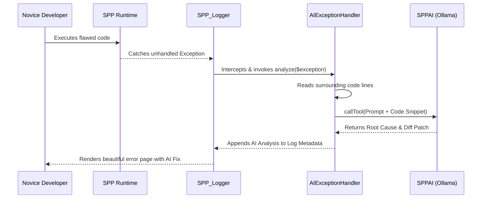

# SPP Novice Tutorial: The Self-Healing AI Exception Handler

Welcome to the SPP Framework! If you have never heard of SPP before, do not worry. This tutorial is designed specifically for total novices, guiding you step-by-step through one of our most powerful features: the **Self-Healing AI Exception Handler**. By the end of this guide, you will have a complete, in-depth ("in and out") understanding of what this feature is, how it works, and how to use it in your daily development workflow.

---

## 1. Foundational Concepts

### What is the Self-Healing AI Exception Handler?
In traditional web development, when your code encounters a fatal error or an uncaught exception (like misspelling a variable or calling a function that does not exist), the screen displays a scary, cryptic stack trace. For beginners, understanding these error messages can take hours of searching online.

The SPP Self-Healing AI Exception Handler solves this problem by acting as an expert pair programmer built directly into your error screen. Whenever an exception occurs, the framework automatically captures the error, reads the surrounding lines of your code, and consults an AI model (like a local Ollama instance) to analyze the problem. It then displays a plain-English explanation of the root cause along with a copy-pasteable code patch to fix it instantly!

### Why Does it Exist in SPP?
We believe enterprise frameworks should empower developers of all skill levels. By automating root cause analysis, we dramatically reduce debugging time, flatten the learning curve for new team members, and keep development enjoyable and highly productive.

---

## 2. Lifecycle & Architecture

To understand how this feature operates under the hood, let's trace the complete end-to-end lifecycle of an exception in SPP:



1. **Error Interception (`SPP_Logger`)**: When an exception is thrown in a controller or service, the core error handler delegates logging to `\SPPMod\SPPLogger\SPP_Logger::write_to_log()`.
2. **Context Inspection (`AIExceptionHandler`)**: If the error level is critical/error and an exception instance is present, the logger invokes `\SPPMod\SPPAI\AIExceptionHandler::analyze()`. This class locates the exact file and line where the error occurred and safely extracts the surrounding 20 lines of code.
3. **AI Tool Calling (`SPPAI`)**: The extracted code, error message, and stack trace are packaged into a structured prompt and sent to `SPPAI::callTool()`, requesting a structured JSON response containing `root_cause`, `recommended_fix`, and `diff`.
4. **Rendering & Telemetry**: The resulting AI analysis is attached to the log metadata and rendered directly on the developer's error display screen.

---

## 3. Step-by-Step Tutorials

Let's walk through exactly how a novice developer configures and interacts with the Self-Healing AI Exception Handler from scratch.

### Step 1: Verify AI Provider Configuration
By default, SPP uses a local Ollama daemon to ensure zero-cost, secure, and private AI analysis. Ensure your `sppai` module configuration in `etc/apps/default/app.yml` or `spp/modules/spp/sppai/module.yml` has the correct provider:

```yaml
sppai:
  default_provider: ollama
  ollama:
    endpoint: "http://127.0.0.1:11434"
    model: "llama3"
```

### Step 2: Triggering an Exception
Create a simple test controller where we deliberately throw an exception or make an error. Notice that we adhere to the strict SPP rule of zero inline HTML string literals!

```php
<?php

namespace App\Controllers;

use SPP\MVC\ViewController;

class FlawedController extends ViewController
{
    public function indexAction()
    {
        // Intentionally calling a non-existent method on a null object to trigger an exception
        $order = null;
        $order->calculateTotal();

        return $this->renderPartial('partials/order_view.html', ['order' => $order]);
    }
}
```

### Step 3: Reviewing the AI Analysis Screen
When you visit this route in your browser, instead of a plain PHP fatal error, the SPP error page displays an elegant **AI Root Cause Analysis** panel:

```text
================================================================================
                      SPP AI EXCEPTION & ROOT CAUSE ANALYSIS
================================================================================
[Root Cause]:
You are attempting to call the method `calculateTotal()` on the variable `$order`, 
but `$order` is currently assigned to `null`. In PHP, you cannot call methods on 
null variables.

[Recommended Fix]:
Initialize the `$order` object using the appropriate SPPEntity or OrderRepository 
before attempting to calculate its total.

[Copy-Pasteable Diff]:
- $order = null;
- $order->calculateTotal();
+ $order = \App\Models\Order::find($this->request->get('id'));
+ if ($order !== null) {
+     $order->calculateTotal();
+ }
================================================================================
```

Simply copy the recommended diff into your controller, and your code is instantly fixed!

---

## 4. Impact of Deletions/Modifications

### Legacy Behavior
Previously, `SPP_Logger` strictly recorded the exception text and stack trace to either the database or filesystem logs without any automated analysis. Developers had to manually locate the log file, copy the stack trace, and debug the issue independently.

### Rationale Behind the Change
The modern enterprise demands rapid iteration and robust developer assistance. Integrating AI directly into the logging pipeline significantly enhances developer ergonomics and slashes mean-time-to-resolution (MTTR) for software defects.

### Migration & Replacement Steps
This enhancement is fully backward-compatible. If your local AI provider (Ollama) is offline or unreachable, `AIExceptionHandler` gracefully falls back to displaying the standard error message and logs a non-blocking warning advising you to check your local AI service connectivity. No manual code changes are required for existing applications!
