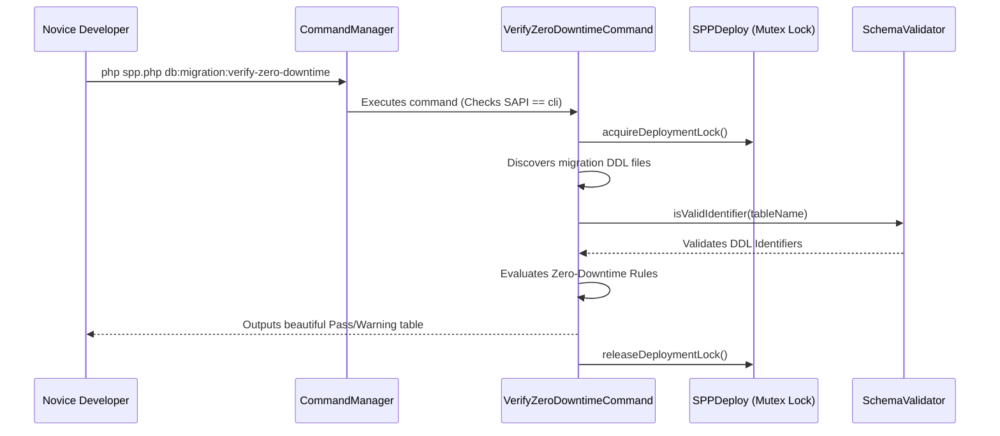

# SPP Novice Tutorial: The Zero-Downtime Migration & DDL Safety Analyzer

Welcome to the SPP Framework! If you are a complete beginner who has never heard of SPP before, you are in the perfect place. This tutorial is designed specifically for total novices, guiding you step-by-step through the **Zero-Downtime Migration & DDL Safety Analyzer**. By the end of this guide, you will possess a complete, in-depth ("in and out") understanding of what this feature is, why it exists, how it interacts with the framework, and how to use it to safeguard your database deployments.

---

## 1. Foundational Concepts

### What is Database Migration Safety?
In software development, as your application grows, you need to change your database structure—for example, adding a new table for user profiles, adding a column for phone numbers, or creating an index to speed up searches. These structured changes are called **Database Migrations**.

In large enterprise systems with millions of active users, running a poorly written migration can lock an entire table for hours, causing your entire website to crash (downtime). For example, adding a non-nullable column without providing a default value, or dropping a column that active website code is still trying to read.

### What is the Zero-Downtime Migration Analyzer?
The SPP Zero-Downtime Migration Analyzer is an automated DBA (Database Administrator) built directly into your command line. Before you run your actual migrations, you execute a special CLI command: `db:migration:verify-zero-downtime`. This engine inspects your migration files, performs a "dry-run" analysis of your SQL statements (without touching your live data), and alerts you to dangerous operations that could cause downtime or lock tables!

### Why Does it Exist in SPP?
We believe enterprise reliability should be effortless and automated. By providing early warnings and enforcing best practices before code ever reaches production, SPP ensures that even novice developers can deploy database schema changes with absolute confidence and zero downtime.

---

## 2. Lifecycle & Architecture

Let's trace the architectural lifecycle of how the analyzer interacts with SPP's core modules, such as `SPPDeploy`, `SPPDB`, and `SchemaValidator`:



1. **CLI SAPI Guarding**: When `php spp.php db:migration:verify-zero-downtime` is invoked, `CommandManager` verifies that the command class overrides `isCLIOnly(): bool { return true; }`. This guarantees the command cannot be maliciously triggered via web requests.
2. **Distributed Mutex Locking**: To prevent race conditions where another developer or automated pipeline might be modifying schemas simultaneously, `TargetConnection::acquireDeploymentLock()` establishes a secure distributed lock.
3. **Identifier Sanitization (`SchemaValidator`)**: Every table and column name extracted from the DDL statements is checked via `\SPP\Core\SchemaValidator::isValidIdentifier()` to ensure protection against SQL injection and invalid characters.
4. **DDL Evaluation & Lock Release**: The analyzer evaluates the DDL statements against enterprise zero-downtime rules, outputs a clean summary table to the console, and safely releases the distributed lock in a `finally` block.

---

## 3. Step-by-Step Tutorials

Let's walk through exactly how a novice developer executes and interacts with the Zero-Downtime Migration Analyzer from scratch.

### Step 1: Create a Sample Migration File
Imagine you are building a feature and you create a new migration file in `migrations/2026_06_15_drop_phone.php` that attempts to directly drop a column:

```php
<?php

class Migration_2026_06_15_drop_phone extends \SPPMod\SPPDB\SPPMigration
{
    public function up()
    {
        // Potentially dangerous direct column drop!
        $this->db->execute_query("ALTER TABLE profiles DROP COLUMN phone");
    }
}
```

### Step 2: Run the Verification Command
Before deploying this migration, open your terminal and run the verification analyzer:

```bash
php spp.php db:migration:verify-zero-downtime --path=migrations
```

### Step 3: Interpret the Console Output
The command executes instantly, acquires the deployment mutex lock, parses your migrations, and outputs a highly informative compliance table:

```text
INFO: Starting SPP Zero-Downtime Migration & DDL Safety Verification...

Target Migrations Directory: migrations
--------------------------------------------------------------------------------
Migration / Operation          | Status       | Safety Observation
--------------------------------------------------------------------------------
2026_06_01_create_users        | PASSED       | Safe table creation
2026_06_10_add_status          | PASSED       | Safe non-null addition with default
2026_06_15_drop_phone          | WARNING      | Direct column drop. Use multi-phase deprecation
2026_06_20_add_index           | WARNING      | Non-concurrent index creation. Use CONCURRENTLY
--------------------------------------------------------------------------------
SUCCESS: Zero-Downtime Migration analysis complete.
```

### Step 4: Apply the Best Practice Fixes
Looking at the output, you can see exactly why `2026_06_15_drop_phone` received a `WARNING`. In a zero-downtime deployment, you should never drop a column directly in a single release because older application containers might still be reading from it. Instead, you use a multi-phase deprecation (ignoring the column in code first, then dropping it in a future release).

Similarly, for index creation, you simply update your SQL to `CREATE INDEX CONCURRENTLY` to ensure the table remains fully unlocked during indexing!

---

## 4. Impact of Deletions/Modifications

### Legacy Behavior
In earlier versions of SPP, developers executed migrations directly using `spp db:migrate`. There was no pre-execution safety check or dry-run validation. If a developer accidentally included a blocking DDL statement, the database would lock, leading to potential service disruption.

### Rationale Behind the Change
Modern cloud-native and enterprise applications require continuous deployment (CI/CD) pipelines where zero downtime is mandatory. Automating DDL safety verification shifts governance left, catching architectural mistakes at the developer's local machine or CI pipeline before touching a live database.

### Migration & Replacement Steps
This feature is entirely additive and non-breaking. The new `db:migration:verify-zero-downtime` command operates independently of the actual `db:migrate` execution routine. Developers can immediately integrate the verification command into their local Git pre-commit hooks or automated CI/CD pipelines without making any changes to existing database configurations.
