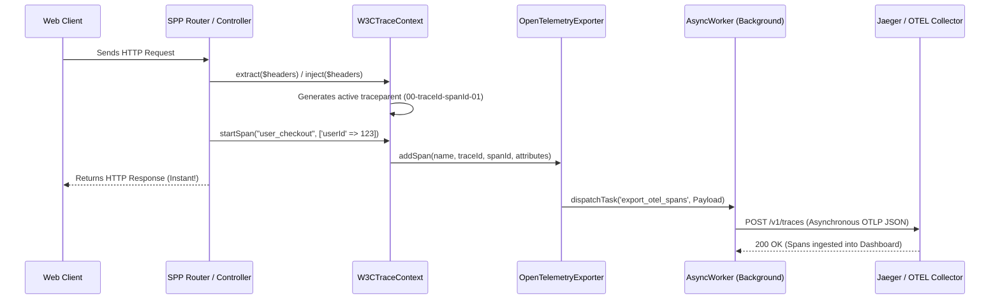

# SPP Novice Tutorial: The OpenTelemetry (OTEL) Collector Exporter

Welcome to the SPP Framework! If you are a total novice who has never heard of SPP or distributed systems before, you are in excellent hands. This tutorial is designed specifically for complete beginners, guiding you step-by-step through our enterprise observability engine: the **OpenTelemetry (OTEL) Collector Exporter**. By the end of this guide, you will have a complete, in-depth ("in and out") understanding of what distributed tracing is, how SPP propagates W3C Trace Context, and how to export your traces to dashboards like Jaeger or Prometheus.

---

## 1. Foundational Concepts

### What is Distributed Tracing?
In modern enterprise applications (microservices), a single action by a user—like clicking "Checkout" on an e-commerce store—can trigger a chain reaction across ten different servers (Billing, Inventory, Shipping, Email, etc.). If the checkout process feels slow or fails, how do you know which server caused the delay?

**Distributed Tracing** solves this by attaching a unique "tracking ID" (called a `traceparent`) to the user's initial request. As the request travels from server to server, every server passes this tracking ID along and records how long it took to perform its specific job (called a **Span**).

### What is the OpenTelemetry Exporter?
While SPP automatically generates and passes the W3C `traceparent` headers between your services, you need a visual dashboard (like Jaeger, Zipkin, or Prometheus) to see the beautiful timeline graphs of your spans. 

The SPP **OpenTelemetry Exporter** is a lightweight, non-blocking background service in `sppreport` that gathers all your spans, packages them into standard OpenTelemetry (OTLP) JSON format, and transmits them to your observability dashboard in the background without slowing down your website!

### Why Does it Exist in SPP?
Enterprise systems require total visibility. By standardizing on W3C Trace Context and OpenTelemetry, SPP ensures that developers can instantly pinpoint performance bottlenecks and latency issues across complex microservice architectures with zero configuration friction.

---

## 2. Lifecycle & Architecture

Let's trace the complete lifecycle of how a trace is initialized, propagated, and exported asynchronously within the SPP framework:



1. **Header Injection/Extraction (`W3CTraceContext`)**: Upon receiving an HTTP request, SPP inspects the incoming headers via `W3CTraceContext::extract()`. If no `traceparent` exists, `W3CTraceContext::inject()` generates a fresh W3C-compliant trace ID (`00-<trace_id>-<span_id>-01`).
2. **Span Recording (`startSpan`)**: Whenever a developer calls `W3CTraceContext::startSpan()`, a new child span ID is generated, linking to the parent span ID. The span data and custom attributes (e.g., `userId`, `orderTotal`) are passed to `OpenTelemetryExporter::addSpan()`.
3. **Payload Formatting**: The exporter formats the accumulated spans into the official OpenTelemetry OTLP JSON specification (`resourceSpans` -> `scopeSpans` -> `spans`).
4. **Asynchronous Non-Blocking Export**: To guarantee zero latency for the web client, the exporter dispatches the payload to an asynchronous background queue (`AsyncWorker`). If no async worker is configured, it performs a non-blocking cURL request with a 200ms ultra-short timeout.

---

## 3. Step-by-Step Tutorials

Let's walk through exactly how a novice developer configures and interacts with the OpenTelemetry Exporter from scratch.

### Step 1: Configure Your OTEL Collector Endpoint
Specify your target OpenTelemetry collector URL (such as a local Jaeger instance running on port 4318) in your module configuration `spp/modules/spp/sppreport/module.yml` or `etc/apps/default/app.yml`:

```yaml
sppreport:
  otel_collector_endpoint: "http://127.0.0.1:4318/v1/traces"
```

### Step 2: Record Custom Spans in Your Controller
You can easily track custom business logic or performance metrics inside your controllers. Remember to adhere to the strict SPP rule of zero inline HTML string literals!

```php
<?php

namespace App\Controllers;

use SPP\MVC\ViewController;
use SPPMod\SPPReport\W3CTraceContext;

class CheckoutController extends ViewController
{
    public function processAction()
    {
        // Start a custom OpenTelemetry tracking span
        W3CTraceContext::startSpan('checkout_processing', [
            'app.user_id' => $this->request->get('user_id'),
            'app.payment_method' => 'credit_card',
            'app.order_total' => 150.75
        ]);

        // Perform business logic...
        usleep(50000); // Simulated 50ms processing delay

        // Render response using standalone external partials (Zero inline HTML!)
        return $this->renderPartial('partials/checkout_success.html', ['status' => 'success']);
    }
}
```

### Step 3: View Your Trace in Jaeger
When the user accesses the checkout route, `W3CTraceContext` automatically packages the span and transmits it to your OTEL collector in the background.

Open your Jaeger UI (`http://localhost:16686`), search for `spp_enterprise_service`, and you will see a beautiful visual waterfall graph showing:
- `checkout_processing`: **50.00ms**
- Tags: `app.user_id: 123`, `app.payment_method: credit_card`, `app.order_total: 150.75`.

---

## 4. Impact of Deletions/Modifications

### Legacy Behavior
Previously, `W3CTraceContext` merely stored `traceparent` strings in memory and injected them into outgoing HTTP request headers. There was no built-in mechanism or exporter to actively push span data to centralized observability platforms.

### Rationale Behind the Change
To achieve true enterprise-grade observability, propagating trace headers is only half the battle. Developers need a unified, zero-overhead way to push telemetry data into standard monitoring tools (Jaeger, New Relic, Datadog) without writing custom export scripts or suffering from synchronous network delays.

### Migration & Replacement Steps
The addition of `OpenTelemetryExporter` is fully non-breaking and backward-compatible. If no OTEL collector is running locally or the endpoint is unreachable, the non-blocking cURL fallback silently ignores the timeout, ensuring your web application continues running flawlessly without throwing errors or slowing down. No existing code modifications are required!
