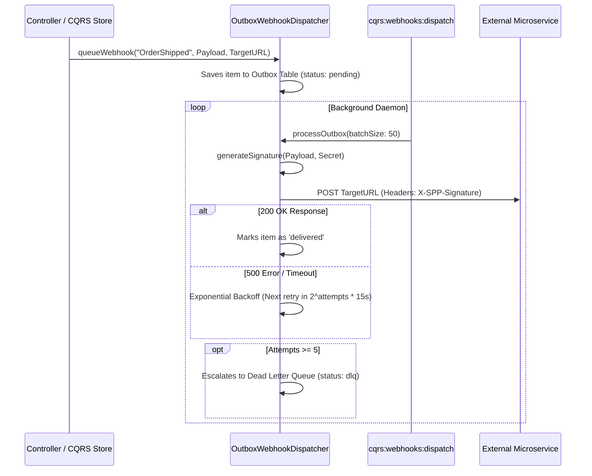

# SPP Novice Tutorial: The Outbox Pattern Webhook Dispatcher

Welcome to the SPP Framework! If you are a complete beginner who has never heard of SPP or event-driven architecture before, you are in the perfect place. This tutorial is designed specifically for total novices, guiding you step-by-step through our resilient messaging engine: the **Outbox Pattern Webhook Dispatcher**. By the end of this guide, you will have a complete, in-depth ("in and out") understanding of what webhooks are, why the Transactional Outbox pattern is essential for reliability, and how SPP securely dispatches webhooks with cryptographic signatures.

---

## 1. Foundational Concepts

### What is a Webhook?
A **Webhook** is a way for one server to automatically send data to another server as soon as an event happens. For example, when a customer buys a product on your SPP website, your server might send an automatic HTTP POST request (a webhook) to a shipping warehouse's server saying: `"Order #123 paid! Please ship it."`.

### What is the Transactional Outbox Pattern?
Imagine your website successfully charges a customer's credit card, and you try to send the webhook to the shipping warehouse instantly. But at that exact second, the warehouse's server is rebooting and returns an error! If your code doesn't save the webhook anywhere, the warehouse will never know about the order, and the customer will never receive their package.

The **Transactional Outbox Pattern** solves this. Instead of sending the webhook directly across the internet during the customer's checkout, your code saves the webhook payload into a local database table called an **Outbox** (just like an email outbox). Then, a separate background worker (`cqrs:webhooks:dispatch`) reads the outbox table and delivers the webhooks securely. If the warehouse server is offline, the worker automatically retries later!

### Why Does it Exist in SPP?
Enterprise systems must guarantee "at-least-once" delivery for critical business events. By integrating the Outbox pattern directly into our CQRS Event Store, SPP ensures that network failures, timeouts, or third-party server outages never result in lost data or broken transactions.

---

## 2. Lifecycle & Architecture

Let's trace the complete lifecycle of how a domain event is queued, signed, and dispatched asynchronously within the SPP framework:



1. **Queueing (`queueWebhook`)**: When a domain event occurs in your application (e.g., `OrderShipped`), `OutboxWebhookDispatcher::queueWebhook()` records the payload, target subscriber URL, and an initial attempt count of `0` into the outbox table with a `pending` status.
2. **Background Processing (`cqrs:webhooks:dispatch`)**: A background daemon periodically invokes `OutboxWebhookDispatcher::processOutbox()`. It selects pending webhooks whose `next_retry` timestamp has passed.
3. **Cryptographic Signing (`generateSignature`)**: To prove to the receiving server that the webhook genuinely came from your application (and not a hacker), SPP generates a secure HMAC-SHA256 hash of the payload using an application secret key (`X-SPP-Signature: sha256=...`).
4. **Resilient Dispatch & DLQ**: The worker attempts non-blocking delivery via cURL. If delivery fails, it calculates an exponential backoff retry window (`2^attempts * 15s`). If delivery fails 5 times, the item is moved to the Dead Letter Queue (`dlq`) for administrative review.

---

## 3. Step-by-Step Tutorials

Let's walk through exactly how a novice developer queues and dispatches webhooks from scratch in SPP.

### Step 1: Queue a Webhook in Your Controller
When an important business action completes, queue an outgoing webhook to your target subscriber URL. Notice that we adhere to the strict SPP rule of zero inline HTML string literals!

```php
<?php

namespace App\Controllers;

use SPP\MVC\ViewController;
use SPPMod\SPPWorkflow\CQRS\OutboxWebhookDispatcher;

class OrderController extends ViewController
{
    public function shipAction()
    {
        $orderId = $this->request->get('id');
        $orderPayload = ['order_id' => $orderId, 'shipped_at' => time(), 'carrier' => 'FedEx'];

        // Securely queue the webhook in the Transactional Outbox
        OutboxWebhookDispatcher::queueWebhook(
            'order.shipped',
            $orderPayload,
            'https://api.externalwarehouse.com/webhooks/spp'
        );

        // Render response using standalone external partials (Zero inline HTML!)
        return $this->renderPartial('partials/shipment_confirmed.html', ['order_id' => $orderId]);
    }
}
```

### Step 2: Run the Webhook Dispatcher CLI Daemon
Open your terminal and run the background dispatch command to process pending items in the outbox:

```bash
php spp.php cqrs:webhooks:dispatch --batch=100
```

### Step 3: Verify the Console Output
The command instantly wakes up, discovers the pending webhook, generates the HMAC-SHA256 cryptographic signature, and transmits the payload:

```text
INFO: Starting SPP CQRS Outbox Webhook Dispatcher Daemon...
Processing batch size: 100
SUCCESS: Outbox webhook dispatching cycle complete. Delivered: 1 webhooks.
```

If `api.externalwarehouse.com` was offline, the console would indicate `Delivered: 0 webhooks` and the item's `next_retry` timestamp would be bumped by 30 seconds for the next cycle!

---

## 4. Impact of Deletions/Modifications

### Legacy Behavior
In previous versions of SPP, developers wishing to send webhooks had to write manual cURL requests inside their controllers or event listeners. If the remote webhook endpoint responded slowly or timed out, the user's web page would hang, and failed webhooks were lost permanently.

### Rationale Behind the Change
Direct synchronous network calls to third-party APIs during an active web request violate enterprise decoupling principles. The Transactional Outbox pattern isolates the web request from external network instability, providing rock-solid message delivery guarantees and preventing data loss.

### Migration & Replacement Steps
This feature is entirely additive and non-breaking. The `cqrs:webhooks:dispatch` command is automatically registered in `CommandManager`. Developers can easily add the command to their server's crontab or supervisor configuration (`* * * * * php /app/spp.php cqrs:webhooks:dispatch --batch=50`) to enable background outbox dispatching instantly!
