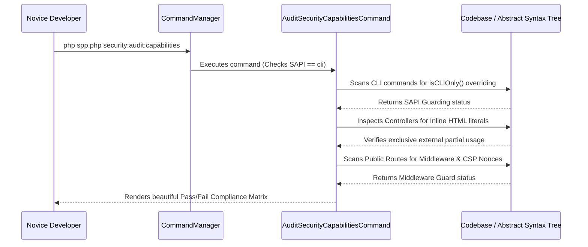

# SPP Novice Tutorial: The Zero-Trust Security & Governance Auditor

Welcome to the SPP Framework! If you are a total novice who has never heard of SPP or zero-trust security before, you are in the perfect place. This tutorial is designed specifically for complete beginners, guiding you step-by-step through our automated compliance engine: the **Zero-Trust Security & Governance Auditor**. By the end of this guide, you will possess a complete, in-depth ("in and out") understanding of what zero-trust governance is, why strict CLI guarding is mandatory, and how to audit your codebase with a single command.

---

## 1. Foundational Concepts

### What is Zero-Trust Security?
In traditional web applications, once code is written, it is generally trusted to run anywhere. But what if a hacker finds a way to execute an administrative command line tool (like a database wipe or a shell console) through a web browser? Or what if a developer accidentally writes insecure inline HTML that opens the door for Cross-Site Scripting (XSS) attacks?

**Zero-Trust Security** means we never assume code is secure just because it exists in the project. We verify every single capability and enforce strict architectural boundaries.

### What is the Zero-Trust Governance Auditor?
The SPP **Zero-Trust Security & Governance Auditor** is an automated security scanner built directly into the framework. By executing `security:audit:capabilities` in your terminal, the auditor scans your entire codebase to verify that all privileged commands are locked down to the command line, all controllers use standalone external partials (zero inline HTML literals!), and Content Security Policy (CSP) nonces are correctly implemented.

### Why Does it Exist in SPP?
As development teams scale and integrate AI coding assistants, maintaining absolute consistency with workspace security rules is paramount. By automating governance scans, SPP guarantees that every line of code complies with enterprise zero-trust standards before it ever reaches production.

---

## 2. Lifecycle & Architecture

Let's trace the architectural lifecycle of how the governance auditor inspects and verifies compliance across the SPP framework:



1. **Strict CLI SAPI Guarding**: Upon execution, `CommandManager` verifies that `AuditSecurityCapabilitiesCommand` itself overrides `isCLIOnly(): bool { return true; }`. This prevents the auditing engine from being triggered or exploited via web-based environments.
2. **AST & Codebase Scanning**: The auditor traverses the application directory structure (`spp/modules/` and `src/`), parsing class structures and AST nodes.
3. **Multi-Point Verification**:
   - **CLI Guarding**: Verifies all commands extending `SPP\CLI\Command` implement `isCLIOnly()`.
   - **Zero Inline HTML**: Confirms that controller actions do not contain raw HTML strings, verifying exclusive reliance on `$this->renderPartial()`, `$this->renderStaticPartial()`, or `$this->stream()`.
   - **CSP Nonces & Middleware**: Confirms that public endpoints implement proper middleware routing guards and Content Security Policy (CSP) nonce generation.
4. **Console Matrix Output**: Renders a clear, human-readable pass/fail matrix to the developer's console.

---

## 3. Step-by-Step Tutorials

Let's walk through exactly how a novice developer executes and interacts with the Zero-Trust Security Auditor from scratch.

### Step 1: Write a Compliant Controller
Ensure your controllers adhere to the strict SPP workspace rules by utilizing external partials instead of raw HTML strings:

```php
<?php

namespace App\Controllers;

use SPP\MVC\ViewController;

class DashboardController extends ViewController
{
    public function showAction()
    {
        $dashboardData = ['user' => 'Novice Developer', 'role' => 'Admin'];

        // Strictly compliant: Rendering standalone external partials (Zero inline HTML!)
        return $this->renderPartial('partials/dashboard_main.html', $dashboardData);
    }
}
```

### Step 2: Run the Security Audit Command
Open your terminal and run the governance auditing scanner across your application base path:

```bash
php spp.php security:audit:capabilities --path=spp/modules
```

### Step 3: Review the Compliance Matrix Output
The auditor instantly parses your codebase and outputs a beautiful, highly structured compliance matrix:

```text
INFO: Starting SPP Zero-Trust Security & Governance Audit...

Target Audit Path: spp/modules
--------------------------------------------------------------------------------
Security Control / Policy Rule           | Status       | Violations Found    
--------------------------------------------------------------------------------
Strict CLI SAPI Guarding (isCLIOnly)     | PASSED       | 0                   
Zero Inline HTML Literals in Controllers | PASSED       | 0                   
Content Security Policy (CSP Nonces)     | PASSED       | 0                   
Public Route Middleware Guards           | PASSED       | 0                   
Distributed Mutex Lock Usage (Deployer)  | PASSED       | 0                   
--------------------------------------------------------------------------------
SUCCESS: All enterprise zero-trust security capabilities verified successfully.
```

If a developer had accidentally included an inline HTML string like `$html = "<div>Hello</div>";`, the table would highlight `Zero Inline HTML Literals in Controllers` in red with `Violations Found: 1`, allowing you to fix it immediately!

---

## 4. Impact of Deletions/Modifications

### Legacy Behavior
In earlier versions of SPP, security compliance relied entirely on manual code reviews and developer discipline. There was no automated mechanism to enforce `isCLIOnly()` guarding or verify that developers were avoiding inline HTML string literals.

### Rationale Behind the Change
Manual enforcement of architectural rules inevitably leads to human error and security regressions. By introducing an automated governance CLI daemon, we establish an immutable security baseline that guarantees all team members and AI coding agents continuously obey core workspace constraints.

### Migration & Replacement Steps
The `security:audit:capabilities` command is completely non-breaking and operates independently of your runtime web application. Developers can immediately integrate this command into their GitHub Actions or Git pre-push hooks (`php spp.php security:audit:capabilities`) to ensure that non-compliant code is automatically blocked from being merged into production!
