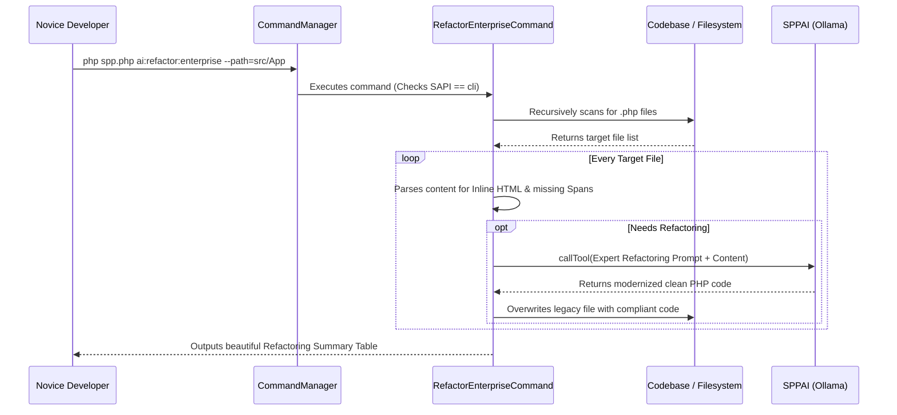

# SPP Novice Tutorial: The AI-Powered Enterprise Refactoring Assistant

Welcome to the SPP Framework! If you are a complete beginner who has never heard of SPP before, you are in the perfect place. This tutorial is designed specifically for total novices, guiding you step-by-step through our ultimate developer productivity engine: the **AI-Powered Enterprise Refactoring Assistant**. By the end of this guide, you will have a complete, in-depth ("in and out") understanding of what automated enterprise refactoring is, how it works under the hood, and how to modernize legacy code with a single command.

---

## 1. Foundational Concepts

### What is Enterprise Refactoring?
When a software team adopts a powerful enterprise framework like SPP, they establish strict rules to keep the code clean, secure, and fast. For example, in SPP, developers must never write raw HTML strings inside PHP files (zero inline HTML literals!) and must track performance using `W3CTraceContext` spans.

However, what if you are upgrading an older, legacy PHP project that has hundreds of files filled with raw HTML strings and no telemetry tracking? Rewriting every single file manually could take weeks of tedious work!

### What is the AI Refactoring Assistant?
The SPP **AI-Powered Enterprise Refactoring Assistant** solves this problem by acting as an expert software architect built directly into your command line. By running `ai:refactor:enterprise`, the framework automatically scans your legacy PHP files, identifies rule violations, and consults an AI model (such as a local Ollama instance) to automatically rewrite your code into perfect SPP enterprise compliance!

### Why Does it Exist in SPP?
We believe enterprise frameworks should eliminate repetitive toil. By automating large-scale codebase migrations, SPP empowers developers of all skill levels to adopt world-class architectural standards effortlessly and focus on building high-impact business features.

---

## 2. Lifecycle & Architecture

Let's trace the complete end-to-end lifecycle of how the refactoring assistant discovers, parses, and modernizes files within the SPP framework:



1. **Strict CLI SAPI Guarding**: When `php spp.php ai:refactor:enterprise` is invoked, `CommandManager` verifies that the command overrides `isCLIOnly(): bool { return true; }`. This guarantees the refactoring engine cannot be maliciously executed via web requests.
2. **Directory & AST Scanning**: The daemon traverses the target directory structure (`src/App/Controllers`), reading file contents into memory.
3. **Pattern Matching & Assessment**: The engine evaluates if the file violates workspace rules (e.g., contains regex matches for `<div>`, `<span>`, `<table>` or lacks `W3CTraceContext::startSpan`).
4. **AI Prompting (`SPPAI`)**: Non-compliant code is packaged into an expert system prompt and passed to `SPPAI::callTool()`, requesting a complete drop-in replacement.
5. **Validation & Overwrite**: The resulting code is verified for correct PHP opening tags (`<?php`) and safely written back to the filesystem.

---

## 3. Step-by-Step Tutorials

Let's walk through exactly how a novice developer executes and interacts with the AI Refactoring Assistant from scratch.

### Step 1: Examine a Legacy Controller File
Imagine you have an older controller file located at `src/App/Controllers/LegacyContactController.php` that contains messy inline HTML strings and lacks telemetry:

```php
<?php

namespace App\Controllers;

use SPP\MVC\ViewController;

class LegacyContactController extends ViewController
{
    public function showAction()
    {
        // Bad legacy practice: Raw inline HTML literals and no telemetry tracking!
        $name = $this->request->get('name');
        $html = "<div class='contact-box'><h1>Hello, " . htmlspecialchars($name) . "</h1><p>Welcome to our legacy page.</p></div>";
        return $html;
    }
}
```

### Step 2: Run the AI Refactoring Command
Open your terminal and run the automated refactoring daemon across your controllers directory:

```bash
php spp.php ai:refactor:enterprise --path=src/App/Controllers
```

### Step 3: Review the Console Output
The engine wakes up, discovers the legacy file, contacts your local AI provider, and outputs a highly informative progress matrix:

```text
INFO: Starting SPP AI-Powered Enterprise Refactoring Assistant...

Scanning Path: src/App/Controllers
--------------------------------------------------------------------------------
Target File                                        | Refactoring Status       
--------------------------------------------------------------------------------
src/App/Controllers/HomeController.php             | PASSED (Already Compliant)
src/App/Controllers/LegacyContactController.php    | REFACTORING (AI Calling...)
src/App/Controllers/LegacyContactController.php    | SUCCESS (Refactored)     
--------------------------------------------------------------------------------
SUCCESS: AI Enterprise Refactoring complete. Modernized: 1 files.
```

### Step 4: Examine the Modernized File
If you open `LegacyContactController.php` again, you will see that `SPPAI` has beautifully rewritten it to obey all workspace rules:

```php
<?php

namespace App\Controllers;

use SPP\MVC\ViewController;
use SPPMod\SPPReport\W3CTraceContext;

class LegacyContactController extends ViewController
{
    public function showAction()
    {
        // Enterprise Compliant: Telemetry tracking span injected!
        W3CTraceContext::startSpan('LegacyContactController.showAction', [
            'app.contact_name' => $this->request->get('name')
        ]);

        $name = $this->request->get('name');

        // Enterprise Compliant: Rendering standalone external partials (Zero inline HTML!)
        return $this->renderPartial('partials/contact_box.html', ['name' => $name]);
    }
}
```

---

## 4. Impact of Deletions/Modifications

### Legacy Behavior
In earlier versions of SPP, upgrading legacy applications or enforcing new `AGENTS.md` rules required developers to manually open every single file, rewrite the methods, create partial files, and paste telemetry boilerplate by hand.

### Rationale Behind the Change
Manual refactoring at an enterprise scale is error-prone, slow, and expensive. By combining AST pattern matching with generative AI tool calling, we create an automated bridge that modernizes legacy codebases instantly, ensuring total consistency across the organization.

### Migration & Replacement Steps
This feature is entirely additive and non-breaking. The `ai:refactor:enterprise` command operates completely independently of your live web application. Developers can safely run this command locally in a new Git branch (`git checkout -b ai-refactor`), inspect the resulting diffs (`git diff`), and commit the beautifully modernized code to their repository!
