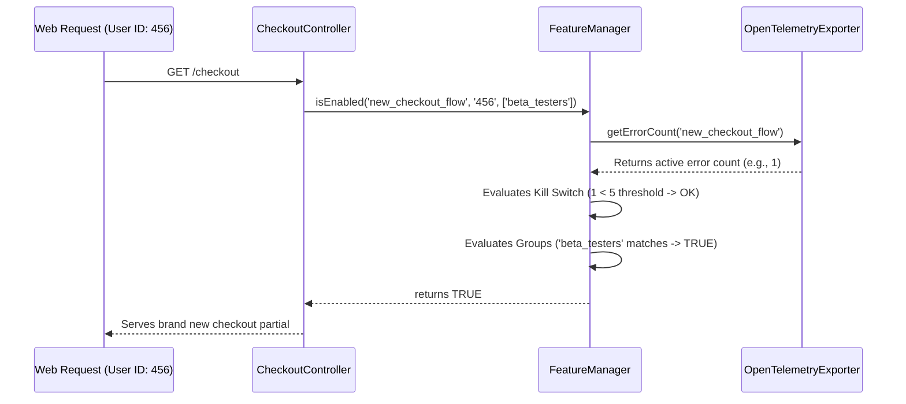

# SPP Novice Tutorial: Advanced Feature Flags & Canary Experimentation Engine

Welcome to the SPP Framework! If you are a total novice who has never heard of SPP or enterprise deployment strategies, this tutorial is crafted perfectly for you. We will take you on an exciting journey into one of the most powerful paradigms in cloud-native software engineering: **Advanced Feature Flags, Canary Experimentation, and Automated Telemetry Kill Switches**. By the end of this article, you will have a complete, in-depth ("in and out") understanding of how to decouple deployments from releases and manage features like a true enterprise architect.

---

## 1. Foundational Concepts

### The Old Way: Big Bang Deployments
In traditional web development, launching a new feature (such as a brand-new Checkout page) requires uploading your code to the live server. As soon as the code lands, 100% of your active users immediately see the new feature. If there is a hidden bug in your code, every single user experiences a broken website simultaneously! This high-risk approach is known as a "Big Bang" deployment.

### The Enterprise Way: Feature Flags & Canary Releases
SPP introduces a vastly superior approach using **Feature Flags** (`FeatureManager`). A feature flag is like a remote-controlled light switch wrapped around your new code. You can deploy your code to production with the switch turned **OFF**. The code is live on the server, but nobody sees it.

When you are ready, you can turn the switch **ON** for specific groups (e.g., `beta_testers`), or execute a **Canary Release**. A canary release lets you slowly roll out the new feature to a small percentage of your users (say, 10%). If everything works perfectly, you increase it to 50%, and eventually 100%.

### What is the Telemetry Kill Switch?
But what happens if that 10% canary group encounters a sudden wave of severe errors? You might be asleep or away from your desk! SPP includes an automated **Telemetry Kill Switch**. `FeatureManager` constantly communicates with the `OpenTelemetryExporter`. If error counts associated with your feature exceed a configured safety threshold (e.g., 5 errors), SPP automatically trips the kill switch, instantly disabling the feature flag and protecting your users without any human intervention!

---

## 2. Lifecycle & Architecture

Let's trace the complete end-to-end lifecycle of how `FeatureManager` evaluates flags and interacts with telemetry within the SPP framework:



1. **Invocation**: A controller or live component calls `FeatureManager::isEnabled('flag_name', $userId, $userGroups)`.
2. **Telemetry Kill Switch Interception**: Before anything else, `FeatureManager` queries `OpenTelemetryExporter::getErrorCount('flag_name')`. If the active error count equals or exceeds the threshold (e.g., 5), the flag is instantly returned as `false`.
3. **User Group Evaluation**: If the kill switch is safe, the manager checks if the user's groups match the flag's target whitelist (e.g., `enterprise_admins`).
4. **Deterministic Canary Hashing**: If groups don't match, the engine hashes the flag name and user ID (`crc32`) to generate a consistent value between 0 and 99. If this hash falls below the configured canary percentage (e.g., 25%), the user receives the new feature.

---

## 3. Step-by-Step Tutorials

Let's walk through exactly how a novice developer configures, toggles, and tests feature flags in SPP from scratch.

### Step 1: Implement Feature Flags in Your Controller
Imagine you are building a new checkout experience in `src/App/Controllers/CheckoutController.php`. You can easily wrap your logic in `FeatureManager`:

```php
<?php

namespace App\Controllers;

use SPP\MVC\ViewController;
use SPPMod\SPPFeatureFlags\FeatureManager;

class CheckoutController extends ViewController
{
    public function indexAction()
    {
        $userId = $this->request->get('user_id') ?: 'guest_999';
        $userGroups = ['regular_user'];

        // Check if the new checkout flow feature flag is active for this user
        if (FeatureManager::isEnabled('new_checkout_flow', $userId, $userGroups)) {
            // Serve the brand new experimental checkout experience
            return $this->renderPartial('partials/new_checkout.html', ['title' => 'Express Checkout']);
        }

        // Fallback to the rock-solid legacy checkout experience
        return $this->renderPartial('partials/legacy_checkout.html', ['title' => 'Standard Checkout']);
    }
}
```

### Step 2: Inspect Active Feature Flags via CLI
Open your terminal and run the `feature:toggle` command to view the real-time status of all enterprise flags:

```bash
php spp.php feature:toggle
```

### Step 3: Review the Status Table
The CLI outputs a beautiful summary of your active flags, canary percentages, and kill switch statuses:

```text
INFO: SPP Advanced Feature Flags & Canary Experimentation Manager

Current Enterprise Feature Flags Status:
--------------------------------------------------------------------------------
Feature Flag Name              | Enabled    | Canary %     | Telemetry Kill Switch
--------------------------------------------------------------------------------
new_checkout_flow              | TRUE       | 25%          | ACTIVE (0/5)       
multi_region_active_sync       | TRUE       | 10%          | ACTIVE (0/3)       
--------------------------------------------------------------------------------
```

### Step 4: Dynamically Modify Flag Configurations
Suppose you want to expand the canary rollout of `new_checkout_flow` to 75% of your global traffic. Run:

```bash
php spp.php feature:toggle --flag=new_checkout_flow --enable=true --canary=75
```

```text
INFO: SPP Advanced Feature Flags & Canary Experimentation Manager

SUCCESS: Feature flag 'new_checkout_flow' updated. Enabled: true, Canary: 75%
```

---

## 4. Impact of Deletions/Modifications

### Legacy Behavior
In previous versions of SPP, enabling or disabling experimental features required modifying hardcoded configuration files (`config.php`), performing fresh deployments, or restarting application servers.

### Rationale Behind the Change
Modern cloud-native engineering demands zero-downtime experimentation and instantaneous rollback capabilities. By building a high-performance in-memory feature flag engine with deterministic hashing and automated telemetry interception, SPP eliminates deployment risk entirely.

### Migration & Replacement Steps
This feature is completely additive. Developers can begin integrating `FeatureManager::isEnabled()` into existing controllers immediately without breaking any legacy routes. If a flag name does not exist in the configuration, `FeatureManager` gracefully defaults to `false`, ensuring your application remains perfectly stable!
