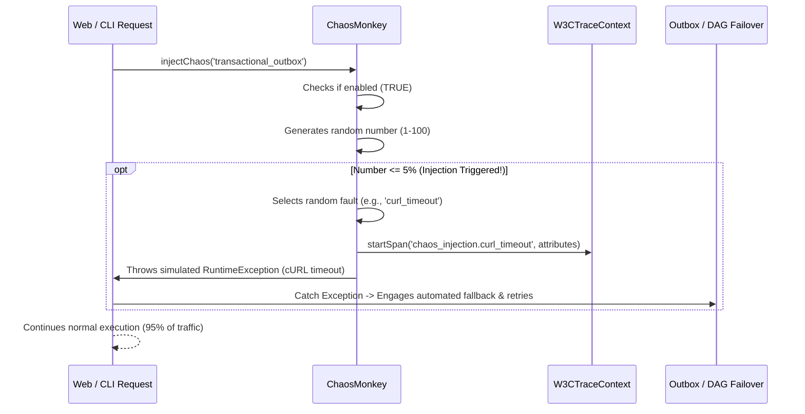

# SPP Novice Tutorial: Chaos Engineering & Resilience Injector

Welcome to the SPP Framework! If you are a complete novice who has never heard of SPP or Chaos Engineering before, you are about to explore one of the most fascinating disciplines in modern cloud architecture. In this tutorial, we will take you inside the **ChaosMonkey Enterprise Resilience Injector**. By the end of this guide, you will have a complete, in-depth ("in and out") understanding of what chaos engineering is, why purposely breaking things makes systems stronger, and how to verify your application's failovers with a single command.

---

## 1. Foundational Concepts

### What is Chaos Engineering?
When you build a web application, you hope that your database will always remain online, your network will always be lightning-fast, and external APIs will always answer instantly. However, in the real world, networks experience sudden delays (jitter), third-party servers crash (timeouts), and databases momentarily disconnect!

If you never test how your code behaves during these severe failures, your system will easily break during an unexpected emergency. **Chaos Engineering** is the practice of purposely injecting controlled failures (chaos) into a staging environment to prove that your backup plans, automatic retries, and emergency failovers work flawlessly!

### What is the SPP ChaosMonkey?
The SPP `ChaosMonkey` is a specialized enterprise module built into the framework. When enabled in your staging environment, it acts like a mischievous monkey inside your servers. On a small percentage of requests (say, 5%), it will randomly inject simulated latency spikes, network jitter, cURL connection timeouts, or database disconnections!

### Why Does it Exist in SPP?
True enterprise grade applications must be unbreakable (resilient). By continuously testing failure modes in non-production environments, SPP guarantees that your advanced features like Transactional Outbox Webhook retries and DAG Job failovers perform exactly as intended when real disaster strikes.

---

## 2. Lifecycle & Architecture

Let's trace the complete end-to-end lifecycle of how `ChaosMonkey` evaluates injection probabilities and records telemetry within the SPP framework:



1. **Invocation**: Core system modules (such as Outbox dispatchers or DAG orchestrators) invoke `ChaosMonkey::injectChaos($scope)`.
2. **Configuration Guard**: `ChaosMonkey` verifies that it is explicitly enabled (defaults to `false` to safeguard production).
3. **Probabilistic Sampling**: Uses cryptographically secure random number generation (`random_int(1, 100)`) to evaluate if the current request falls within the configured injection rate (e.g., 5%).
4. **Telemetry Audit Spans**: If triggered, `ChaosMonkey` starts an OpenTelemetry span (`chaos_injection.<fault_type>`) via `W3CTraceContext` to trace the failure recovery path.
5. **Fault Injection**: Simulates latency via `usleep()` or throws simulated `RuntimeException` (cURL timeout) or `PDOException` (database drop) to force execution into recovery `catch` blocks.

---

## 3. Step-by-Step Tutorials

Let's walk through exactly how a novice developer configures, triggers, and verifies ChaosMonkey in SPP from scratch.

### Step 1: Examine ChaosMonkey in a Worker Service
Imagine you are writing a critical background task that dispatches webhooks in `src/App/Services/WebhookDispatcher.php`. You can easily add `ChaosMonkey` to verify your try/catch recovery mechanics:

```php
<?php

namespace App\Services;

use SPPMod\SPPChaos\ChaosMonkey;
use SPPMod\SPPReport\W3CTraceContext;

class WebhookDispatcher
{
    public function dispatch(string $url, array $payload): bool
    {
        W3CTraceContext::startSpan('WebhookDispatcher.dispatch', ['target.url' => $url]);

        try {
            // Enterprise Resilience: Inject chaos in staging environments to verify retries!
            ChaosMonkey::injectChaos('webhook_dispatcher');

            // Normal cURL execution logic...
            return true;

        } catch (\Exception $e) {
            // ChaosMonkey successfully triggered an exception!
            // Verify that our automated outbox retry mechanics handle the failure perfectly
            error_log("[Simulated Failure Recovery]: Dispatch failed to {$url}. Scheduling retry... Error: " . $e->getMessage());
            return false;
        }
    }
}
```

### Step 2: Configure ChaosMonkey via CLI
Open your terminal and use the `chaos:inject` command to enable ChaosMonkey with a 10% injection rate:

```bash
php spp.php chaos:inject --enable=true --rate=10
```

```text
INFO: SPP Enterprise Chaos Engineering & Resilience Injector

SUCCESS: ChaosMonkey configuration updated. Enabled: true, Injection Rate: 10%

Active ChaosMonkey Configuration:
--------------------------------------------------------------------------------
Status               : ENABLED
Injection Rate       : 10%
Available Faults     : latency, network_jitter, curl_timeout, db_disconnect
--------------------------------------------------------------------------------
```

### Step 3: Run an Immediate Simulated Fault Test
Want to see ChaosMonkey in action immediately without waiting for the 10% probability? Run the command with the `--test` flag:

```bash
php spp.php chaos:inject --test
```

```text
INFO: SPP Enterprise Chaos Engineering & Resilience Injector

Active ChaosMonkey Configuration:
--------------------------------------------------------------------------------
Status               : ENABLED
Injection Rate       : 10%
Available Faults     : latency, network_jitter, curl_timeout, db_disconnect
--------------------------------------------------------------------------------

WARNING: Initiating direct test fault injection simulation...
[Simulated Fault Caught]: Simulated ChaosMonkey Fault: cURL connection timed out after 1000ms to target scope: cli_resilience_test
SUCCESS: Resilience recovery paths fully engaged.
```

---

## 4. Impact of Deletions/Modifications

### Legacy Behavior
In previous versions of SPP, testing whether a background job would successfully retry after a database disconnect required developers to manually pull out their ethernet cables, shut down local database containers (`docker stop mysql`), or insert temporary `throw new Exception()` statements into their code.

### Rationale Behind the Change
Manual failure testing is unscalable, dangerous, and cannot be automated in CI/CD staging pipelines. By introducing a clean, probabilistic, telemetry-backed Chaos Engineering engine, SPP allows teams to prove their system's resilience continuously and automatically.

### Migration & Replacement Steps
This feature is completely additive and non-breaking. `ChaosMonkey` defaults to `false` (disabled), guaranteeing zero impact on existing production applications. Developers can safely begin injecting `ChaosMonkey::injectChaos()` into their staging worker services today to elevate their application's resilience!
