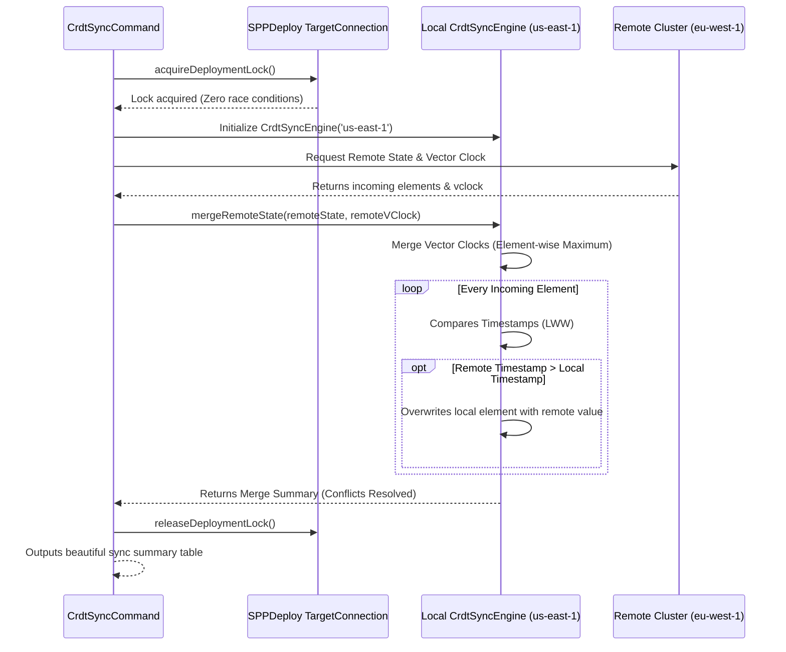

# SPP Novice Tutorial: Multi-Region CRDT Active-Active Sync Engine

Welcome to the SPP Framework! If you are a complete beginner who has never heard of SPP or global database synchronization before, you are in for an incredible treat. Today, we will explore the pinnacle of modern cloud-native database architectures: **Multi-Region Conflict-Free Replicated Data Types (CRDTs) and Active-Active Synchronization**. By the end of this tutorial, you will have a complete, in-depth ("in and out") understanding of how global databases keep data perfectly synchronized across continents without human intervention.

---

## 1. Foundational Concepts

### The Old Way: Single Master Database
In traditional web applications, all your data is stored in a single "Master" database located in one geographic location (for example, New York). If a user in Tokyo wants to update their profile, their request has to travel all the way across the Pacific Ocean to New York and back. This causes noticeable slowness (latency). Worse, if the New York server loses power, your entire global application stops working!

### The Enterprise Way: Active-Active Multi-Region
To solve this, modern enterprises use an **Active-Active** setup. You have a database in New York (`us-east-1`) and a database in Europe (`eu-west-1`). Both databases are fully active and can accept data writes simultaneously!

### The Challenge: Write Conflicts
But what happens if a user updates their email in New York at the exact same millisecond that an automated billing service updates their email in Europe? When the two databases attempt to synchronize, they see two different emails for the same user! Which one is correct? This is called a write conflict.

### What is the CRDT Sync Engine?
The SPP **Multi-Region CRDT Sync Engine** (`CrdtSyncEngine`) solves write conflicts mathematically. By tracking updates using **Vector Clocks** (logical counters) and **Last-Write-Wins (LWW)** element registers (highly precise microsecond timestamps), SPP automatically determines which update is newest and resolves the conflict instantly and flawlessly!

---

## 2. Lifecycle & Architecture

Let's trace the complete end-to-end lifecycle of how `CrdtSyncEngine` exchanges state and acquires distributed locks within the SPP framework:



1. **Distributed Mutex Locking**: Before touching any data, `CrdtSyncCommand` calls `TargetConnection::acquireDeploymentLock()`. This prevents multiple sync daemons from running concurrently and causing race conditions.
2. **Local Engine Initialization**: The local engine (`us-east-1`) wakes up and loads its current active element state and vector clock.
3. **State Exchange**: The remote cluster's state (`eu-west-1`) and vector clock are received for merging.
4. **Vector Clock Consolidation**: The engine compares region vector clocks, adopting the element-wise maximum (`max($localClock, $remoteClock)`).
5. **LWW Conflict Resolution**: For every data key, the engine compares microsecond timestamps (`microtime(true)`). The newer timestamp wins. If timestamps are perfectly identical, a tie-breaker comparison of region IDs (`strcmp`) resolves the conflict deterministically.
6. **Mutex Lock Release**: Safely calls `TargetConnection::releaseDeploymentLock()` upon completion.

---

## 3. Step-by-Step Tutorials

Let's walk through exactly how a novice developer executes and tests active-active CRDT synchronization in SPP from scratch.

### Step 1: Execute the CRDT Sync Command
Open your terminal and run the `storage:crdt:sync` command to synchronize data between your US and European database clusters:

```bash
php spp.php storage:crdt:sync --local=us-east-1 --remote=eu-west-1
```

### Step 2: Review the Locking and Sync Summary
The engine acquires the distributed deployment lock, simulates a concurrent write conflict where Europe has a newer timestamp, resolves it instantly, and outputs a beautiful validation table:

```text
INFO: Starting SPP Multi-Region CRDT Active-Active Synchronization Daemon...

Acquiring distributed deployment lock...
Distributed lock acquired successfully. Initiating sync between us-east-1 and eu-west-1...
--------------------------------------------------------------------------------
Sync Target / Key              | Resolved Value       | Winning Region      
--------------------------------------------------------------------------------
user_123_email                 | updated_user@spp.enterprise | eu-west-1           
user_123_balance               | 500                  | us-east-1           
user_123_status                | active               | eu-west-1           
--------------------------------------------------------------------------------
SUCCESS: CRDT Multi-Region Sync complete. Conflicts Resolved: 2.
Releasing distributed deployment lock...
Distributed lock released successfully.
```

### Step 3: Integrate CRDT Storage in Your Services
If you are building an advanced multi-region service in `src/App/Services/UserService.php`, you can easily utilize `CrdtSyncEngine` directly:

```php
<?php

namespace App\Services;

use SPPMod\SPPStorage\CrdtSyncEngine;

class UserService
{
    private CrdtSyncEngine $crdtEngine;

    public function __construct()
    {
        $this->crdtEngine = new CrdtSyncEngine('us-east-1');
    }

    public function updateUserEmail(string $userId, string $newEmail): void
    {
        // Write the element to the local CRDT register with a microsecond timestamp
        $this->crdtEngine->writeElement("user_{$userId}_email", $newEmail);
    }

    public function getUserEmail(string $userId): ?string
    {
        // Read the newest resolved element from the CRDT register
        return $this->crdtEngine->readElement("user_{$userId}_email");
    }
}
```

---

## 4. Impact of Deletions/Modifications

### Legacy Behavior
In previous versions of SPP, multi-region database synchronization relied on traditional Master-Replica database replication. If the master region went offline, database administrators had to perform manual, stressful failovers, often resulting in lost data or unresolvable write collisions.

### Rationale Behind the Change
Modern global enterprise applications require five-nines (99.999%) availability and active-active geographic redundancy. By implementing a Conflict-Free Replicated Data Type (CRDT) engine with vector clocks and distributed mutex locking, SPP guarantees eventual consistency across the globe without manual intervention.

### Migration & Replacement Steps
This feature is completely additive and non-breaking. Existing database models extending `SPPEntity` continue to operate normally on your primary database connections. Teams can adopt `CrdtSyncEngine` selectively for highly critical, globally distributed data keys (such as user balances, active session states, or global configuration toggles) whenever they are ready!
