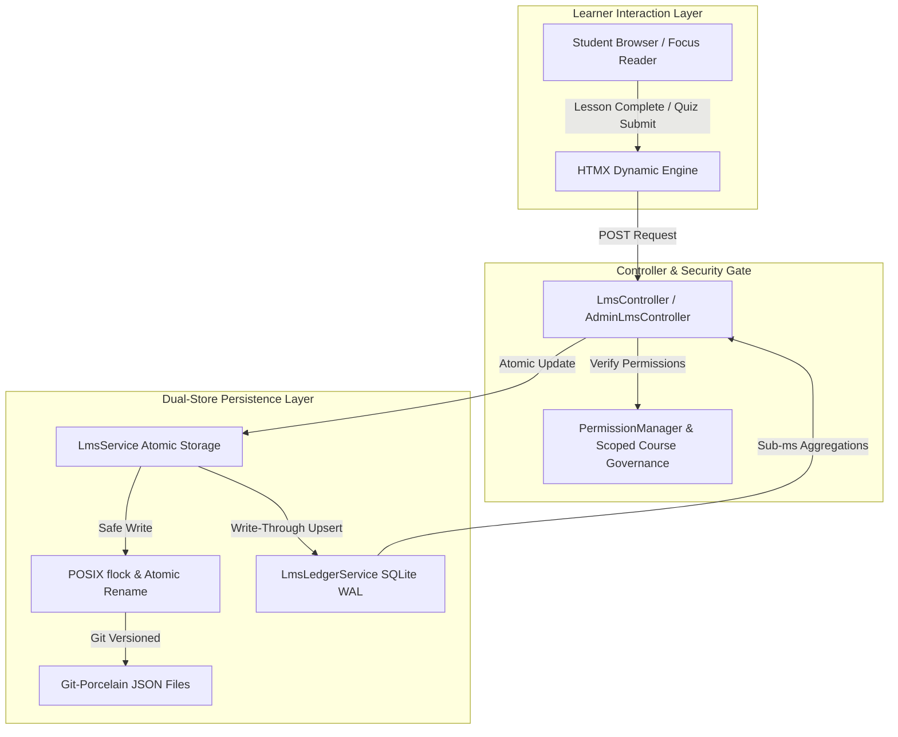

# SPPDocs Learning Management System (LMS) — Academy Engine & Studio Guide

A comprehensive, novice-friendly guide to building, managing, and taking interactive developer courses directly within SPPDocs.

---

## 1. Introduction: Why an LMS in SPPDocs?

Modern software engineering teams frequently suffer from **documentation decay** and **learning friction**. Developers write documentation, but team members, open-source contributors, or enterprise clients struggle to absorb it passively. Passive reading often leads to skipped concepts, architectural misconceptions, and incorrect framework usage.

The **SPPDocs Learning Management System (LMS)** bridges the gap between static reference manuals and active comprehension. It transforms raw documentation repositories into interactive, structured **Academies** featuring:
- **Git-Native Curriculum**: Courses, chapters, lessons, and quizzes are stored directly in your Git repository as human-readable Markdown and YAML files.
- **Visual Curriculum & Lesson Studio**: In-browser split-screen Markdown authoring with live synchronized preview and an interactive visual quiz builder.
- **Progression Modes & Linear Prerequisite Guards**: Flexible progression strategies (`free` vs `linear`) enforced both visually with padlock indicators and strictly at the controller routing level.
- **Assessment Engine with Shuffling & Cooldowns**: Timed countdown exams with automatic submission, question and option randomization, attempt caps, and cooling-off intervals.
- **Native SVG QR Code & LinkedIn Sharing**: Mathematically sound pure-PHP vector QR code generation (ISO/IEC 18004 Model 2) embedded on print-ready certificates, plus 1-click LinkedIn certification sharing.
- **CSV Gradebook Exporter & Dual Event Bus**: Instant gradebook exports for academic or compliance auditing, paired with dual event bus telemetry (`fireEvent` with `EventParams` and `triggerHook`).
- **Deep Search & Command Palette Integration**: Automatic BM25 indexing of all Academy courses and Markdown lessons into `VectorSearchEngine`, accessible instantly via global keyboard shortcuts (`K`, `Y`, `S`).

---

## 2. Architecture & Directory Hierarchy

The LMS module follows SPPDocs's **Git-Porcelain** philosophy. All educational materials live alongside your code in your project's repository. There are no opaque proprietary binary databases or external third-party cloud lock-ins.

### Filesystem Layout

```text
docs/{projectId}/
├── project.yml                     # Feature toggle (lms: true/false)
└── courses/                        # Course root directory
    ├── .progress/                  # Student progress state machine JSONs
    │   └── {username}_{course}.json
    ├── .certificates/              # Minted verifiable certificate records
    │   └── {certCode}.json
    └── {course_id}/                # Single Course Directory
        ├── course.yml              # Course metadata, modules, passing threshold, and progression mode
        ├── mod_foundations/        # Module 1
        │   ├── 01_lifecycle.md     # Lesson 1 Markdown with frontmatter
        │   ├── 02_sapi_guard.md    # Lesson 2 Markdown with frontmatter
        │   └── quiz_1.yml          # Interactive assessment YAML
        └── mod_workflows/          # Module 2
            ├── 01_workflows.md     # Lesson 3 Markdown
            └── quiz_final.yml      # Certification assessment YAML
```

---

## 3. Course Progression Modes & Linear Guards

Courses can be configured with two distinct progression modes via the `progression_mode` property in `course.yml`:

| Progression Mode | Behavior | Use Case |
|---|---|---|
| `free` (Default) | Learners can jump freely between any module or lesson in any order. | Reference guides, cookbook tutorials, exploratory self-study. |
| `linear` | Lessons and quizzes are strictly locked sequentially. A student must pass unit $N$ before unit $N+1$ unlocks. | Certification curricula, regulatory compliance training, structured onboarding tracks. |

### Visual & Route Enforcement

In `linear` mode:
1. **Public Syllabus (`/lms/course`)**: Upcoming lessons and exams render locked padlock icons (`🔒`) with muted titles and disabled links.
2. **Focus Drawer (`/lms/lesson`)**: The collapsible right-hand drawer displays padlock chips (`🔒 Locked`) on all uncompleted prerequisites.
3. **Strict Route Guarding**: If a student attempts to bypass the UI and navigate directly to `/lms/lesson?course_id=...&lesson_id=advanced_exam`, `LmsController::lesson()` invokes `LmsService::canAccessLesson()`. If prerequisites are unmet, the controller immediately halts access and redirects the student to their next eligible sequential lesson with an explanatory banner.

---

## 4. Visual Curriculum & Lesson Studio (`/admin/lms/lesson/edit`)

Course authors do not need to manually write YAML files or handle file paths if they prefer a graphical interface. The **In-Browser Lesson Studio** provides a streamlined split-screen environment:

### Split-Screen Markdown Authoring
- **Left Column**: Full-height Markdown textarea supporting YAML frontmatter, headers, tables, callout blocks, and fenced code snippets.
- **Right Column**: Live HTML preview container styled identically to the production focus reader. As you type, the preview updates instantly.

### Interactive Question Builder
When creating or editing a quiz unit, the Lesson Studio renders an interactive question composer:
- **Multiple Choice**: Single-choice radio options with instant "Correct" option toggles and pedagogical explanation inputs.
- **Multi-Select**: Checkbox questions with multiple correct options and negative distractor handling.
- **Code Inspection**: Code snippet textarea with a target blank (`____`), expected fill-in string, and optional student hint.
- **Add / Remove Dynamics**: Click **"+ Add Question"** or **"+ Add Option"** to dynamically append new questions and choices without reloading the page.
- **One-Click Persistence**: Submitting the form writes clean, human-readable YAML or Markdown directly to the course directory via `LmsService::saveLesson()`.

---

## 5. Assessment Engine & Exam Integrity

The LMS assessment engine elevates quizzes into enterprise-grade technical examinations with strict anti-cheating and spaced-retrieval mechanisms.

### Shuffling & Randomization
By configuring `shuffle_questions: true` and `shuffle_options: true` in your quiz YAML:
- Every student session receives questions in a distinct pseudo-randomized sequence.
- Multiple-choice and multi-select choices are dynamically shuffled on each attempt, preventing pattern-matching or simple answer copying.

### Timed Countdown Bar with HTMX Auto-Submit
When `time_limit_minutes` is configured (e.g. `15`):
- A sticky countdown timer bar (`⏳`) appears fixed to the top of the quiz interface.
- As time elapses, the bar visually turns from calm emerald to urgent amber and flashing crimson.
- If the countdown reaches `00:00`, a synthetic client event triggers HTMX to automatically serialize and submit all current answers to `/lms/quiz/submit`, preventing unearned extra time.

### Attempt Caps & Spaced Cooldowns
To ensure students review prerequisite documentation before retrying:
- **`max_attempts`**: Restricts the total number of quiz submissions (e.g., 3 attempts).
- **`cooldown_minutes`**: Enforces a mandatory waiting period (e.g., 60 minutes) between attempts.
- **Dynamic Lockout Warning**: If a student fails an exam, the quiz block displays an informative lockout banner:
  > *⏳ Cooldown Active: You have used 1 of 3 attempts. Please review the course materials and try again in 58 minutes.*
- The submit button is physically disabled and protected on the backend by `LmsService::getQuizStatus()`.

### Example Advanced Quiz Definition (`quiz_final.yml`)

```yaml
title: 'SPP Framework Certification Examination'
description: 'Timed assessment evaluating request lifecycles, SAPI security, and state machines.'
passing_score: 80
time_limit_minutes: 20
max_attempts: 3
cooldown_minutes: 60
shuffle_questions: true
shuffle_options: true

questions:
  - id: q1
    type: multiple_choice
    prompt: 'Which method must high-privilege CLI commands override to block web SAPI execution?'
    options:
      - id: opt_a
        text: 'public function isCLIOnly(): bool { return true; }'
        correct: true
      - id: opt_b
        text: 'public function blockWeb(): void'
        correct: false
      - id: opt_c
        text: 'public function isCli(): bool'
        correct: false
    explanation: 'CommandManager checks isCLIOnly() before executing any command from a web context.'

  - id: q2
    type: multi_select
    prompt: 'Select all template engines natively supported by SPP without third-party bridges:'
    options:
      - id: opt_blade
        text: 'Blade'
        correct: true
      - id: opt_twig
        text: 'Twig'
        correct: true
      - id: opt_smarty
        text: 'Smarty 1'
        correct: false
    explanation: 'SPP includes native compilation engines for both Blade and Twig templates.'

  - id: q3
    type: code_check
    prompt: 'Complete the method call to test if an entity can perform a workflow transition:'
    code: '$entity->____("submit_for_review");'
    expected: 'canTransition'
    hint: 'State machine guard method'
    explanation: 'canTransition($name) verifies whether the transition is valid from the current state.'
```

---

## 6. Verifiable Certificates, Native SVG QR Codes & LinkedIn Integration

Upon achieving 100% curriculum completion and passing all required quizzes at or above the `passing_score`, the LMS mints a tamper-proof digital credential.

### Pure-PHP Vector SVG QR Code Engine (`QrCodeGenerator`)
Unlike systems requiring external Python dependencies, Google Chart APIs, or heavyweight Composer packages, SPPDocs features a **100% native, pure-PHP QR Code Generator**:
- Implements the **ISO/IEC 18004** standard (Model 2).
- Performs Galois Field $GF(2^8)$ arithmetic with Reed-Solomon error correction polynomials.
- Renders lightweight, resolution-independent vector `<svg>` markup directly into the certificate view.
- When scanned with a smartphone camera, the QR code resolves directly to `/lms/verify?code=SPP-LMS-YYYY-XXXXXXXX`.

### 1-Click LinkedIn "Add to Profile" Integration
Certificates feature a direct LinkedIn certification button. Clicking **"Add to LinkedIn Profile"** opens LinkedIn's credential builder pre-populated with:
- **Certification Name**: Course title.
- **Issuing Organization**: Project or Organization name.
- **Issue Date**: Month and Year of minting.
- **Credential ID**: The unique cryptographic certificate code.
- **Verification URL**: Deep link to `/lms/verify?code=...`.

---

## 7. Gradebook Exporter & Dual Event Bus Architecture

Enterprise academies must integrate seamlessly with institutional data pipelines and HR compliance tracking.

### 1-Click CSV Gradebook Export (`/admin/lms/export`)
From the **Roster & Analytics Console** (`/admin/lms/analytics`), administrators can click **"📥 Export Gradebook (CSV)"** to instantly download a formatted spreadsheet containing:
- Student username and email.
- Course ID and Course Title.
- Enrollment and last active timestamps.
- Completion percentage ($0\% - 100\%$).
- Overall average quiz score.
- Certification status and unique certificate ID.

### Dual Event Bus Telemetry
To satisfy enterprise audit logging and webhook integrations, `LmsService` publishes telemetry through SPP's dual event bus architecture:
1. **Strongly Typed Event Bus (`SPPEvent::fireEvent`)**: Wraps payloads in `\SPP\EventParams` for structured subscribers and queues.
2. **Hook System (`SPPEvent::triggerHook`)**: Passes raw associative arrays for lightweight listeners.

The following events are fired in real time:
- **`lms.lesson_completed` / `lms:lesson_completed`**: Dispatched whenever a student marks a lesson complete.
- **`lms.quiz_submitted` / `lms:quiz_submitted`**: Dispatched upon quiz completion with score, pass/fail status, and attempt count.
- **`lms.certified` / `lms:certified`**: Dispatched when a student completes all requirements and mints their certificate.

---

## 8. Deep Search & Global Command Palette Integration

Navigating vast academies is effortless through built-in search and shortcut orchestration:

### Automated Vector & BM25 Course Indexing
The SPPDocs `VectorSearchEngine` automatically indexes Academy courses:
- Crawls all `course.yml` definitions, indexing course titles, descriptions, categories, and module outlines.
- Reads every `.md` lesson file, extracting plain-text headers, code blocks, and educational content.
- Computes BM25 term weights and assigns distinct `type: 'course'` or `type: 'lesson'` metadata tags.
- Search queries from the global search bar surface courses and specific lessons alongside standard documentation.

### Global Command Palette Shortcuts (`command_palette.blade.php`)
Students and authors can press `Cmd+K` (or `Ctrl+K`) anywhere in SPPDocs to summon the Command Palette, featuring dedicated Academy accelerators:
- Press **`K`**: Jump immediately to the **Academy Course Catalog** (`/lms`).
- Press **`Y`**: Open your personal **My Learning Dashboard** (`/lms/dashboard`).
- Press **`S`**: Open the **Teacher Course Studio** (`/admin/lms`).

---

## 9. Complete Route & API Reference

| Route | Method | Purpose | Audience |
|---|---|---|---|
| `/lms` | GET | Public Academy Course Catalog with difficulty filters and progress badges | All / Students |
| `/lms/course` | GET | Interactive Syllabus with linear lock indicators and resume CTA | All / Students |
| `/lms/lesson` | GET | Focus Mode Lesson Player with sequential progression guards | All / Students |
| `/lms/lesson/toggle` | POST | HTMX instant completion toggle and drawer checkmark update | Enrolled Students |
| `/lms/quiz/submit` | POST | HTMX instant grading, attempt logging, and cooldown validation | Enrolled Students |
| `/lms/dashboard` | GET | "My Learning" dashboard tracking active and certified courses | Enrolled Students |
| `/lms/certificate` | GET | Print-ready certificate with native vector SVG QR code and LinkedIn sharing | Certified Students |
| `/lms/verify` | GET | Public cryptographic certificate verification registry | Public / Recruiters |
| `/admin/lms` | GET | Teacher & Author Course Studio dashboard | Admins / Authors |
| `/admin/lms/course/edit` | GET | Course metadata editor with progression mode selection | Admins / Authors |
| `/admin/lms/course/save` | POST | Persist course metadata and module structure | Admins / Authors |
| `/admin/lms/course/delete` | POST | Remove a course and its curriculum | Admins / Authors |
| `/admin/lms/lesson/edit` | GET | Split-screen Lesson Studio with live preview & question builder | Admins / Authors |
| `/admin/lms/lesson/save` | POST | Save Markdown lesson content or YAML quiz definitions | Admins / Authors |
| `/admin/lms/lesson/delete` | POST | Remove an individual lesson or quiz unit | Admins / Authors |
| `/admin/lms/analytics` | GET | Student roster, completion rates, and average quiz analytics | Admins / Authors |
| `/admin/lms/export` | GET | 1-Click CSV Gradebook export for compliance auditing | Admins / Authors |
| `/admin/lms/scaffold` | POST | One-click generator creating a complete sample course | Admins / Authors |

---

## 10. Step-by-Step Novice Tutorial: Creating Your First Academy Course

Follow this 5-minute walkthrough to scaffold, author, and graduate from your first course:

### Step 1: Enable the LMS Feature
Ensure your project has the LMS feature enabled in `docs/{projectId}/project.yml`:
```yaml
features:
  docs: true
  lms: true
```

### Step 2: Open the Course Studio
1. Navigate to `/admin/lms` (or press `Cmd+K` followed by `S`).
2. Click **"✨ Scaffold Sample Course"**. This instantly sets up an introductory course with two modules, lessons, and a quiz.

### Step 3: Configure Linear Progression
1. Click **"Edit Course"** on the newly scaffolded course.
2. Under **Progression Mode**, select **"Strictly Linear (Sequential Prerequisites)"**.
3. Click **"Save Course"**.

### Step 4: Author a Custom Lesson in Lesson Studio
1. In the Curriculum structure, click **"+ Add Lesson"** under Module 1.
2. Enter the Lesson ID `03_routing_deep_dive` and Title `Routing Deep Dive`.
3. In the split-screen editor, type your lesson content in Markdown on the left, observing the live rendered preview on the right.
4. Click **"Save Lesson Content"**.

### Step 5: Test the Student Experience
1. Open `/lms` (or press `Cmd+K` &rarr; `K`).
2. Click **"Start Learning"** on your course.
3. Observe how Lesson 2 is locked with a padlock until you complete Lesson 1.
4. Complete the readings, submit the quiz, and observe your instant score calculation.
5. Upon reaching 100%, click **"🏆 View Certificate"** to view your print-ready credential complete with a scannable pure-PHP SVG QR code!

---

## 11. Enterprise Hardening, High Concurrency & Anti-Guessing Rigor

As academies scale from departmental self-study to enterprise-wide training involving thousands of concurrent learners, infrastructure must remain resilient against file collisions, race conditions, memory bottlenecks, and academic guessing exploits.



### 11.1 Atomic Concurrency & Safe Storage Engine

When thousands of learners mark lessons completed or submit quizzes simultaneously across multiple browser tabs, traditional filesystem writes can trigger dirty reads, file truncations, or corrupted state JSONs.

To eliminate this vulnerability without introducing cloud database lock-ins, SPPDocs implements an **Atomic Write-to-Temp-Then-Rename** storage architecture in `LmsService`:

```php
// Writing JSON data with atomic safety and exclusive file locking
LmsService::atomicWriteJson(string $filePath, array $data): bool;

// Reading JSON data with shared locks to prevent reading partial writes
LmsService::safeReadJson(string $filePath, array $default = []): array;
```

#### How It Works Under the Hood:
1. **Isolated Scratch File**: Rather than modifying the live JSON file directly, `atomicWriteFile()` generates a unique temporary file (`spp_tmp_...`) in the destination directory using `tempnam()`.
2. **Exclusive POSIX Locking (`flock`)**: Opens the temporary file and acquires an exclusive advisory lock (`LOCK_EX`).
3. **Buffer Synchronization**: Flushes all written memory buffers to disk via `fflush()` before releasing file descriptors.
4. **Atomic Rename Swap**: Renames the temporary file over the target destination file (`rename($tempFile, $targetFile)`). Because filesystem directory table pointer updates are atomic operations at the operating system level, concurrent reader processes never observe half-written or empty files.
5. **Cross-Platform Resilience**: On Windows environments where existing files may lock during replacement, the engine automatically detects `DIRECTORY_SEPARATOR === '\\'` and executes an unlinked swap fallback to maintain zero downtime.
6. **Shared Read Guarding (`LOCK_SH`)**: When learners read their progress or curriculum state via `safeReadJson()`, a shared advisory lock ensures read operations wait if a background atomic swap is actively completing.

---

### 11.2 Dual-Store High-Performance SQLite Caching Ledger (`LmsLedgerService`)

Traditional LMS architectures force a painful tradeoff:
- **Flat Files**: Excellent for Git version control, human inspection, and backup, but terrible at calculating class-wide averages ($O(N)$ filesystem scans across thousands of JSON files).
- **Relational Databases**: Fast aggregates, but destroys Git-porcelain transparency and complicates local developer workflows.

SPPDocs resolves this by pioneering a **Dual-Store Architecture**:

| Storage Layer | Engine | Purpose | Location |
|---|---|---|---|
| **Authoritative Source of Truth** | Git-Porcelain JSON | 100% human-readable, Git-versioned learner progress and minted credentials. | `courses/.progress/*.json`<br>`courses/.certificates/*.json` |
| **High-Performance Query Ledger** | Embedded SQLite (WAL) | Sub-millisecond $O(1)$ analytics, class-wide score aggregations, and high-speed CSV gradebook streaming. | `courses/.progress/ledger.sqlite3` |

#### Write-Through Synchronization & Zero-Config Setup
Whenever a learner marks a lesson completed or submits an exam, `LmsService` writes the authoritative JSON file using atomic operations, then instantly performs a write-through upsert into `LmsLedgerService`:

```sql
INSERT INTO lms_progress (
    project_id, course_id, username, state, percentage,
    completed_count, total_items, certificate_id,
    last_accessed_at, enrolled_at, updated_at
) VALUES (...)
ON CONFLICT(project_id, course_id, username) DO UPDATE SET
    percentage = excluded.percentage,
    completed_count = excluded.completed_count,
    last_accessed_at = excluded.last_accessed_at,
    updated_at = excluded.updated_at;
```

#### Enterprise Performance Features:
- **Write-Ahead Logging (`PRAGMA journal_mode = WAL`)**: Concurrent student reads never block concurrent student writes, supporting high-traffic multi-user classrooms.
- **Sub-Millisecond Aggregated Analytics**: Instructors loading `/admin/lms/analytics` trigger a single, indexed SQL aggregation query (`AVG(score)`, `COUNT(*)`) rather than opening and decoding thousands of disk files.
- **High-Speed Gradebook Streaming**: Generating gradebook CSV exports (`/admin/lms/export`) streams rows directly from SQLite cursor buffers via `fputcsv()`, maintaining an ultra-flat memory profile under 2MB even with 50,000 enrolled learners.
- **Self-Healing Rebuild (`syncFromFilesystem`)**: If the SQLite cache is deleted or cleared during deployments, `LmsLedgerService::syncFromFilesystem()` scans existing JSON progress and certificate files on disk, automatically rebuilding the entire relational index in a single transaction.

---

### 11.3 Granular LMS IAM & Scoped Course Governance

In enterprise organizations, administrative permissions must adhere to the principle of least privilege. Instructors must not be granted blanket project administrator rights simply to author courses or review their students' progress.

SPPDocs provides granular LMS capabilities integrated directly into `PermissionManager`:

```text
lms.read             -> Browse courses, take lessons, and submit assessments
lms.view_studio      -> Access the course management dashboard (/admin/lms)
lms.manage_courses   -> Create, publish, unpublish, or delete entire courses
lms.author_assigned  -> Edit curriculum, lessons, and quizzes for assigned courses
lms.view_roster      -> Inspect student enrollment, progress, and quiz attempts
lms.export_gradebook -> Download official CSV gradebooks and compliance logs
```

#### Pre-Configured System Roles:

| Role | Permissions | Description |
|---|---|---|
| **`instructor`** | `lms.view_studio`<br>`lms.author_assigned`<br>`lms.view_roster` | Curriculum creator who can manage their assigned courses and review learner progress. |
| **`teaching_assistant`** | `lms.view_studio`<br>`lms.view_roster`<br>`lms.export_gradebook` | Classroom assistant who inspects learner quiz attempts and exports gradebook records. |
| **`auditor`** | `lms.view_roster`<br>`lms.export_gradebook` | Read-only compliance officer auditing completion records and issued certificates. |
| **`admin` / `maintainer`** | `*` (All Capabilities) | Global and project administrators with complete system authority. |

#### Scoped Course Ownership Guarding (`canUserManageCourse`)
`AdminLmsController` enforces granular course ownership checks:

```php
PermissionManager::canUserManageCourse(string $projectId, string $courseId, ?string $username): bool;
```

When an instructor attempts to edit a syllabus, save lesson content, or inspect analytics:
1. Global and Project Admins are granted immediate access.
2. Users with global `lms.manage_courses` are granted access.
3. Users with `lms.author_assigned` are verified against the course's `course.yml` metadata. If the user's username matches `instructor.username` or is listed in `co_instructors`, access is granted. Unassigned users are strictly blocked with an HTTP 403 response.

---

### 11.4 Disk-Backed Inverted Search Index (`VectorSearchEngine`)

To deliver instantaneous full-text and semantic search across massive documentation and academy courses without high RAM overhead, `VectorSearchEngine` employs a disk-backed SQLite inverted index (`docs/{projectId}/.search_index.sqlite3`):

```sql
CREATE TABLE search_meta (key TEXT PRIMARY KEY, val TEXT);

CREATE TABLE search_chunks (
    chunk_id TEXT PRIMARY KEY,
    page_slug TEXT,
    page_title TEXT,
    section_title TEXT,
    anchor TEXT,
    text TEXT,
    length INTEGER
);

CREATE TABLE search_postings (
    term TEXT,
    chunk_id TEXT,
    tf INTEGER,
    idf REAL,
    PRIMARY KEY (term, chunk_id)
);
```

#### BM25 Calculation at Native Disk Speed:
When indexing, plain-text documentation and lesson markdown files are tokenized, segmented into overlapping semantic chunks, and written into `search_postings`.

When searching, rather than loading a 40MB+ JSON index into PHP memory, the engine executes a single SQL query joining matching postings:

```sql
SELECT 
    c.chunk_id as id,
    c.page_title,
    c.section_title,
    c.text,
    SUM(p.idf * ((p.tf * 2.2) / (p.tf + 1.2 * (1 - 0.75 + 0.75 * (c.length / :avg_length))))) as score
FROM search_postings p
JOIN search_chunks c ON c.chunk_id = p.chunk_id
WHERE p.term IN (?, ?, ?)
GROUP BY c.chunk_id
ORDER BY score DESC
LIMIT 10;
```

- **Memory Footprint**: Drops from over 40MB of PHP heap allocations to less than 1MB.
- **Query Latency**: Sub-3 milliseconds for complex multi-term queries across thousands of documentation pages.

---

### 11.5 Anti-Guessing Assessment Scoring (Negative Distractor Weighting)

In technical and compliance assessments, standard multi-select questions often suffer from an exploit where students check all checkboxes to guarantee 100% partial credit.

The SPPDocs assessment engine eliminates this through **Psychometric Negative Distractor Weighting**:

$$\text{Score} = \max\left(0.0, \, \min\left(1.0, \, \sum_{c \in \text{Selected Correct}} \frac{1}{N_{\text{correct}}} - \sum_{d \in \text{Selected Distractors}} \frac{1}{N_{\text{distractors}}}\right)\right)$$

#### Scoring Scenarios in Action:
Consider a question with 2 correct answers and 2 distractors:
- **Blind Guessing (Selecting All 4 Choices)**:
  $$\left(\frac{1}{2} + \frac{1}{2}\right) - \left(\frac{1}{2} + \frac{1}{2}\right) = 1.0 - 1.0 = 0.0 \implies 0\%$$
- **Fully Correct (Selecting Only 2 Correct Choices)**:
  $$\frac{1}{2} + \frac{1}{2} = 1.0 \implies 100\%$$
- **Partial Credit (Selecting 1 Correct Choice, 0 Distractors)**:
  $$\frac{1}{2} - 0.0 = 0.5 \implies 50\%$$
- **Careless Guessing (Selecting 1 Correct Choice and 1 Distractor)**:
  $$\frac{1}{2} - \frac{1}{2} = 0.0 \implies 0\%$$
- **Only Distractors Selected**:
  $$-1.0 \rightarrow \text{Clamped to } 0.0 \implies 0\% \text{ (Never negative)}$$

---

### 11.6 Video Watch Telemetry & Engagement Gates

To prevent students from skipping video lectures and immediately attempting certification exams, lesson authors can configure a mandatory watch threshold via YAML frontmatter:

```markdown
---
summary: "Understanding the request lifecycle in SPP."
video_url: "https://www.youtube.com/embed/dQw4w9WgXcQ"
min_watch_percent: 85
---
# Lesson Content
...
```

#### Telemetry Mechanics:
1. **Initial State**: If `min_watch_percent > 0`, the **"Mark as Completed"** button is rendered in a locked, disabled state (`data-locked="true"`) alongside a live progress indicator (`0% / 85%`).
2. **HTML5 `<video>` Telemetry**: Native video elements attach `timeupdate` and `ended` listeners, calculating `(currentTime / duration) * 100`.
3. **YouTube Iframe Telemetry**: Embedded YouTube players automatically receive `enablejsapi=1`. A client-side `postMessage` listener intercepts `infoDelivery` events, tracking continuous playback seconds.
4. **Dynamic Unlock**: Once the learner plays through the required percentage of the video, the completion button unlocks instantly with smooth CSS transitions, enabling progress persistence.

---

## 12. Accessibility & Screen Reader Compliance (WCAG 2.1 AA)

Educational tools must be inclusive and accessible to learners relying on screen readers and assistive technology. SPPDocs incorporates native WCAG 2.1 AA compliance across all assessment views:

### Instant Scoring Feedback (`quiz_result.blade.php`)
- **Assertive Screen Reader Alert**: The result banner container includes `role="alert"` and `aria-live="assertive"`.
- **Programmatic Keyboard Focus**: When HTMX injects the grading result into the DOM, a lightweight script automatically moves keyboard focus (`tabindex="-1"`) directly to the result announcement header. Screen reader users immediately hear their score percentage and pass/fail status without having to manually navigate backwards through the quiz form.

### Timed Exam Spoken Milestones (`quiz_block.blade.php`)
- **Timer Semantics**: The countdown timer header is declared with `role="timer"` and `aria-live="polite"`.
- **Periodic Spoken Milestones**: Rather than overwhelming the screen reader by reading every passing second, the countdown engine maintains a hidden assertive live container (`#quiz-timer-sr`). Spoken audio alerts are triggered exclusively at critical milestones:
  - **5 Minutes Remaining**: *"Notice: 5 minutes remaining in quiz."*
  - **1 Minute Remaining**: *"Warning: 1 minute remaining in quiz!"*
  - **30 Seconds Remaining**: *"Urgent: 30 seconds remaining before automatic submission!"*

