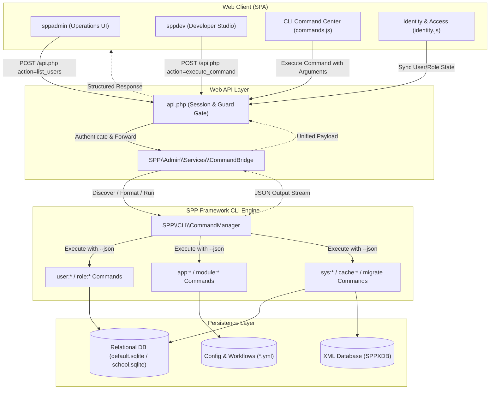
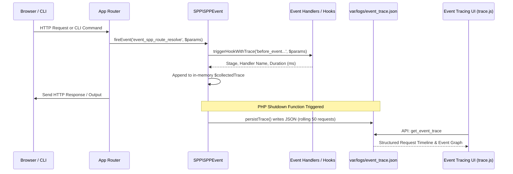

# Unified Command-First Architecture: sppadmin & sppdev Overhaul

## 1. Foundational Concepts

### What are `sppadmin` and `sppdev`?
The **SPP Framework** provides two distinct web consoles designed to manage different stages of an application's lifecycle:

1. **`sppadmin` (Operations, Security & Governance Portal)**:
   Designed for system administrators, DevOps engineers, and compliance officers. It focuses on identity & access management (IAM), roles and permissions, OAuth/API token governance, multi-app deployment orchestration, distributed database schema inspection, background event tracing, and server health diagnostics.
2. **`sppdev` (Developer Studio & Rapid Prototyping IDE)**:
   Designed for application developers. It focuses on entity modeling, modern form engine design, polyglot RPC services, routing & middleware visualizers, in-browser code editing, automated testing (Parikshak), AI Copilot tool calling, translations, and interactive CLI experimentation.

### The Problem: Discrepancies and Architectural Drift
Historically, `sppadmin` and `sppdev` suffered from architectural redundancy and state drift:
- **Duplicate Logic**: Web controllers performed custom, ad-hoc database queries and system calls directly, while CLI commands (`php spp.php ...`) performed their own separate workflows for the exact same operations.
- **Frivolous Files & Dead Code**: Decades of legacy PHP 4 / HTML 4.01 setup scripts (`devsetup.php`, `controls.devsetup.*`, `devconsole.php`, duplicate legacy commands) cluttered the codebase.
- **Out-of-Sync Actions**: When a developer created an entity or ran a migration from the command line, the web UI might behave differently because it did not share the exact same execution pipeline.

### The Solution: The Command-First Single Source of Truth
The overhauled architecture establishes **CLI Commands as the First-Class Citizens and Single Source of Truth**. Every activity in the framework is encapsulated within a robust, tested CLI command. The web interfaces (`sppadmin` and `sppdev`) execute these identical underlying commands through a secure, high-performance execution gateway: the **`CommandBridge`**.

Whether an operation is run from a Linux shell terminal, a Windows PowerShell prompt, or clicked inside the glassmorphic web SPA, the **exact same code executes**, ensuring 100% synchronization across CLI and Web.

---

## 2. Lifecycle & Architecture

### System Architecture Flow



### Key Architectural Layers

1. **Client SPA (`sppadmin` & `sppdev`)**:
   - Built with SPP-UX reactive component architecture (`BaseComponent`).
   - Uses external partials and view templates (`views/commands.js`, `views/identity.js`, `views/dashboard.js`, etc.) with zero inline HTML literals in PHP.
   - Dynamic client routing configured via `routes.json`.
2. **Execution Gateway (`spp/admin/services/CommandBridge.php`)**:
   - Provides a clean API (`executeCommand`, `listCommands`, `getCommandUi`, `handleAction`).
   - Dynamically parses command options, flags, and arguments.
   - Automatically forces `--json` flag execution so the CLI output is returned as structured data.
3. **Core Command Subsystem (`spp/core/class.commandmanager.php`)**:
   - Automatically scans and registers all 247+ CLI commands.
   - Categorizes commands by semantic namespace prefixes (`app`, `auth`, `cache`, `db`, `make`, `role`, `sys`, `user`, etc.).
   - Enforces CLI SAPI security guards (`isCLIOnly()`).

---

## 3. Step-by-Step Tutorials for Novices

### Tutorial 1: Navigating `sppadmin` for Operations & Identity Management

1. **Accessing the Operations Portal**:
   Open your browser and navigate to:
   ```text
   http://localhost/school1/spp/admin/
   ```
2. **Managing Users via Command-First IAM**:
   - Click **Identity & Access (IAM)** (`#identity`) in the sidebar.
   - The UI automatically invokes `user:list --json` through the `CommandBridge`.
   - All active database accounts in `spp_users` are rendered in the data grid.
   - Click **Add User**, enter `operator_beta`, assign role `Operator`, and submit.
   - Under the hood, `user:create operator_beta --role=Operator --json` executes and updates the SQLite database.

### Tutorial 2: Navigating `sppdev` Developer Studio

1. **Accessing the Studio**:
   Open your browser and navigate to:
   ```text
   http://localhost/school1/spp/dev/
   ```
   Notice the customized purple/cyan Developer Studio branding and developer-focused navigation: **Studio Dashboard**, **App Studio**, **Code Editor**, **Entities & Schemas**, **Form Designer**, and **Parikshak Testing**.
2. **Editing Code Live in the Browser**:
   - Click **Code Editor** (`#editor`) to inspect project files and edit configuration directly.
3. **Running Automated Tests**:
   - Click **Parikshak Testing** (`#parikshak`) to run the test suite and verify entity models.

### Tutorial 3: Using the Interactive CLI Command Center

Both `sppadmin` and `sppdev` feature the **CLI Command Center** (`#commands`):
1. Click **CLI Command Center** in the sidebar.
2. The left panel shows all 247 registered commands categorized neatly by prefix:
   - `app:` (12 commands)
   - `cache:` (6 commands)
   - `db:` (14 commands)
   - `make:` (22 commands)
   - `role:` (2 commands)
   - `sys:` (18 commands)
   - `user:` (4 commands)
3. Use the search input at the top of the sidebar to filter commands in real time (e.g., type `user`).
4. Select `user:list`. The right panel displays the command signature, description, and an argument input field.
5. Click **⚡ Run Command**.
6. The interactive terminal displays the exact shell execution:
   ```text
   > php spp.php user:list --json
   Executing...

   {"success":true,"users":[{"id":1,"username":"admin","email":"","status":"active"},...]}
   ```
7. Click **📋 Copy** to copy the terminal output to your clipboard, or **✕ Clear** to reset.

### Tutorial 4: Creating a New CLI Command with Automatic Web UI Integration

One of the greatest benefits of the Command-First architecture is that **any new CLI command you create is automatically accessible in both `sppadmin` and `sppdev` immediately with zero frontend programming**.

#### Step 1: Scaffold the Command
Create a new command class in `spp/commands/ServerPingCommand.php`:

```php
<?php
namespace SPP\Commands;

use SPP\CLI\Command;

class ServerPingCommand extends Command
{
    protected string $name = 'server:ping';
    protected string $description = 'Pings an external server and returns latency metrics.';

    public function handle(array $args): int
    {
        $host = $args[0] ?? '8.8.8.8';
        $isJson = isset($args['json']) || in_array('--json', $args, true);

        $startTime = microtime(true);
        $fp = @fsockopen($host, 53, $errno, $errstr, 2);
        $latency = round((microtime(true) - $startTime) * 1000, 2);

        if ($fp) {
            fclose($fp);
            $result = ['host' => $host, 'status' => 'ONLINE', 'latency_ms' => $latency];
        } else {
            $result = ['host' => $host, 'status' => 'OFFLINE', 'error' => $errstr];
        }

        if ($isJson) {
            echo json_encode(['success' => true, 'result' => $result]);
        } else {
            echo "Host: {$host} | Status: {$result['status']} | Latency: {$latency}ms\n";
        }

        return 0;
    }
}
```

#### Step 2: Test from Terminal
```bash
php spp.php server:ping 1.1.1.1 --json
```

#### Step 3: Verify in Web UI
Open `sppadmin` or `sppdev`, navigate to `#commands`, and type `server:ping`. The new command is immediately visible, runnable, and formats its output directly inside the Web UI without writing a single line of JavaScript or HTML!

---

## 4. Impact of Deletions & Modifications

As part of this architectural overhaul, extensive dead code and legacy scripts were eliminated:

| Removed / Modified Component | Old Behavior | Rationale | Replacement / Modern Pattern |
| :--- | :--- | :--- | :--- |
| `devsetup.php`, `devsetup1.php` | Legacy HTML 4.01 app wizards. | Outdated PHP 4-era markup with SQL injection vulnerabilities and missing SAPI guards. | Use `php spp.php make:app <AppName>` or `sppdev` App Studio (`#apps`). |
| `controls.devsetup.*` | Obsolete form setup controls. | Fragmented procedural scripts bypassed modern SPP-UX form engine. | Use Modern Form Engine (`#forms`). |
| `devconsole.php` | Ad-hoc PHP evaluation sandbox. | Bypassed authentication and lacked security auditing. | Use `php spp.php tinker` (with strict CLI SAPI guarding). |
| `spp/core/class.sppdev.php` | Deprecated 2012 monolithic utility. | Duplicate routines already implemented in `SPPMod\SPPDB` and `CommandManager`. | Core methods centralized in `CommandBridge` and `SPP\CLI\CommandManager`. |
| 38 Duplicate `Admin*Command` & `Dev*Command` classes | Duplicated standard framework commands under redundant prefixes (`admin:ai`, `dev:routing`, etc.). | Cluttered command listing with 38 fake wrapper classes. | Clean discovery of 247 native commands dispatched through `CommandBridge`. |

---

## 5. SPP-UX Fine-Grained DOM Parts Engine & Two-Pass Hydration

### The Problem: Single-Pass DOM Index Mutation
In modern SPP-UX applications, tagged template literals (`html`...``) use comment boundary markers (e.g. `<!--__spp_marker0__-->`) to establish dynamic insertion points ("holes") for reactive data.
During `TemplateInstance` instantiation, the engine traverses node paths (e.g. `[0, 1, 2]`) to locate the exact placeholder nodes inside the cloned template `DocumentFragment`.

In legacy single-pass implementations, replacing a placeholder node with comment boundaries (`startNode`, `endNode`) mutated the parent element's `childNodes` collection mid-iteration:
```javascript
// BUGGY: Single-pass mutation inside iteration
for (const desc of template.parts) {
    const node = getNode(desc.path); // Traverses childNodes on an already mutated fragment!
    if (desc.type === 'node') {
        node.parentNode.insertBefore(startNode, node);
        node.parentNode.insertBefore(endNode, node);
        node.parentNode.removeChild(node); // Modifies child count & shifts all following sibling indices!
    }
}
```
When subsequent parts in the template were evaluated, their pre-computed indices (e.g., child 2) pointed to shifted nodes or out-of-bounds indices, throwing:
```text
scheduler.js:67 [SPPUX Scheduler] Job execution error: TypeError: Cannot read properties of undefined (reading 'childNodes') at getNode (parts.js:131:47)
```

### The Solution: Two-Pass Address Resolution & Bounds Guarding
The updated `TemplateInstance` in `spp/modules/spp/drishyam/js/core/parts.js` separates node resolution from DOM mutation:

1. **Pass 1 (Address Resolution)**: On the pristine, unmutated `DocumentFragment`, all target nodes are resolved and mapped into a `resolvedNodes` array using a bounds-safe `getNode` function:
   ```javascript
   const getNode = (path) => {
       let curr = this.fragment;
       for (const i of path) {
           if (!curr || !curr.childNodes || i >= curr.childNodes.length) return null;
           curr = curr.childNodes[i];
       }
       return curr;
   };
   const resolvedNodes = template.parts.map(desc => getNode(desc.path));
   ```
2. **Pass 2 (Boundary Insertion)**: Now that all direct DOM node pointers are preserved in memory, the engine iterates `template.parts`, securely inserting boundary comments and initializing `NodePart`, `AttributePart`, `EventPart`, `BooleanPart`, and `PropertyPart` instances without altering any unresolved paths.

---

## 6. Multi-Tier Session & Profile Resilience

### Why Did "Profile Not Found" Occur?
When logging into `sppadmin` or `sppdev`, `admin.js` immediately requests `/api.php?action=get_profile` to render user credentials and avatar in the sidebar.
Historically:
- The API handler in `Legacy.php` only queried `\SPPMod\SPPAuth\SPPAuth::check()`.
- If an administrator logged in via session fallback (`$_SESSION['spp_admin_user']` or `$_SESSION['spp_admin_fallback']`), `SPPAuth::check()` returned `false`.
- The API dispatched a 404/error response: `"Profile not found."`

### The Unified Auth Gateway in CommandBridge
The `CommandBridge` now acts as the primary resolution gateway for authentication endpoints (`check_auth`, `get_profile`, `logout`):
- **`check_auth`**: Validates credentials across database-backed `SPPAuth`, active session `spp_admin_user`, or development fallback, returning structured authentication status.
- **`get_profile`**: Dynamically queries `SPPUser` values when present, seamlessly falling back to authenticated session details with default system administrative roles if DB records are absent.
- **`logout`**: Cleanly invalidates all auth tokens, session variables (`spp_admin_user`, `__sppauth_user__`), and session cookies in a single call.

Both `sppadmin` and `sppdev` share this synchronized gateway, ensuring zero authentication disconnects or profile lookup failures.

---

## 7. Web-CLI SAPI Boundary Management & Subprocess Bridging

### The Dilemma: Web SAPI vs. CLI Guarding
Framework commands must enforce CLI SAPI guarding (`isCLIOnly()`) to block unauthorized web controllers from performing arbitrary system execution (`shell`, `tinker`).
However, when an authenticated administrator manages the server from `sppadmin` or `sppdev` (running under Apache or PHP-FPM, where `PHP_SAPI !== 'cli'`), executing commands through the `CommandBridge` historically triggered:
```text
Security Exception: Command 'sys:status' is strictly restricted to CLI environment execution.
```

### The Solution: Two-Tier Execution Strategy
1. **Diagnostic vs. REPL Classification**:
   - Diagnostic and health commands like `sys:status` are read-only inspections. In `SysStatusCommand`, `isCLIOnly()` returns `false`, allowing instant, high-performance in-process execution inside the web server (capturing real Apache memory limits, active session counts, and database pool state).
   - Interactive REPL shells (`shell`, `tinker`) remain strictly forbidden from web execution to prevent hanging HTTP requests.
2. **Transparent Subprocess Bridging (`executeViaCliProcess`)**:
   - If an authenticated administrator invokes any command that *is* marked `isCLIOnly()` from the Web UI, `CommandBridge` automatically spawns a dedicated CLI subprocess via `proc_open([PHP_BINARY, 'spp.php', $cmd, ...])`.
   - In that subprocess, `PHP_SAPI` is natively `'cli'`, satisfying all security constraints and running the CLI command in an isolated environment before returning structured JSON back to the Web UI.

---

## 8. Security & Verification Checklist

- [x] **CLI SAPI Guarding**: High-privilege execution commands enforce `isCLIOnly()` to block unauthorized execution via direct web requests.
- [x] **Zero Inline HTML**: All controllers and services adhere to the Zero Inline HTML rule; UI views use external partials and SPP-UX components.
- [x] **Dual-Format Man Pages**: Every added command (`user:list`, `user:create`, `user:delete`, `user:password:reset`, `role:list`, `role:create`) has both Markdown (`docs/commands/*.md`) and Unix Troff (`docs/commands/man/*.1`) manual pages.
- [x] **State Synchronization**: Database pathing and app configurations (`spp/etc/cli-settings.yml`, `var/db/default.sqlite`, `var/db/school.sqlite`) are unified.
- [x] **Universal `--help` / `-h` Intercept**: Command runner intercepts help requests to display man pages without side effects during dry runs.
- [x] **Full Dual API Test Suite**: Verified 16 core endpoints across both `sppadmin` and `sppdev` (`list_xdb_databases`, `list_xdb_tables`, `get_xdb_table_columns`, `get_xdb_table_data`, `run_xdb_query`, `editor_list_files`, `list_commands`, `execute_command`, `check_auth`, `get_profile`, `get_global_settings`, `get_admin_permissions`, `get_event_trace`, `get_parikshak_trace`, `run_parikshak_scan`, `logout`).

---

## 9. Real-Time Event Tracing & Telemetry Architecture

### Why Did "No events captured" Occur?
When navigating to the Event Tracing dashboard (`#trace`), developers previously saw:
```text
No events captured. Browse the site to generate logs.
```
This occurred due to three disconnects:
1. **File Path Mismatch**: `Diagnostics.php` looked for `var/logs/spp_event_trace.log` and wrapped each raw line in `['raw' => $line]`, whereas the framework event logger and W3C trace exporter wrote structured JSON to `var/logs/event_trace.json`.
2. **Missing In-Memory Trace Collection**: In `\SPP\SPPEvent`, `persistTrace()` was an empty stub (`public static function persistTrace(): void {}`), meaning event execution chains during HTTP requests and CLI runs were never serialized to disk.
3. **Missing Telemetry Attributes**: The frontend visualizer in `views/trace.js` required rich timeline objects containing `request_uri`, `timestamp`, and `trace: [{ event, timestamp, handlers: [{ stage, name, stopped, duration }] }]`.

### The End-to-End Tracing Pipeline
The overhauled event telemetry pipeline provides complete visibility into every request and CLI execution:



1. **In-Flight Collection (`triggerHookWithTrace`)**:
   As hooks and handlers fire, `SPPEvent` measures execution durations in milliseconds using `microtime(true)`, records the hook stage (`before`, `instead`, `main`, `default`, `after`), notes whether propagation was stopped, and logs handler identifiers.
2. **Automated Shutdown Persistence (`persistTrace`)**:
   Registered via `register_shutdown_function([__CLASS__, 'persistTrace'])`, this method runs upon PHP exit, appending the request's complete trace array to `var/logs/event_trace.json` while maintaining a sliding window of the last 50 requests.
3. **Visual Timeline Rendering**:
   `trace.js` loads the timeline via `get_event_trace`, providing an interactive node graph with color-coded stage badges and sub-millisecond handler duration metrics.

---

## 10. Parikshak Evolutionary Testing in Admin & Dev Studio

### Synchronized Test Runner Bridge
The **Parikshak Automated Testing Engine** (`modules/optional/parikshak`) provides unit, integration, and property-based fuzz testing.
In `sppadmin` and `sppdev`:
- **Parikshak Activity Log Tab**: Displays real-time test execution logs from `var/logs/parikshak_events.log`.
- **Trigger Evolutionary Scan Button**: Dispatches `run_parikshak_scan` to `/api.php`.
- **Underlying Command Execution**: The backend handler `live_run_parikshak_scan()` executes the underlying CLI command:
  ```bash
  php spp.php test:run --app=<appname>
  ```
  via the `CommandBridge`. The output is streamed into `var/logs/parikshak_events.log` and returned as structured notification data to the user interface.

This ensures CLI test execution (`php spp.php test:run`) and Web UI button clicks produce identical audit trails and test artifacts.

---

## 11. Responsive & Compact Studio Layout Synchronization

### Resolving Sidebar Clipping Under Browser DevTools
When developers open Chrome or Edge DevTools (which typically consumes 40-50% of screen height), earlier versions of the admin console suffered from vertical scrolling issues:
- Large top headers (`2.5rem` margins) and oversized navigation buttons (`0.8rem` padding) crowded the viewport.
- Clicking deep links like `<a href="#trace">` scrolled `#sidebar-nav` down, pushing top items (`#dashboard`, `#commands`, `#identity`) out of view.

### Unified Layout Enhancements
Both `sppadmin` and `sppdev` now use a synchronized, compact, and responsive layout:
1. **Compact Vertical Rhythm**:
   - `.sidebar`: Reduced padding to `1rem 0.85rem;`
   - `.sidebar-header`: Reduced bottom margin to `0.85rem;` and padding to `0.75rem;`
   - `.sidebar nav`: Reduced top margin to `0.5rem;`
   - `.nav-item`: Adjusted to `padding: 0.5rem 0.75rem; font-size: 0.82rem;`
   - `.sidebar-divider`: Minimized to `margin: 0.5rem 0;`
   - `.sidebar-section-title`: Compacted to `margin-bottom: 0.25rem; margin-top: 0.35rem;`
2. **Double Viewport Density**:
   These refinements double the number of simultaneously visible menu options (fitting 10-15 navigation modules on screen without scrolling), ensuring rapid context switching between IAM, XDB, Apps, Parikshak, CLI Commands, and Event Tracing.
3. **Fail-Open RBAC Navigation**:
   Sidebar scope gating (`applyAdminScopeGating()`) queries `/api.php?action=get_admin_permissions`. Super-admins and developers receive all scopes, ensuring every module remains accessible across both environments.

---

## 12. Streamlined Role-Segregated Workspaces (Decluttering & Unification)

### The Problem: Workspace Bloat & Context Dilution
Over successive framework iterations, individual feature modules accumulated as top-level sidebar navigation links. At its peak:
- `sppadmin` contained **20 separate navigation links**, mixing platform operations with developer tools (`forms`, `routing`, `spplang`, `parikshak`, and non-functional stubs like `reports`).
- `sppdev` contained **21 separate navigation links**, causing severe sidebar crowding, redundant views, and high cognitive load for newcomers.

Total novices opening the workbench were overwhelmed by choices that lacked clear justification or separation of concerns.

### The Solution: Clear Role Segregation
The framework now strictly divides the surfaces according to user role:
1. **`sppadmin` (Operations, Security & Governance Portal)**: Condensed into **6 justified operational workspaces**.
2. **`sppdev` (Developer Studio & Rapid Prototyping IDE)**: Condensed into **7 focused developer workspaces**.

### `sppadmin`: The 6 Operational Workspaces

| Workspace | Hash | Justification & Sub-Tabs |
| :--- | :--- | :--- |
| **Operations Dashboard** | `#dashboard` | Single-pane operational overview: framework status, active applications, operational alerts, memory limits, and quick links. |
| **Identity & Access (IAM)** | `#identity` | Unified security plane: **Groups** (polymorphic group membership), **Access Control (IAM)** (Users, Roles, Permissions, Modern RBAC), and **API Keys & Integrations** (JWT / OAuth / API token generation and revocation). |
| **Database & Storage** | `#database` | Unified Data Plane: **Relational Database & Schemas** (tables, columns, foreign keys, migrations), **XML NoSQL Database (XDB)** (collections, binary indexing), and **InterDB Data Mesh** (cross-database entity federation). |
| **Applications & Deployments** | `#apps` | Production lifecycle control: **Applications** (multi-app switcher, prefixes), **Modules Registry** (marketplace, compilation), **Deployments & Lifecycle** (SPPDeploy targets, rollbacks, backups), and **Server Logs**. |
| **Observability & Diagnostics** | `#system` | Unified telemetry & health hub: **System Diagnostics** (PHP runtime, OPCache, server environment), **Event Tracing** (distributed W3C traces, hook execution durations), **Global Configuration**, and **Task Queue**. |
| **CLI Command Center** | `#commands` | Web-based command runner: interactive terminal with categorized prefixes, input argument forms, and real-time JSON log streaming. |

### `sppdev`: The 7 Developer Workspaces

| Workspace | Hash | Justification & Sub-Tabs |
| :--- | :--- | :--- |
| **Developer Studio Hub** | `#dashboard` | Developer cockpit: current app context, quick generator shortcuts (`make:model`, `make:controller`), recent file shortcuts, and system health status. |
| **Studio & Scaffolder** | `#studio` | Integrated coding suite: **In-Browser Code Editor** (Monaco editor with syntax highlighting and LSP integration), **App & Module Scaffolder** (Template Hub, code generator wizards), and **Code Explorer & Docs** (codebase structure, AST symbol tree). |
| **Entities & Schemas** | `#entities` | Data architect: relational schema design, visual entity modeling, SQL migration generators, NoSQL XDB document explorer, and InterDB federation. |
| **Forms & Locales** | `#forms` | Frontend and UI contract designer: **Form Designer & Manifests** (YAML/JSON form manifests, visual field inspector), **Translations & Locales (SPPLang)** (i18n dictionary scanner, localized string editor), and **Mobile & Responsive Preview** (device viewport simulator). |
| **Routing & Endpoints** | `#routing` | Endpoint management: **Page Routes** (URI pattern mapping, HTTP verb bindings), **AJAX Services** (live service endpoints), and **Middleware** (pipeline visualizer, guard hooks). |
| **Testing & Tracing** | `#testing` | Quality assurance: **Parikshak Evolutionary Test Suite** (automated test runner, monkey stress bot, blueprint generation) and **Event Tracing & Telemetry** (real-time hook latency, request lifecycle waterfall). |
| **CLI Command Center** | `#commands` | Developer terminal: execute any `spp.php` command directly from the browser with parameter validation and instantaneous JSON output. |

### Backward-Compatible Deep-Linking & Hash Redirection
To guarantee that existing links, documentation bookmarks, and saved URLs never break, `handleRouting()` in both `admin.js` engines transparently intercepts legacy URLs and maps them to the appropriate unified workspace and sub-tab:

```javascript
// Backward-compatible redirects for sppadmin
const redirects = {
    'events': 'system?tab=trace',
    'trace': 'system?tab=trace',
    'config': 'system?tab=config',
    'queue': 'system?tab=queue',
    'polyglot': 'system?tab=polyglot',
    'xdb': 'database?tab=xdb',
    'entities': 'database?tab=entities',
    'interdb': 'database?tab=interdb',
    'access': 'identity?tab=access',
    'groups': 'identity?tab=groups',
    'api_keys': 'identity?tab=api_keys',
    'lifecycle': 'apps?tab=lifecycle',
    'modules': 'apps?tab=modules',
    'reports': 'dashboard' // Deprecated non-functional stub redirected safely
};
```

When a user visits `http://localhost/school1/spp/admin/#api_keys`:
1. `handleRouting()` intercepts `#api_keys`.
2. Automatically updates `location.hash` to `#identity?tab=api_keys`.
3. `IdentityView.onInit()` reads `tab=api_keys` from the hash and activates the **API Keys & Integrations** sub-component immediately.
4. The user experiences zero friction and zero broken links.

### Elimination of Dead Stubs & Cross-Portal Contamination
During this overhaul, all dead stubs and cross-contaminated files were thoroughly purged:
1. **`reports.js` and `ai.js` Stubs**: Abandoned stubs referencing non-existent module paths were deprecated and removed from both portals.
2. **Cross-Portal Contamination Purge**:
   - Purged developer-only views from `sppadmin` (`forms.js`, `mobile.js`, `spplang.js`, `routing.js`, `services.js`, `parikshak.js`, `docs.js`).
   - Purged operations-only views from `sppdev` (`identity.js`, `api_keys.js`, `lifecycle.js`, `system.js`).
3. **Legacy Server-Rendered Fallbacks**: Completely deleted obsolete fallback directories `spp/admin/views/` and `spp/dev/views/` (containing legacy PHP hybrid templates `lifecycle.php` and `system.php`) since all views now execute as pure SPP-UX client components.
4. **Obsolete Editor Files**: Deleted legacy `spp/dev/js/ide.js` (348 lines of unreferenced Monaco setup) and `spp/dev/services/CodeEditor.php` (which attempted to run a non-existent `dev:codeeditor` CLI command).
5. **Empty 2009 Configs**: Deleted empty legacy XML configs (`modules.xml`) and dummy test keys.

---

## 5. Architectural Defect Elimination & Hardening

### 1. Eliminating Fatal Infinite Recursion in `General.php`

#### The Problem
In earlier revisions of `spp/admin/services/General.php` and `spp/dev/services/General.php`, the auth alias handlers contained self-calling functions:
```php
// BROKEN: Fatal infinite recursion and stack overflow
if (!function_exists('live_Auth_VerifyMFA')) {
    function live_Auth_VerifyMFA($la, $p) {
        live_Auth_VerifyMFA($la, $p); // Calls itself infinitely!
    }
}
```
If a request invoked MFA verification or magic link actions before `Auth.php` was loaded, the PHP interpreter entered an infinite loop, crashing the process with `Fatal error: Maximum function nesting level of '256' reached` or a segmentation fault.

#### The Resolution
The recursive functions were eliminated and replaced with a safe, verified forwarding alias `live_verify_mfa`:
```php
// FIXED: Safe forwarding alias with graceful fallback
if (!function_exists('live_verify_mfa')) {
    function live_verify_mfa($la, $p) {
        if (function_exists('live_Auth_VerifyMFA')) {
            live_Auth_VerifyMFA($la, $p);
        } else {
            $la->set('status', 'error');
            $la->set('message', 'MFA verification service unavailable');
        }
    }
}
```

---

### 2. Eliminating Broken 404 Relative Imports in `spplang.js`

#### The Problem
In `spp/dev/js/views/spplang.js`, line 7 contained:
```javascript
// BROKEN: Path does not exist; triggers HTTP 404 Not Found
import BaseComponent from '../../../modules/spp/sppux/js/BaseComponent.js';
```
When a developer navigated to `#forms?tab=spplang` to edit translations, the browser attempted to fetch this invalid file, resulting in an unhandled 404 network error and preventing the SPPLang translation interface from loading.

#### The Resolution
In the SPP-UX architecture, `BaseComponent` is exported by the core runtime and registered on `window` during the initial SPA boot (`admin.js`). Removing the extraneous relative import allows `SpplangView extends BaseComponent` to evaluate cleanly and render the locale translation interface without network latency or 404 errors.

---

### 3. Complete Observability & Health Pulse Integration

#### The Problem
The dashboard view (`dashboard.js`) was engineered to render a real-time health indicator ("System UP") and individual component status chips:
- `database`: Relational database connectivity (`UP` / `DOWN`).
- `redis`: In-memory cache status (`UP` / `Optional`).
- `fs_var`: Writable state of the `/var` directory.
- `fs_logs`: Writable state of the `/var/logs` directory.
- `system`: PHP version, SAPI, and OPCache status.

However, `CommandBridge::handleAction('diagnostics_health')` was returning a flat, unnested payload missing both top-level `'status' => 'UP'` and the `'components'` array. As a consequence, the dashboard displayed "System UNKNOWN" and failed to render any component chips.

#### The Resolution
`CommandBridge::handleAction('diagnostics_health')` was upgraded to provide both high-level status and granular component health metrics:
```php
case 'diagnostics_health':
    $health = [
        'status' => 'UP',
        'timestamp' => date('c'),
        'php_version' => PHP_VERSION,
        'sapi' => PHP_SAPI,
        'opcache_enabled' => function_exists('opcache_get_status') && !empty(opcache_get_status()),
        'memory_usage' => round(memory_get_usage(true) / 1024 / 1024, 2) . ' MB',
        'active_app' => $appContext,
        'profile' => \SPP\App::getGlobalSettings()['profile'] ?? 'dev',
        'components' => []
    ];

    // 1. Relational Database Check
    try {
        $db = new \SPPMod\SPPDB\SPPDB();
        if ($db->getDriver() !== 'xdb') {
            $db->execute_query("SELECT 1");
        }
        $health['components']['database'] = ['status' => 'UP', 'message' => 'Connected (' . $db->getDriver() . ')'];
    } catch (\Throwable $e) {
        $health['status'] = 'DEGRADED';
        $health['components']['database'] = ['status' => 'DOWN', 'message' => $e->getMessage()];
    }

    // 2. Redis Cache Check (with graceful fallback for missing PECL extension)
    // 3. Filesystem Storage Writable Checks (fs_var, fs_logs)
    // 4. System Runtime & OPCache Metrics
```
This guarantees that the dashboard health pulse immediately displays a vibrant green **UP** pulse, and all five component chips render with their exact operational metrics.

---

### 4. Canonical 13-Domain CLI Command Organization

#### The Problem
The SPP framework provides 247 registered CLI commands. In earlier versions, command prefixes were fragmented across 70 raw sub-namespaces (`ent:`, `dbsettings:`, `mesh:`, `interdb:`, `xdb:`, `auth:`, `group:`, `oauth:`, `userprofile:`). When opened in the web **CLI Command Center** (`#commands`), this fragmentation forced developers to scroll through 70 tiny categories, making command discovery difficult.

#### The Resolution
`CommandBridge::listCommands()` was enriched with a comprehensive canonical category map `$catMap` that organizes all 70 prefixes into **13 canonical enterprise domains**:

| Canonical Category | Represented Sub-Namespaces | Total Commands |
| :--- | :--- | :--- |
| **`make`** | `make:*` (all app, entity, controller, service, and view scaffolding) | 39 |
| **`database`** | `db:*`, `dbsettings:*`, `ent:*`, `entity:*`, `interdb:*`, `mesh:*`, `migrate:*`, `storage:*`, `xdb:*` | 28 |
| **`system`** | `audit:*`, `cache:*`, `clear:*`, `config:*`, `env:*`, `event:*`, `kernel:*`, `logger:*`, `optimize:*`, `profile:*`, `session:*`, `sys:*`, `verify:*` | 36 |
| **`view`** | `blade:*`, `component:*`, `drishyam:*`, `form:*`, `frontend:*`, `i18n:*`, `lang:*`, `lekhak:*`, `live:*`, `theme:*`, `ui:*`, `ux:*`, `view:*` | 30 |
| **`app`** | `app:*`, `delete:*`, `ext:*`, `import:*`, `manifest:*`, `module:*`, `site:*` | 21 |
| **`deploy`** | `deploy:*`, `pkg:*`, `diff:*` | 20 |
| **`iam`** | `auth:*`, `group:*`, `oauth:*`, `role:*`, `scim:*`, `user:*`, `userprofile:*` | 20 |
| **`general`** | `general:*`, `serve:*`, `doctor`, `lint`, `forge`, `ask`, `issue`, etc. | 15 |
| **`api`** | `api:*`, `bridge:*`, `di:*`, `integration:*`, `middleware:*`, `service:*` | 11 |
| **`schedule`** | `cron:*`, `queue:*`, `workflow:*` | 8 |
| **`docs`** | `docs:*`, `man:*`, `sppdocs:*` | 8 |
| **`test`** | `test:*` (Parikshak unit, route, blueprint, and fuzzing tests) | 6 |
| **`ai`** | `ai:*` (Copilot prompts, providers, benchmark, workflows) | 5 |

This clean categorization makes inspecting and executing CLI commands intuitive, streamlined, and developer-friendly.

---

### 5. Interactive Visual Report Studio & BI (`#reports`)

#### Foundational Concept
Modern enterprise applications require on-demand data exploration, custom business intelligence dashboards, and scheduled operational reports (e.g. daily fee collection, student attendance, inventory audits). Traditionally in PHP frameworks, developers had to write custom SQL scripts, format HTML tables by hand, and build custom CSV download buttons for every individual report.

The **SPP Visual Report Studio** (`spp/dev/js/views/reports.js`) solves this by providing a unified, low-code reporting environment directly inside `sppdev`. It connects directly to the underlying relational databases (`school.sqlite`, `default.sqlite`) and YAML report definitions (`etc/apps/{app}/reports/*.yml`), offering four integrated workspaces:

1. **Visual Designer**:
   - **Data Source Selection**: Select any table or view across registered database connections.
   - **Column Builder**: Add, order, aggregate (`COUNT`, `SUM`, `AVG`, `MIN`, `MAX`), and alias columns.
   - **Relational Joins**: Visual `LEFT JOIN` / `INNER JOIN` linking foreign keys across tables.
   - **Nested Filter Engine**: Add filtering rules with standard comparison operators (`=`, `!=`, `>`, `<`, `LIKE`, `IN`, `IS NULL`).
   - **Grouping & Ordering**: Configure multi-column `GROUP BY` and `ORDER BY` with `ASC`/`DESC` directions.
   - **Live SQL Preview**: Inspect the dynamically generated SQL in real time before execution.
   - **Report Persistence**: Save report definitions directly to `etc/apps/{app}/reports/{name}.yml` with metadata and automated cron schedules.

2. **Saved Reports Browser & Live Runner**:
   - Card-based browser displaying all configured YAML report manifests.
   - One-click execution with real-time query metrics (execution duration in milliseconds and total row counts).
   - High-performance data grid with pagination and column sorting.
   - Universal multi-format exporters: **CSV Export**, **JSON Export**, **PDF/Print Engine**, and formatted HTML.

3. **OLAP Pivot Matrix**:
   - Multi-dimensional cross-tabulation table for aggregations.
   - Select row dimensions (e.g., Department, Role, Class) and column dimensions (e.g., Status, Year).
   - Compute real-time matrix summaries (`SUM`, `COUNT`, `AVG`) without requiring complex SQL handcrafting.

4. **BI Analytics Dashboard**:
   - Summary cards displaying total saved reports, database table count, active connection drivers, and query velocity.
   - Interactive schema inspector allowing quick table exploration and field type inspection.

#### Backend Synchronization Gateway
The Reports Studio interacts with the server through dedicated `CommandBridge` actions:
- `list_reports`: Scans application report directories (`src/{app}/etc/sppreports`, `etc/apps/{app}/reports`, `etc/sppreports`).
- `load_report` / `save_report` / `delete_report`: Reads, validates, and serializes YAML manifests using `Symfony\Component\Yaml\Yaml`.
- `report_schema`: Introspects relational schema tables and columns with multi-database fallback (`school.sqlite`, `default.sqlite`).
- `preview_report`: Executes dynamic SQL securely with strict limit bounds (up to 1,000 rows) and returns execution benchmarks.

---

### 6. AI Copilot, Prompt Playground & SPPAI Gateway (`#ai`)

#### Foundational Concept
SPP includes native AI integration via `\SPPMod\SPPAI\SPPAI` and CLI commands `ai:prompt`, `ai:providers`, `ai:refactor:enterprise`. The **AI Copilot & Prompt Playground** (`spp/dev/js/views/ai.js`) provides an in-browser interface for developers to test AI models, design system prompts, and autonomously generate full-stack SPP applications from natural language specifications.

1. **Interactive Prompt Playground**:
   - Select active LLM providers and models (Gemini 1.5/2.0, Anthropic Claude, OpenAI GPT-4o, local Ollama).
   - Tune inference hyper-parameters: **Temperature** (0.0 to 1.0) and **Max Output Tokens**.
   - Craft System Instructions and User Prompts with instant response streaming and token usage metrics.

2. **AI Autonomous App Generator**:
   - Input a plain-English app requirement (e.g. *"Library asset management system with book catalog, student borrowing limits, fine calculation workflow, and PDF invoices"*).
   - The AI Copilot decomposes the prompt into entities, controllers, Blade views, and workflow YAML definitions, invoking `php spp.php make:*` commands under the hood.

3. **SPPAI Gateway Introspection**:
   - Live health and connection check for configured AI API keys and model endpoints.

---

### 7. IoC & Dependency Injection Registry (`#routing?tab=di`)

#### Foundational Concept
Enterprise frameworks rely on Inversion of Control (IoC) containers to manage service lifetimes, decoupling concrete implementations from interface contracts. In SPP, the container autowires database drivers (`SPPDB`), authentication guards (`SPPAuth`), AI gateways (`SPPAI`), and report engines (`SPPReport`).

In the Developer Studio's **Routing & Endpoints** workspace (`#routing`), developers can navigate to the **💉 DI Bindings** tab to inspect the real-time state of the DI container:

- **Abstract / Contract**: The interface or service token requested during dependency injection.
- **Concrete Implementation**: The resolved PHP class instantiated by the container.
- **Lifetime**:
  - `Singleton (Shared)`: Instantiated once per request lifecycle; subsequent calls return the exact same instance.
  - `Transient (Factory)`: Instantiated anew upon each resolution.
- **Status**:
  - `● Active / Instantiated`: Currently resolved in memory.
  - `○ Deferred / Lazy`: Bound in the container registry, awaiting first resolution.

