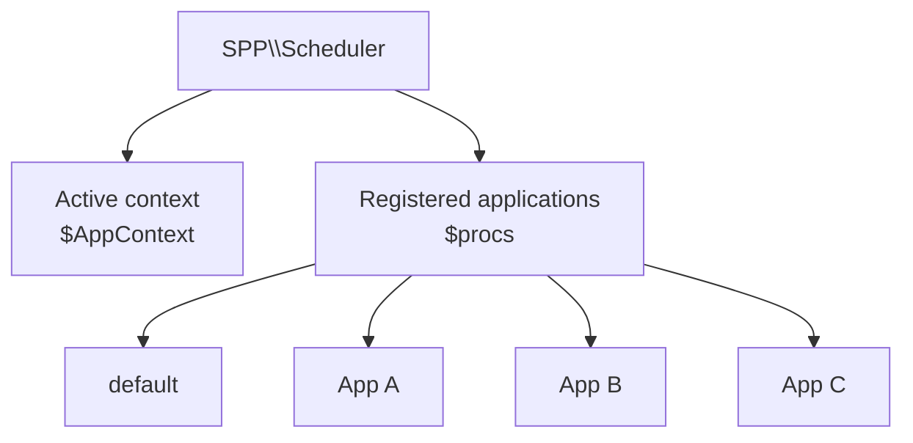
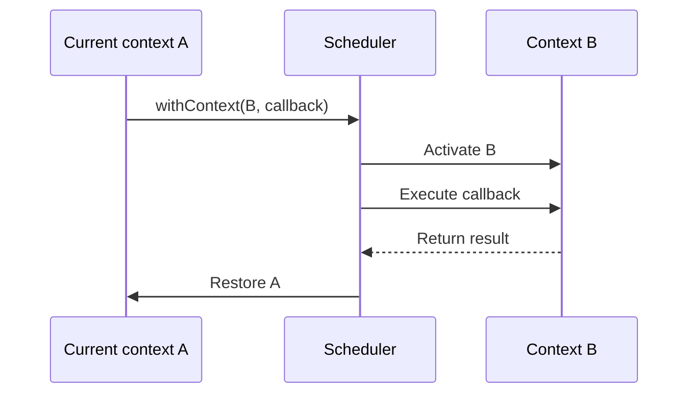

# Volume II — Kernel

## Chapter 2 — Scheduler and Application Contexts

**Evidence:** `spp/core/class.scheduler.php`, `spp/core/class.app.php`

The SPP Scheduler is a context and application-process manager. The implementation keeps a static map of registered `SPP\\App` objects and a current application context name.

## 2.1 Scheduler state

The scheduler tracks two things that matter for normal application code: the active context and the registered application objects.



The diagram is deliberately small: it shows the relationship that developers need without implying ownership of every subsystem by `Scheduler`.

The important point is that an application is represented by an `SPP\\App` object and registered through `Scheduler::regProc()`.

## 2.2 Registering an application process

`Scheduler::regProc(App $proc)` obtains the process name from `App::getName()` and stores the object in the internal process map if that name is not already present.

```php
Scheduler::regProc($app);
```

Registration is idempotent with respect to an existing process name: an already-registered name is not replaced by `regProc()`.

## 2.3 Selecting the active context

`Scheduler::setContext()` performs validation and context switching.

```mermaid
flowchart TD
    A[setContext("finance")] --> B[Normalize context]
    B --> C{Registered process?}
    C -- No --> X[Throw SPPException]
    C -- Yes --> D{Already active?}
    D -- Yes --> H[Keep active context]
    D -- No --> E[Current App -> APP_WAITING]
    E --> F[Target App -> APP_EXEC]
    F --> G[Update $AppContext]
    G --> H
```

The implementation writes an optional debug trace to `SPP_LOG_DIR/spp_context.log` when `SPP_DEBUG` is enabled.

## 2.4 Application status model

`SPP\\App` defines four status constants:

| Constant | Meaning |
|---|---|
| `APP_EXEC` | Active/executing application |
| `APP_WAITING` | Registered but not the current execution context |
| `APP_STOPPED` | Stopped application |
| `APP_ERROR` | Application in error state |

`App::setStatus()` accepts only these four values.

## 2.5 Accessing context-bound application state

The Scheduler exposes two complementary APIs:

- `getActiveProc()` — the current `SPP\\App` object.
- `getProcObj($name)` — a registered application by name.

Convenience methods such as `getModsConfDir()` delegate into the active `App` object.

## 2.6 Context-scoped execution

`Scheduler::withContext()` is a higher-level context-switching primitive. When the requested context is already active, the callback is invoked directly. Otherwise, SPP switches context, executes the callback, and restores the previous context.



This pattern is useful for code that needs to inspect or operate on another registered application without permanently changing the caller's context.

## 2.7 URI-driven context detection

`Scheduler::detectAndEnforceContext()` derives an application context from the request URI and configured application `base_url` values.

The implementation:

1. loads shared Registry state;
2. registers context-enforcement and route-resolution events;
3. normalizes the request URI;
4. reads global application settings;
5. fires `event_spp_context_enforce` with the URI, application map, and a nullable context;
6. selects the matched application or configured `base_app` fallback;
7. fires `event_spp_route_resolve`, allowing the event pipeline to influence the selected context; and
8. stores the final context in `Scheduler::$AppContext`.

This is a concrete example of SPP's event system influencing scheduler behavior.

## 2.8 Application discovery and App instances

`SPP\\App::getApp()` resolves the requested application name from the explicit parameter or the active Scheduler context. `App` maintains its own static instance map.

`App::getGlobalSettings()` loads the system configuration cache when available. Otherwise it parses `global-settings.yml` and performs dynamic application discovery by scanning `src/*/etc/app.yml`.

The discovery logic can populate application-specific `etc_path`, `src_path`, `var_path`, and `modules_path` values, normalizing relative paths under the discovered application's source tree.

## 2.9 Enterprise implications

The implemented scheduler model enables a single SPP runtime to host multiple `App` objects while maintaining a single active context. That is materially different from a conventional single-application request bootstrap.

What the source **does not** by itself prove is a general-purpose process isolation mechanism comparable to operating-system processes. The term `process` in this subsystem refers to an SPP `App` runtime object and its execution status.

## 2.10 Comparison with common frameworks

| Concern | Typical PHP MVC | SPP implementation |
|---|---|---|
| Application holder | One application object | Multiple registered `App` objects |
| Active application | Implicit/request-scoped | Explicit Scheduler context |
| Context switch API | Usually absent | `setContext()` / `withContext()` |
| Application status | Often external | `APP_EXEC`, `WAITING`, `STOPPED`, `ERROR` |
| URI-based application selection | Router-specific | Scheduler event-assisted context detection |

## Kernel Hacker note

The Scheduler is intentionally small. It does not contain the module loader, the view compiler, or the event listener implementation. Instead, it provides the **context boundary** through which those systems locate the active application.

### Source map

- `spp/core/class.scheduler.php`
- `spp/core/class.app.php`