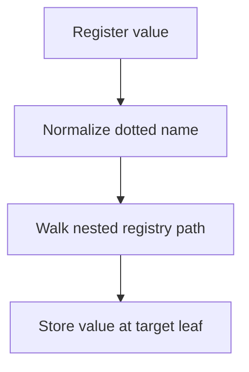
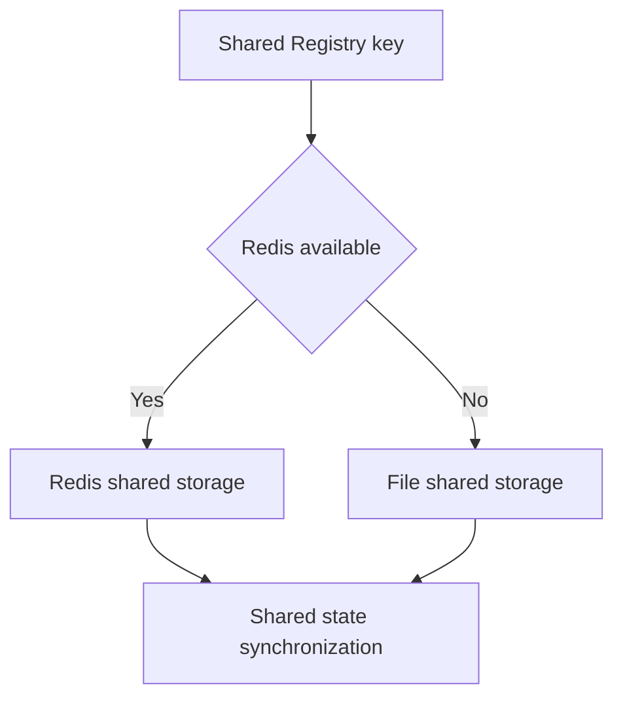
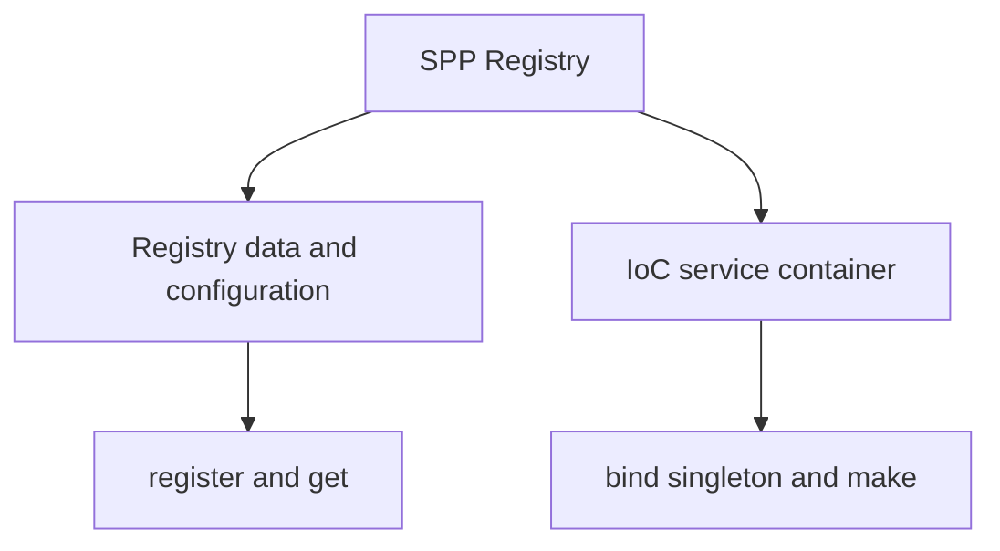
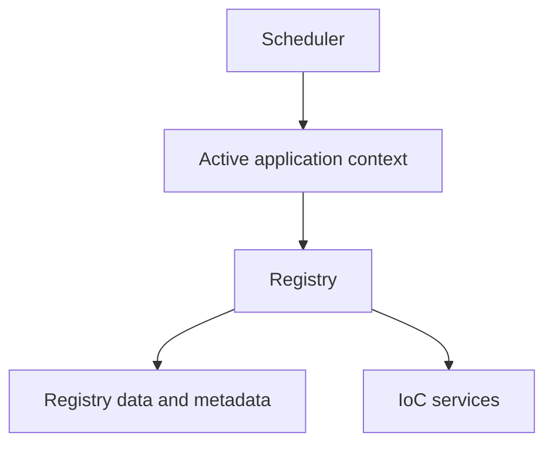

# Volume II — Kernel

## Chapter 3 — Registry and IoC Container

**Evidence:** `spp/core/class.registry.php`, `spp/core/class.container.php`

SPP's `Registry` should be understood as two related facilities exposed through one class:

1. a hierarchical runtime key/value registry; and
2. an IoC service-container facade.

They share the same access point but have different semantics.

## 3.1 Hierarchical Registry

The Registry stores values in a nested array. `register()` converts dotted names to the internal `=>` path form and walks the tree until it reaches the target leaf.

```php
register("app.database.driver", "mysql");
```

Conceptually, that path resolves as:



`get()` performs the inverse traversal and returns `false` when a path is not present. Typed convenience methods such as `getString()`, `getInt()`, `getBool()`, and `getArray()` provide default-aware casting at the boundary.

## 3.2 Registry locks

The Registry supports configuration locking. `lock($entity)` normalizes and resolves a key and records it as permanently locked for the current runtime. Subsequent modifications beneath the locked path trigger a `RuntimeException` through `checkLock()`.

This is useful for protecting runtime-critical configuration after initialization.

## 3.3 Registry metadata registries

The same hierarchical registry stores framework metadata categories such as:

- `__dirs` — directories registered under a category;
- `__classes` — classes registered under a category;
- `__functions` — functions registered under a category; and
- `__mods` — module metadata used by other runtime systems.

These are not generic examples; they are part of the Registry's actual API surface.

## 3.4 Shared registry

Keys beginning with `__shared=>` activate shared-state synchronization. The Registry lazily chooses a `SharedStorageInterface` implementation.

The current source supports Redis and file-backed shared storage:



If Redis storage is selected but fails, the implementation can downgrade to file storage during execution. The shared state is synchronized during shutdown rather than on every single write.

## 3.5 IoC container

`Registry::container()` lazily creates `SPP\Core\Container`.

The Registry exposes three direct service-container operations:

- `bind($abstract, $concrete, $shared = false)`;
- `singleton($abstract, $concrete)`; and
- `make($abstract)`.

These are separate from `Registry::register()` and `Registry::get()`. The handbook must preserve that distinction because a registry value and a service binding have different lifecycles and resolution semantics.

## 3.6 Why the separation matters



A developer can therefore store runtime metadata without turning every value into a dependency-injection service.

## 3.7 Shared state is selective

The presence of shared storage does **not** mean that the entire Registry is globally shared. Only values written beneath the `__shared` namespace participate in that storage path.

This distinction is important for multi-application and multi-process architectures because application-local Registry state remains local unless explicitly promoted to shared state.

## 3.8 Registry and Scheduler

The Scheduler determines the active `App`. The Registry provides runtime metadata and service-resolution mechanisms consumed by the active application and its modules.

The relationship is therefore:



The source does not show the Registry being a per-`App` object. The Registry is implemented as a static runtime facility with selective shared storage, so the handbook should not describe it as a separate isolated container automatically created for every application.

## 3.9 Testing guidance

The repository contains `spp/tests/core/RegistryTest.php`. The handbook will use those tests as the executable source for expected Registry behavior and will keep implementation-specific claims synchronized with them.

## Kernel Hacker note

The Registry is effectively a **dual-plane runtime service**: a hierarchical data plane and an IoC service plane. This explains why SPP code may use Registry access for both configuration-style values and service resolution while still keeping the two APIs explicit.
