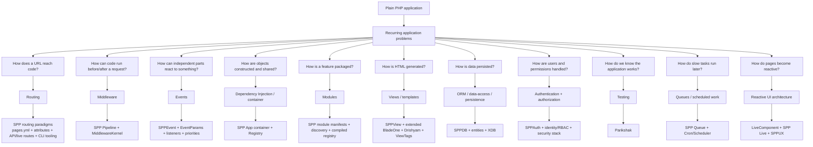
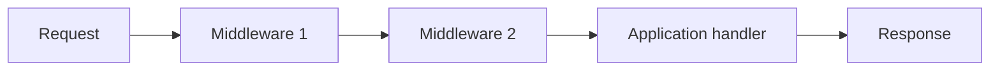
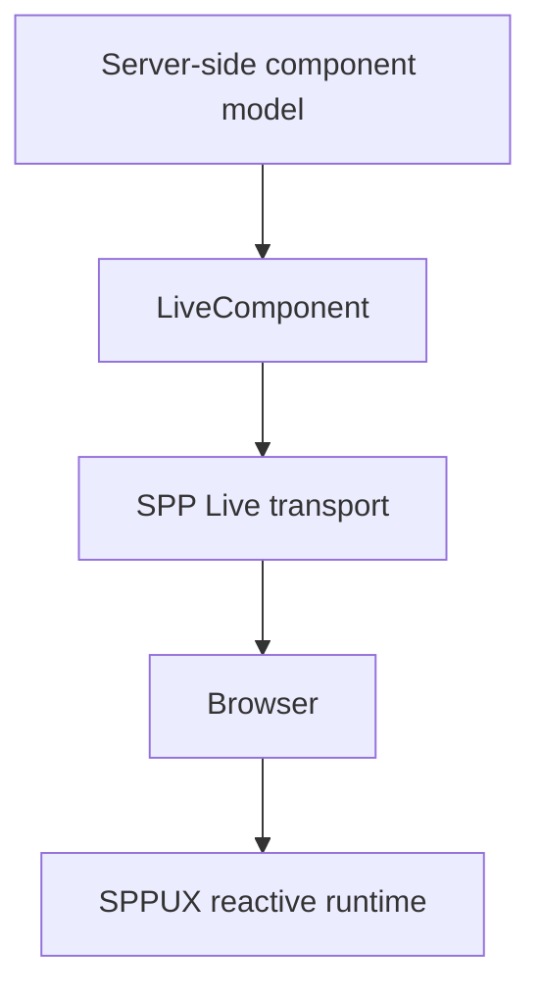

# Framework Concept → SPP Feature Map

A reader who is completely new to frameworks needs one mental model before learning dozens of framework classes:

> **A framework is a collection of reusable runtime mechanisms that solve recurring application problems.**

The useful way to learn SPP is therefore not to memorize module names. Start with the problem, learn the general framework idea, then see the SPP implementation and finally the additional capabilities SPP builds on top.

---

## The big picture



The point of this diagram is not to show every SPP class. It shows the **reasoning chain**:

**problem → general framework concept → SPP implementation → SPP extension**.

---

## 1. Routing: “Where does this request go?”

### The general problem

In plain PHP, a website can easily become a collection of files such as:

```text
index.php
about.php
users.php
profile.php
```

Very quickly you want URLs such as:

```text
/users/42
/admin/reports
/api/tasks
```

A framework therefore provides a routing mechanism.

### The common framework idea

A router answers:

> Given this request method and URL, which application code should run?

### What SPP provides

SPP does not force one routing style. The repository contains multiple paradigms, including centralized `pages.yml` page definitions, PHP attribute routing, API routing, live/reactive endpoints, and CLI/scaffold support for creating routing artifacts.

### What SPP adds

The important SPP idea is **multiple routing paradigms inside one runtime**. A page-oriented application can use page configuration, controller-oriented code can use attributes, API modules can use API routing, and reactive features can expose their own endpoints.

---

## 2. Middleware: “How can code wrap request processing?”

### The general problem

Many requests need the same cross-cutting behavior:

```text
authentication
logging
rate limiting
CSRF checks
security headers
input normalization
```

Copying that logic into every controller is a maintenance problem.

### The common framework idea

Middleware wraps request handling:



### What SPP provides

SPP has a `MiddlewareInterface`, a `Pipeline`, and a `MiddlewareKernel`.

The middleware can continue with the next layer, short-circuit the request, or post-process the result.

### What SPP adds

SPP combines middleware sources at framework, application, and route level, including YAML configuration and PHP attributes, and integrates the pipeline into the kernel request flow.

---

## 3. Events: “How can independent parts react to something?”

### The general problem

Suppose a task is created and five things may need to react:

```text
send notification
write audit record
update search index
emit analytics
trigger workflow
```

Directly calling all five services creates tight coupling.

### The common framework idea

Publish an event and let listeners subscribe.

### What SPP provides

SPP has `SPPEvent`, `EventParams`, `EventHandler`, and attribute-based listeners such as `#[On(...)]`.

### What SPP adds

The SPP event system goes beyond a basic emitter. It provides listener priorities, propagation control, before/main/after stages, event definitions, and override behavior.

That makes the event mechanism useful as both a notification mechanism and a framework extension mechanism.

---

## 4. Dependency Injection: “How should objects get their dependencies?”

### The general problem

Without a container:

```php
$service = new ReportService(new UserRepository(new Database(...)));
```

As the system grows, construction logic spreads everywhere.

### The common framework idea

The framework manages object construction and dependency resolution.

### What SPP provides

The SPP application exposes service registration and resolution through the application container, including `singleton()`, `make()`, and `call()`, while `Registry` provides the framework-wide registry mechanism.

### What SPP adds

The container is tied to application context and module/runtime behavior, so dependency management participates in the broader SPP multi-application architecture.

---

## 5. Modules: “How should features be packaged?”

### The general problem

A large application cannot remain one huge folder of unrelated classes.

### The common framework idea

Group reusable functionality into modules/packages/components.

### What SPP provides

SPP modules have manifests, dependencies, configuration, source trees, events, resources, and compiled discovery/registry behavior.

### What SPP adds

Modules participate deeply in runtime bootstrapping. They are not only a source-code organization mechanism; they can influence discovery, configuration, events, services, routes, views, and other application features.

---

## 6. Views: “How should server-side HTML be produced?”

### The general problem

Putting HTML directly inside controllers becomes difficult to maintain.

### The common framework idea

Separate application logic from presentation templates.

### What SPP provides

SPP has SPPView and a rendering stack that includes an extended BladeOne layer, ViewTags and Drishyam-related rendering infrastructure.

### What SPP adds

The rendering architecture can participate in the page/routing model, custom template syntax, resource/asset handling, validation/form rendering, and later reactive UI features.

---

## 7. Persistence: “How should data survive the request?”

### The general problem

PHP variables disappear after the request ends. Business applications need persistent data.

### The common framework idea

Provide models/entities and an abstraction over database access.

### What SPP provides

SPP contains entity/data abstractions, SPPDB, and the XDB subsystem with engines and supporting facilities such as queries, pagination, migration, indexing, validation, locking and ACL components.

### What SPP adds

The handbook treats this as a layered persistence architecture rather than a single “ORM” feature. The application can remain above the storage boundary while the XDB subsystem handles lower-level persistence concerns.

---

## 8. Authentication and security: “Who is this user and what may they do?”

### The general problem

Applications need to distinguish:

```text
who the user is
what the user is allowed to do
how requests are protected
```

### The common framework idea

Authentication + authorization + request-security mechanisms.

### What SPP provides

SPP has SPPAuth/identity and RBAC-related mechanisms, plus a separate security stack containing features such as CSRF handling, sanitization, rate limiting, throttling, and security headers.

### What SPP adds

The handbook intentionally separates **identity/authorization** from **web/request security** because they solve different problems and are implemented in different parts of the framework.

---

## 9. Testing: “How do we know the framework-based application works?”

### The general problem

Manual testing does not scale as the codebase grows.

### The common framework idea

Automated unit, integration, and application tests.

### What SPP provides

SPP includes Parikshak, with framework-aware test classes, test runners, database-refresh support, API interaction helpers, Faker support, and related testing infrastructure.

### What SPP adds

The handbook uses Parikshak continuously throughout the tutorial. Tests are not postponed to a final chapter; every major subsystem gets tested while it is learned.

---

## 10. Background work: “What should not block a web request?”

### The general problem

Some tasks are slow or can happen later:

```text
sending emails
building reports
processing imports
long-running workflows
indexing
content transfer
```

### The common framework idea

Queues and scheduled jobs.

### What SPP provides

The framework includes queue/background-job infrastructure and a Cron/Scheduler execution path.

### What SPP adds

These features connect to workflow, reporting, migration/promotion, and enterprise operations so asynchronous work is part of the larger application architecture rather than an isolated worker mechanism.

---

## 11. Reactive UI: “How can a page update without rebuilding everything manually?”

### The common framework idea

Reactive/server-driven UI and client-side reactive runtimes reduce manual AJAX/DOM code.

### What SPP provides

SPP has three related but distinct layers:



### The key SPP lesson

These layers are not interchangeable:

- **LiveComponent** manages server-side component state/lifecycle.
- **SPP Live** provides transport mechanisms.
- **SPPUX** is the browser-side reactive runtime.

This separation is one of the most important architectural ideas in the SPP handbook.

---

## 12. APIs: “How should other programs talk to my application?”

### The general problem

A web application may have browsers, mobile clients, other applications, and automated systems as clients.

### The common framework idea

REST/HTTP APIs, authentication, serialization, pagination, validation, documentation.

### What SPP provides

SPPAPI includes resources/responses, route model binding, pagination, AJAX/live actions, API authentication support and API documentation infrastructure.

### What SPP adds

API development is integrated with the same application context, middleware, modules, entities, validation, and reactive mechanisms instead of being treated as a completely separate framework.

---

## 13. Enterprise integration: “How do separate systems cooperate?”

### The common problem

Real systems are often more than one application and more than one programming language.

### The common framework idea

Use APIs, messaging, RPC, queues, adapters, or other IPC protocols.

### What SPP provides

SPP has explicit polyglot/bridge infrastructure and supports external applications as a composable architectural boundary.

### What SPP adds

The handbook teaches this as a deliberate **boundary architecture**: each application/runtime has its own lifecycle and trust boundary, and integration is performed through explicit contracts rather than assuming every application must become an SPP module.

---

## 14. CLI: “How do developers work with the framework?”

### The common framework idea

Framework CLIs usually provide:

```text
project creation
code generation
migrations
tests
cache management
server/worker operations
```

### What SPP provides

SPP has a broad command surface and an interactive SPP command mode in addition to one-shot commands and generators.

### What SPP adds

The CLI becomes part of the learning architecture. A developer can generate an application or feature, inspect the generated artifact, then learn how the runtime consumes that artifact.

---

## 15. What makes SPP “SPP” rather than just another MVC framework?

The strongest answer is not one class or one feature.

It is the **composition** of many runtime systems:

```mermaid
flowchart TD
    A[SPP Runtime]
    A --> B[Application contexts]
    A --> C[Middleware]
    A --> D[Events]
    A --> E[Modules]
    A --> F[Registry / DI]
    A --> G[Routing paradigms]
    A --> H[SPPView / rendering]
    A --> I[SPPDB / XDB]
    A --> J[Auth / security]
    A --> K[Parikshak]
    A --> L[Workflow]
    A --> M[Queue / Cron]
    A --> N[LiveComponent]
    A --> O[SPP Live]
    A --> P[SPPUX]
    A --> Q[API]
    A --> R[Polyglot / IPC]
    A --> S[Migration / promotion]
    A --> T[Observability]
```



The handbook should therefore resist the temptation to summarize SPP with a single label such as “MVC framework” or “PHP framework”.

A more useful mental model is:

> **SPP is an application runtime and framework platform that contains MVC-style application patterns and extends them with middleware, events, modular runtime composition, multiple routing paradigms, persistence, testing, workflow, reactive UI, transport, polyglot integration, and enterprise operations.**

That sentence is a conceptual summary, not a claim that every application must use every subsystem.

---

## 16. How to use this map while reading the handbook

Whenever you encounter a new SPP feature, ask five questions:

1. **What recurring problem does this solve?**
2. **What is the general framework concept behind it?**
3. **How does SPP implement that concept?**
4. **What does SPP add beyond the common framework model?**
5. **Where is the implementation in the repository?**

If you can answer those five questions, you understand the feature rather than merely knowing its API.

---

## 17. The learner's progression

The recommended progression is:

```mermaid
flowchart LR
    A[Learn the problem] --> B[Learn the general framework idea]
    B --> C[Build it in plain PHP]
    C --> D[Build it using SPP]
    D --> E[Test with Parikshak]
    E --> F[Break it deliberately]
    F --> G[Diagnose it]
    G --> H[Trace the SPP source]
    H --> I[Compare with another framework]
    I --> J[Understand when not to use it]
```



This is the standard that the rest of the handbook should follow.
