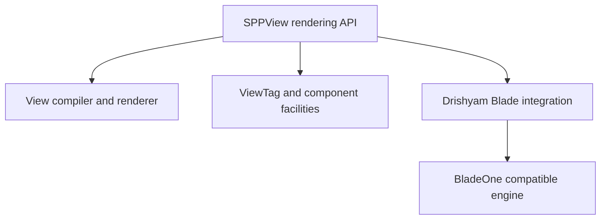
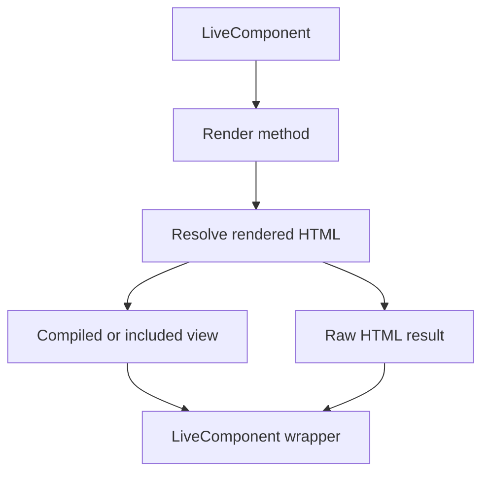

# Volume V — SPPView

## Chapter 6 — SPPView, Extended BladeOne, and Drishyam Integration

**Evidence:** `spp/modules/spp/sppview/`, `spp/modules/spp/drishyam/`, especially `class.viewcompiler.php`, `class.viewrenderer.php`, `class.viewtag.php`, `class.sppblade.php`, `class.templatemacros.php`, `class.phpcomponent.php`, view/form classes, and module manifests.

SPP's presentation subsystem is larger than a template compiler. It contains view compilation, view location/routing, rendering, ViewTags, component helpers, forms, validators, asset management, and Drishyam's extended Blade integration.

## 6.1 SPPView is the framework-facing presentation layer

The `sppview` module includes dedicated classes for:

- view compilation;
- view rendering;
- view location;
- view routing/pages;
- ViewTags;
- PHP components;
- assets;
- forms and form dispatch;
- validation;
- AJAX request/response support;
- HTML blocks/tables; and
- LiveComponent rendering.

The handbook therefore uses **SPPView** to describe this framework-facing layer, not merely Blade syntax.

## 6.2 Extended Blade integration is implemented in Drishyam

`spp/modules/spp/drishyam/class.sppblade.php` wraps the Blade engine and registers SPP-specific directives and rendering behavior.

The source registers directives including examples such as:

- `@checked`, `@selected`, `@disabled`, `@readonly`, `@required`;
- `@js`;
- `@props`;
- `@sppbind`;
- `@react`;
- `@vue`;
- `@sppux`;
- `@spppartial`;
- `@url`;
- `@sppoffline` / `@endsppoffline`; and
- framework/domain helpers such as `@load_node` and `@load_page`.

The exact directive set is implementation-defined and must be read from the current `SPPBlade` initializer rather than inferred from generic Blade documentation.

## 6.3 BladeOne is an implementation dependency, not the public architecture name

The code demonstrates that SPP extends a BladeOne-compatible engine with framework-specific directives and resolution behavior. The important relationship is:

This is why describing SPP as "just BladeOne" is incomplete.

## 6.4 View compilation and rendering

The repository contains `class.viewcompiler.php` and `class.viewrenderer.php`. LiveComponent rendering also delegates file-backed view rendering through `ViewCompiler::compile()` for `.html` content and can include PHP/Blade-backed files directly after resolving the component's render result.

The rendering pipeline is therefore a mixture of compilation, execution, and framework metadata injection.

## 6.5 ViewTags

`class.viewtag.php` is a dedicated framework parser/processor. Its presence should be documented as its own SPP feature rather than folded into generic Blade syntax.

Before asserting a specific grammar, every ViewTag feature in this handbook will be taken from the ViewTag implementation and its examples/tests. The earlier chat-only claim that SPP uses a general AST compiler with a particular token structure is intentionally not promoted here without source evidence.

## 6.6 Forms and validation

The `sppview` module contains a substantial form subsystem:

- `class.form.php`;
- `class.forms.php`;
- `class.viewform.php`;
- `class.viewformbuilder.php`;
- `class.viewformdispatcher.php`;
- `class.viewformtheme.php`;
- form element classes; and
- `sppvalidator/` with single/multiple validators and validation result objects.

This will become a dedicated tutorial and reference section because SPP form handling is not merely HTML helper code.

## 6.7 Asset management

The source contains `class.viewassetmanager.php` and `class.assetorchestrator.php`. These should be documented as concrete asset-management infrastructure. The handbook will not claim a particular bundling algorithm until those implementations have been fully audited.

## 6.8 SPPView and LiveComponent

`LiveComponent::renderComponent()` invokes the component lifecycle, resolves rendered HTML, and wraps the output with the framework's LiveComponent wrapper. File-backed render results may be compiled or included depending on file type.

That creates a direct bridge:

## 6.9 What this means architecturally

SPP has an integrated presentation stack rather than a single templating primitive. A production application can combine server views, PHP components, ViewTags, forms, validation, LiveComponents, Drishyam/Blade directives, and SPPUX bindings.

The handbook will document each layer separately and then provide an integration chapter showing how they compose.

## 6.10 Comparison

| Layer | Laravel Blade | SPP |
|---|---|---|
| Template compiler | Blade | BladeOne-compatible engine + SPP extensions |
| Framework view API | View | SPPView classes |
| Declarative tag layer | Components/Blade | ViewTag subsystem |
| Form system | External packages/common helpers | Native SPPView form classes |
| Asset subsystem | Vite/etc. | Native view asset classes also present |
| Live server UI | Livewire | LiveComponent + SPP Live |
| Client runtime | External JS stack | SPPUX runtime available |

The table is a conceptual mapping, not a claim that feature sets are identical.
