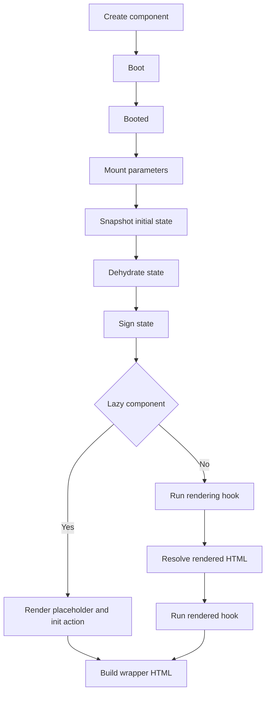

# Volume VI — LiveComponent

## Chapter 7 — LiveComponent: Server-Side Reactive Components

**Evidence:** `spp/modules/spp/sppview/class.livecomponent.php`, `spp/modules/spp/sppview/Attributes/`, `spp/core/attributes/Computed.php`, `spp/core/attributes/On.php`, `spp/modules/spp/spplive/`, LiveComponent tests.

SPP's LiveComponent implementation is a PHP stateful-component runtime integrated with SPPView and SPP Live transport infrastructure. It exposes a component object, server-side public state, lifecycle methods, computed values, event dispatch, streaming, downloads, validation traits, URL/session attributes, and client-facing wire metadata.

## 7.1 Component identity

A LiveComponent instance has an `id`, supplied by the constructor or generated with a `live_` prefix. The initial render path creates a component instance and wraps its HTML with the framework's LiveComponent wrapper.

## 7.2 Initial render lifecycle

The implementation of `LiveComponent::renderComponent()` executes this sequence:



This is the source-backed lifecycle for the initial render path. Earlier generic descriptions of methods such as `hydrate()` or `dehydrate()` should not be assumed to imply a different lifecycle order without checking the current implementation.

## 7.3 Lifecycle API actually present

The base class defines the following overridable methods:

- `boot()`;
- `booted()`;
- `mount(array $params = [])`;
- `updating(string $name, mixed $value)`;
- `updated(string $name, mixed $value)`;
- `rendering()`;
- `rendered(string $html)`;
- `exception(Throwable $e, Closure $stopPropagation)`; and
- `render()` (abstract).

The class also provides `hydrate(array $state)` and `dehydrate(): array`, with `snapshotInitialState()` as an internal state snapshot facility.

## 7.4 Public-state hydration

The current implementation deliberately restores **public properties only** in `hydrate()`:

```text
incoming state
      │
      ▼
property exists?
      │
      ▼
ReflectionProperty
      │
      ├── public → assign
      └── protected/private → ignore
```

This is a concrete safety boundary in the base implementation. It is not accurate to claim that all server-side state is serialized.

## 7.5 Dehydration

`dehydrate()` uses reflection to enumerate public properties and excludes specific derived/runtime values, including:

- computed properties discovered through the parsed attribute metadata;
- the `errors` property.

It also persists properties marked with the `#[Session]` attribute into PHP session storage using a class/property-derived session key.

The resulting array is suitable for JSON serialization.

## 7.6 Session and URL state

The `mount()` implementation recognizes both older property-based query-string conventions and modern attributes:

- `#[Url]` in `SPPMod\SPPView\Attributes` for URL-bound properties;
- `#[Session]` in `SPP\Attributes` for session-backed properties.

During mount, query-string/session state is loaded first, and explicitly passed mount parameters have the highest priority.

## 7.7 Computed properties

The component supports computed values through attribute metadata and a compatibility path for Livewire-style `get{Name}Property()` methods.

`__get()` checks the computed cache first. For a method registered as a computed property, the value is calculated and cached. `forgetComputed()` clears either selected computed values or the entire computed cache.

The current source therefore implements **memoized computed properties**, but the handbook will not describe a general dependency graph or automatic reactive invalidation algorithm unless supported by additional inspected code.

## 7.8 Attributes

The inspected attribute set includes:

| Attribute | Role |
|---|---|
| `Computed` | computed state metadata |
| `Session` | session-backed public property |
| `On` | event listener metadata |
| `Validate` | property validation metadata |
| `Url` | URL/query-string binding |
| `Lazy` | deferred initial component rendering |
| `Isolate` | isolated component rendering behavior |
| `Middleware` | class/method middleware metadata |
| `Renderless` | method-level render suppression metadata |
| `AllowGuest` | guest access metadata |
| `Route` | route metadata |
| `Title` | component title metadata |

Not every attribute belongs to the same namespace. The handbook will preserve the namespace distinction in the reference pages.

## 7.9 Event dispatch

`LiveComponent::dispatch()` creates a fluent `EventDispatch` object containing the source component id, event name, and parameters. The source documents target-oriented chaining such as `.to(...)` and `.self()`.

The older `emit()`, `emitUp()`, and `emitTo()` methods remain as deprecated compatibility APIs.

This is an important distinction: **LiveComponent dispatch is a UI/reactive API layered over the SPP Live runtime**, not evidence that every component event is automatically a kernel `SPPEvent`.

## 7.10 Streaming

`LiveComponent::stream()` queues a streaming payload with:

- target name;
- content; and
- append/replace behavior.

The source explicitly identifies streaming as useful for progressive output such as LLM text generation and live feeds.

## 7.11 Downloads

`download()` stores a URL and filename for reactive frontend download handling.

## 7.12 Reset utilities

The base component stores its initial public-property values and provides:

- `reset()`;
- `resetExcept()`;
- `pull()`; and
- `only()`.

These are deterministic state utilities useful for forms and workflow components.

## 7.13 Lazy and isolated rendering

`#[Lazy]` is recognized during initial rendering. A lazy component can provide its own `placeholder()`. Otherwise SPP uses the framework's `livecomponent_placeholder.php` template. The wrapper is initialized with a `wire:init` action.

`#[Isolate]` is surfaced through `isIsolated()` and the render wrapper marks the component with an isolation attribute.

## 7.14 Render resolution

The `render()` method may return raw HTML or a file path. `resolveRenderedHtml()` recognizes `.html`, `.php`, and `.blade.php` results. For `.html`, it calls `ViewCompiler::compile()`; for PHP/Blade-backed results it includes the corresponding file after extracting dehydrated public state and computed properties.

This establishes a concrete bridge between LiveComponent and SPPView.

## 7.15 Security boundary

The source explicitly signs initial component state and sends only dehydrated public state to the client-facing wrapper. The implementation contains state-signing helpers and HMAC-based checksum handling; the handbook will document the exact algorithm from those methods rather than reducing it to a generic "checksum" claim.

## 7.16 Comparison

| Concern | SPP LiveComponent | Laravel Livewire |
|---|---|---|
| PHP server component | Yes | Yes |
| Public-property hydration | Yes | Yes |
| Computed values | Yes | Yes |
| `#[On]` style listeners | Yes | Conceptually similar |
| URL/session attributes | Yes | Available by different APIs |
| Lazy component | `#[Lazy]` | Supported by Livewire |
| Streaming | `stream()` | Supported by Livewire versions |
| Multiple transport engines | Yes, through SPP Live | Primarily Livewire transport |
| SPPView integration | Native | Laravel Blade ecosystem |

These are architectural comparisons, not claims of API equivalence.

## Kernel Hacker note

The base class is best understood as the **component state machine and server-side API**, while transport and browser behavior live in the separate SPP Live and JavaScript layers. This separation is what allows SPP to provide multiple transport engines without rewriting the component model.
