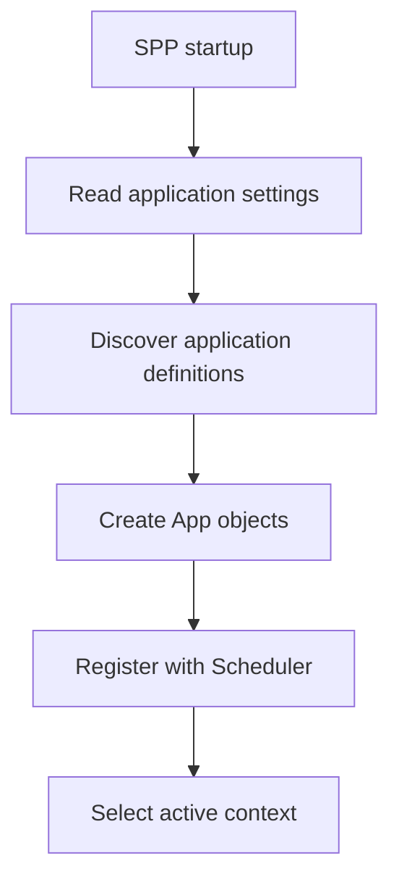
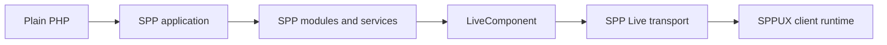

# Volume IX — Building Applications

## Chapter 12 — Your First SPP Application

**Evidence:** `documentation/framework/application-development.md`, `documentation/framework/booting-and-app-loading.md`, `spp/commands/MakeAppCommand.php`, `spp/core/class.app.php`, `spp/core/class.scheduler.php`.

This chapter is for a developer who has **never used SPP before**.

The goal is not to teach a fictional "Hello World" API. It is to teach the real SPP mental model and then build an application using the same concepts that production SPP applications use.

---

## 12.1 First, forget the usual framework mental model

In many PHP frameworks, the first idea is:

> "I have one application, and a request enters that application."

SPP starts from a slightly different model:

> "The runtime can host multiple named applications, and the Scheduler selects the active application context."

That distinction explains several SPP concepts that otherwise look unusual.

| SPP concept | What it means | Beginner interpretation |
|---|---|---|
| Scheduler | Chooses the active application context | "Which application am I running?" |
| App | Runtime representation of one application | "My application object" |
| Registry | Runtime data + service-container access | "Framework-wide runtime toolbox" |
| Module | Reusable feature unit | "A framework-recognized feature package" |
| Event system | Hook/dispatch mechanism | "Tell other code that something happened" |
| SPPView | Presentation layer | "How my application produces UI" |
| LiveComponent | Server-side reactive component | "A stateful PHP UI component" |
| SPP Live | Live transport/runtime engines | "How the browser talks to live components" |
| SPPUX | Client-side reactive runtime | "JavaScript-side state and UI runtime" |

You do not need to understand all of these on day one. The handbook introduces them in layers.

---

## 12.2 What an SPP application looks like on disk

The repository documentation supports a self-contained application layout such as:

```text
src/myapp/
  etc/
    app.yml
    settings.yml
    middleware.yml
    modules.yml
    entities/
    forms/
    pages/
    modsconf/

  init.php
  MyappApp.php

  events/
  modules/
  resources/
    views/
    themes/
    js/
    css/

  serv/
  services/
  commands/
  tests/
  var/
```

There is also a supported split-layout style in which application configuration lives under `etc/apps/myapp` while application source lives under `src/myapp`.

For a new project, the self-contained layout is easier to understand because the application is visibly one unit.

---

## 12.3 The file that makes the application discoverable

The central application definition is `etc/app.yml` inside the application source tree for the self-contained layout.

A minimal example from the repository's application-development guidance is:

```yaml
base_url: /myapp
table_prefix: myapp_
shared_group: core
etc_path: etc
src_path: src/myapp
modules_path: modules
var_path: var
app_init: init.php
```

The exact meaning of the important fields is:

| Field | Meaning |
|---|---|
| `base_url` | URL prefix used to identify the application context |
| `etc_path` | Application configuration directory |
| `src_path` | Application source directory |
| `modules_path` | Application-local module directory |
| `var_path` | Application runtime data/cache area |
| `app_init` | Application initialization file |

You do not have to specify every possible path key when starting. SPP resolves the application paths from its configuration model.

---

## 12.4 How SPP discovers the application

At startup, `App::getGlobalSettings()` can discover applications by scanning application definitions under the configured application source tree. The application-development guide documents the `src/*/etc/app.yml` convention.

At a high level:



The important beginner takeaway is that **`app.yml` describes the application to the runtime**. It is not merely documentation.

---

## 12.5 The Scheduler: answering "which app am I in?"

Once an application exists, SPP needs a current application context.

The Scheduler provides that boundary.

```php
$context = \SPP\Scheduler::getContext();
```

The active application object can be obtained with:

```php
$app = \SPP\App::getApp();
```

This pair of calls is useful when learning SPP because they answer two different questions:

- **What is the active application name?** → `Scheduler::getContext()`
- **What is the active application object?** → `App::getApp()`

The distinction becomes important once one SPP runtime hosts more than one application.

---

## 12.6 Why application context matters

Imagine one SPP deployment hosting:

```text
/myapp
/admin
/reporting
```

These can represent different SPP applications or application contexts rather than three unrelated installations.

The Scheduler can switch context explicitly through `setContext()` and can temporarily execute work in another context through `withContext()`.

That does **not** mean the applications are operating-system processes. The term "process" in SPP's Scheduler refers to registered `App` runtime objects.

---

## 12.7 Create the smallest useful application

For the first tutorial, use this structure:

```text
src/myapp/
  etc/app.yml
  init.php
  resources/views/
  serv/
  services/
  tests/
  var/
```

Create `src/myapp/etc/app.yml`:

```yaml
base_url: /myapp
table_prefix: myapp_
shared_group: core
etc_path: etc
src_path: src/myapp
modules_path: modules
var_path: var
app_init: init.php
```

Create `src/myapp/init.php`:

```php
<?php
// Application-specific lightweight bootstrap code.
```

At this point the application has an identity and a place in the SPP runtime model, even though it contains no business feature yet.

---

## 12.8 Add application business logic as a service

Do not put all business logic into the application class.

The repository's application-development guide recommends using services for reusable business logic, orchestration, integrations, and workflows.

Create:

```text
src/myapp/services/SiteService.php
```

Example:

```php
<?php

namespace App\Myapp\Services;

class SiteService
{
    public function title(): string
    {
        return 'My App';
    }
}
```

The important architectural lesson is not the method itself. It is the separation:

```text
Application
    └── Service
         └── Business behavior
```

The application class is a runtime boundary; the service is a business-code boundary.

---

## 12.9 Resolve the service through SPP

The application-development guide demonstrates resolving services through the application container:

```php
$service = \SPP\App::getApp()->make(
    \App\Myapp\Services\SiteService::class
);

echo $service->title();
```

This is where the Registry/IoC architecture becomes useful to an application developer.

You do not manually construct every dependency everywhere. You ask the application's runtime to resolve a service.

The deeper container mechanics are documented in [Chapter 3 — Registry and IoC Container](03-registry-and-container.md).

---

## 12.10 Add a request-facing class

The repository commonly uses `serv/` for request-facing handlers/controllers.

For example:

```text
src/myapp/serv/HomeController.php
```

A simple class can call the service layer:

```php
<?php

namespace App\Myapp\Serv;

use App\Myapp\Services\SiteService;

class HomeController
{
    public function index(SiteService $site): string
    {
        return '<h1>' . htmlspecialchars(
            $site->title(),
            ENT_QUOTES,
            'UTF-8'
        ) . '</h1>';
    }
}
```

The application container can resolve class-typed parameters when the method is invoked through the app's `call()` helper:

```php
$app = \SPP\App::getApp();

$html = $app->call([
    \App\Myapp\Serv\HomeController::class,
    'index',
]);
```

This is a useful SPP pattern:

```text
Request-facing class
        ↓
Application service
        ↓
Business logic
```

The layers are not mandatory for a tiny script, but the separation becomes valuable as the application grows.

---

## 12.11 Add a view

SPP's presentation subsystem is larger than one template engine. SPPView includes view compilation/rendering, ViewTags, PHP components, forms, validation, assets, and LiveComponent integration.

For the first tutorial, keep the view simple:

```text
src/myapp/resources/views/home.blade.php
```

For example:

```blade
<!doctype html>
<html lang="en">
<head>
    <meta charset="utf-8">
    <title>{{ $title }}</title>
</head>
<body>
    <h1>{{ $title }}</h1>
</body>
</html>
```

At this point it is useful to remember that Blade syntax is only one layer of the SPP presentation stack. The framework-facing layer is documented in [Chapter 6 — SPPView, Extended BladeOne, and Drishyam](06-sppview-and-bladeone.md).

---

## 12.12 Plain PHP first, framework second

For learning purposes, implement the same behavior once without SPP.

### Plain PHP version

```php
<?php

title = 'My App';

echo '<h1>' . htmlspecialchars($title, ENT_QUOTES, 'UTF-8') . '</h1>';
```

The point of this exercise is not to prove that SPP is always shorter. It is to make the framework responsibilities visible.

In plain PHP, you must decide yourself:

- where configuration is stored;
- how application context is selected;
- how services are constructed;
- how routing is organized;
- how templates are located;
- how middleware is applied;
- how events are discovered;
- how reusable modules are loaded; and
- how live UI behavior is transported.

SPP provides infrastructure for those concerns.

---

## 12.13 Then use the SPP runtime

The same simple page now has explicit framework roles:

| Responsibility | SPP layer |
|---|---|
| Application identity | `App` + `app.yml` |
| Active context | `Scheduler` |
| Service resolution | Application/Registry container |
| Feature packaging | Modules |
| Cross-cutting hooks | Events + middleware |
| Rendering | SPPView / rendering modules |
| Reactive server UI | LiveComponent |
| Live transport | SPP Live |
| Client reactive UI | SPPUX |

The benefit is not that every application needs every subsystem. The benefit is that the same architectural pieces are available when the application grows.

---

## 12.14 Where modules enter the picture

Once the application has real features, feature boundaries should not all become giant application folders.

SPP modules provide a framework-recognized unit containing things such as:

- manifest metadata;
- dependencies;
- configuration;
- included files;
- services;
- events; and
- other module contributions.

Application-local modules can live under the application's `modules` directory. Reusable framework modules live in the framework module tree.

Read [Chapter 5 — Module Discovery, Manifests, and Compiled Registry](05-modules-and-manifests.md) before building a large module.

---

## 12.15 When LiveComponent should enter the application

Do **not** make every page a LiveComponent.

Start with normal server rendering and introduce LiveComponent where the UI contains a meaningful interactive stateful region, such as:

- a filterable table;
- a multi-step form;
- a progress display;
- a live search box;
- an interactive dashboard widget.

The implementation provides explicit lifecycle methods, public state hydration/dehydration, computed values, event dispatch, lazy/isolated rendering, streaming, and validation support.

That makes LiveComponent an evolutionary step rather than a replacement for the entire SPPView stack.

---

## 12.16 When SPPUX should enter the application

SPPUX is a **client-side runtime**. It is not the same thing as LiveComponent.

Use SPPUX when a region benefits from local browser-side reactivity, scheduling, templates, event delegation, or DOM reconciliation.

The distinction is fundamental:

```text
LiveComponent
    PHP / server state

SPPUX
    JavaScript / client state
```

The two can be integrated through the SPPUX bridge/live environment, but they remain separate runtimes.

---

## 12.17 The application you will build through this handbook

The full tutorial will use one realistic application and evolve it in stages:



The purpose is not to turn the final application into the most complicated architecture possible. At every stage, the handbook will ask:

> What problem does this layer solve, and do we actually need it?

That question is especially important in enterprise systems, where architecture should reduce operational risk rather than increase abstraction for its own sake.

---

## 12.18 What to learn next

After understanding this chapter, read the chapters in this order:

1. [Scheduler and application contexts](02-kernel-scheduler.md)
2. [Registry and IoC container](03-registry-and-container.md)
3. [Events and EventHandler](04-events-and-event-handlers.md)
4. [Modules and manifests](05-modules-and-manifests.md)
5. [SPPView and BladeOne integration](06-sppview-and-bladeone.md)
6. [LiveComponent](07-livecomponent.md)
7. [SPP Live transports](08-spp-live-transports.md)
8. [SPPUX](09-sppux-runtime.md)

After those, the enterprise integration and total-nerd tracks become much easier to follow.

---

## Kernel Hacker note

The important architectural lesson from the first application is the **direction of dependency**:

```text
Application context
       ↓
Framework runtime services
       ↓
Application services
       ↓
Request-facing code / components
       ↓
Presentation
```

The application should consume framework facilities; framework internals should not become accidental business-logic repositories.

### Source map

- `documentation/framework/application-development.md`
- `documentation/framework/booting-and-app-loading.md`
- `spp/commands/MakeAppCommand.php`
- `spp/core/class.app.php`
- `spp/core/class.scheduler.php`
- `spp/core/class.container.php`
