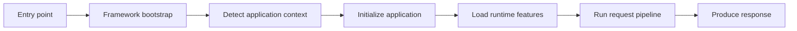
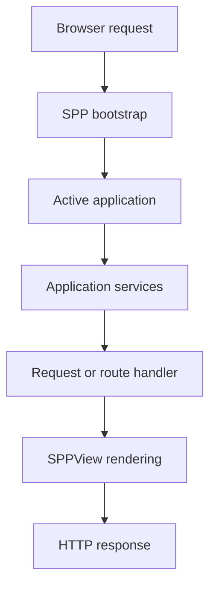
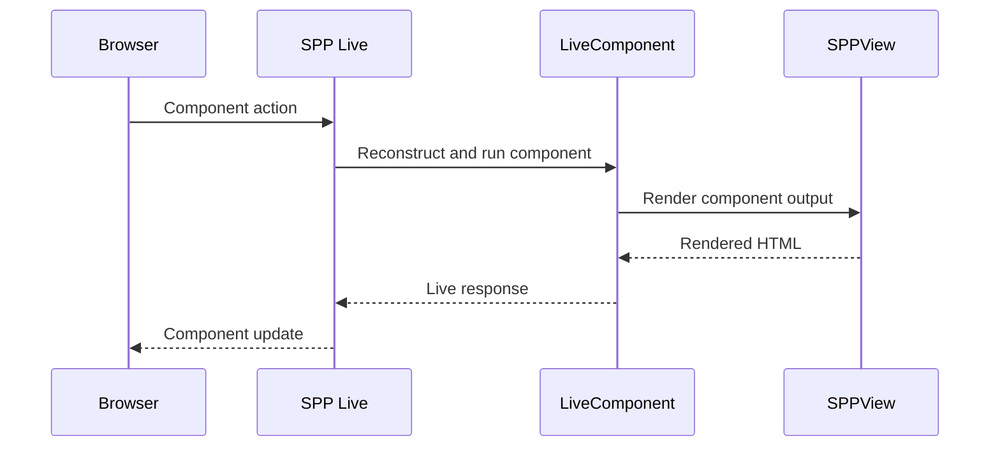
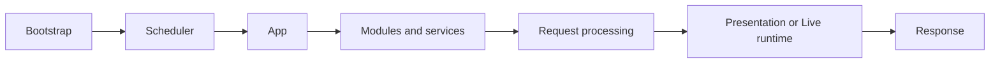

# Volume IX — Building Applications

## Chapter 13 — What Happens to a Request?

**Evidence:** `documentation/framework/booting-and-app-loading.md`, `spp/sppinit.php`, `spp/core/class.scheduler.php`, `spp/core/class.app.php`, `spp/core/class.module.php`, `spp/core/class.sppevent.php`, `spp/core/class.middlewarekernel.php`, `spp/core/class.pipeline.php`, and the corresponding application/runtime tests.

This chapter answers the question every new SPP developer eventually asks:

> **"I opened a URL. What exactly happened inside SPP?"**

The answer matters because SPP is not a single controller function. A request passes through bootstrap, application-context selection, application initialization, modules, middleware, routing/rendering code, and finally the response path.

The exact path can vary by entry point and application, but the major runtime stages are consistent.

---

## 13.1 The mental model

Think of an SPP request as a series of gates:



Each gate prepares information required by the next one.

A beginner should **not** interpret this as one PHP function with seven lines. It is a conceptual map of several cooperating classes.

---

## 13.2 Stage 1 — The entry file

An HTTP request normally begins in a PHP entry point such as an `index.php`, an API entry point, or an application-specific entry file.

The entry file eventually includes:

```text
spp/sppinit.php
```

The important architectural fact is that the entry file is **not** responsible for rebuilding the entire framework itself. It delegates framework initialization to the common bootstrap.

---

## 13.3 Stage 2 — Framework bootstrap

`spp/sppinit.php` performs early runtime setup.

The repository's boot documentation identifies responsibilities including:

- framework constants;
- Composer autoloading;
- SPP autoloaders and compatibility aliases;
- debug/error handling;
- session preparation;
- application-context detection;
- application creation; and
- runtime helper/event setup.

This explains why application code can use framework classes without every entry file manually requiring each class.

---

## 13.4 Stage 3 — Choose the application context

The Scheduler must know which application should handle the request.

A simplified example:

```text
Request URI: /myapp/admin/users

Configured apps:
  myapp       base_url = /myapp
  reporting   base_url = /reports

Selected context:
  myapp
```

The actual scheduler logic is more involved: it normalizes the URI, loads application configuration, can use the context-enforcement and route-resolution events, and stores the resulting context in the Scheduler.

The public API is:

```php
$context = \SPP\Scheduler::getContext();
```

and the active application object is:

```php
$app = \SPP\App::getApp();
```

See [Chapter 2 — Scheduler and Application Contexts](02-kernel-scheduler.md) for the complete context model.

---

## 13.5 Stage 4 — Create the application object

Once the context is known, SPP chooses the application class.

The boot documentation describes the following principle:

1. a specialized application type may select a specialized class;
2. a custom application class may be used when one exists; otherwise
3. the base `SPP\App` class is used.

This lets an application remain simple while still allowing advanced applications to provide their own `App` subclass.

For a beginner, the important point is:

> **The application object is the runtime representation of the selected application.**

It holds application configuration, paths, container access, status, and initialization behavior.

---

## 13.6 Stage 5 — Initialize application paths and services

The application resolves paths such as:

```text
configuration
source
modules
runtime data
logs
cache
temporary files
```

It also creates the application container and registers the application with the Scheduler at the appropriate initialization level.

That means this code:

```php
$app = \SPP\App::getApp();
```

is not merely returning a global configuration array. It returns a runtime object whose directories and service-resolution facilities have already been prepared according to the application lifecycle.

---

## 13.7 Stage 6 — Application initialization events

SPP's event system participates in application startup.

The boot documentation identifies `event_spp_app_init` as part of application initialization.

This is an important design point:

> SPP can extend framework lifecycle stages without editing the core bootstrap path directly.

A module can therefore observe a lifecycle event rather than patching `sppinit.php`.

The complete mechanics of listener discovery, priority, event definitions, overrides, and propagation are documented in [Chapter 4 — Events, EventHandler, and SPPEvent](04-events-and-event-handlers.md).

---

## 13.8 Stage 7 — Module loading

The application then enters the module layer.

A module can contribute framework functionality, configuration, services, event listeners, views, and other runtime metadata depending on the module implementation.

SPP's module system is not simply "include every PHP file in a directory". The framework reads module metadata, discovers active modules, resolves dependencies, and builds a compiled module registry.

See [Chapter 5 — Module Discovery, Manifests, and Compiled Registry](05-modules-and-manifests.md).

---

## 13.9 Stage 8 — Middleware and request processing

The repository contains a `MiddlewareKernel`, middleware contracts, and concrete middleware implementations.

Middleware belongs to the request-processing layer. It is useful for concerns that should happen around many requests, such as:

- authentication-related checks;
- CSRF protection;
- throttling/rate limiting;
- security headers; and
- request/audit context.

The important distinction is:

| Concern | Typical SPP layer |
|---|---|
| Application selection | Scheduler |
| Application lifecycle | App |
| Feature activation | Modules |
| Request cross-cutting behavior | Middleware |
| Event interception | SPPEvent / EventHandler |
| View rendering | SPPView and related modules |

This prevents developers from putting middleware responsibilities into controllers or view code.

---

## 13.10 Stage 9 — Route/page/rendering work

The exact next stage depends on the entry point and application architecture.

An HTTP request may reach a route, page configuration, service, controller, renderer, API handler, or a LiveComponent path.

This is why the handbook does not present one universal controller pipeline for all SPP applications.

For normal server rendering, SPPView-related classes handle view location, compilation, and rendering.

For LiveComponent requests, the LiveComponent and SPP Live subsystems become involved.

For SPPUX interactions, client-side runtime code may participate after the initial page has been delivered.

---

## 13.11 A normal server-rendered page

A simplified request path is:



This is intentionally simpler than the complete boot sequence. It is the mental model to keep in your head while learning the framework.

---

## 13.12 A LiveComponent interaction

Once a page contains a LiveComponent, the interaction path changes.

Conceptually:



The exact transport can vary because SPP Live has multiple engine implementations.

The important architectural boundary is that **LiveComponent remains a PHP component model while the transport is handled separately by SPP Live**.

---

## 13.13 Why the separation exists

Without a transport abstraction, component code would have to know whether the deployment uses AJAX, SSE, WebSocket, or another live engine.

Instead:

```text
LiveComponent
     |
     v
SPP Live abstraction
     |
     +--> AJAX fallback
     +--> SSE path
     +--> WebSocket path
     +--> Redis/SQLite-backed engines
```

This is one of SPP's most important runtime boundaries.

---

## 13.14 What happens after your PHP method returns?

The request is not complete merely because a controller or component method returned a value.

Depending on the path, SPP may still need to:

- render a view;
- serialize LiveComponent state;
- produce a live response;
- execute response-related hooks;
- flush streamed information; or
- finish output handling.

Therefore, a good debugging question is not merely:

> "Did my method run?"

Ask instead:

> "Which runtime stage ran after my method returned?"

That question frequently leads directly to the responsible subsystem.

---

## 13.15 A practical debugging map

When something goes wrong, start with the layer that owns the behavior.

| Symptom | First place to inspect |
|---|---|
| Wrong application handles URL | Scheduler/context detection |
| App configuration not found | App path/config resolution |
| Module not active | Module registry/compiler |
| Service cannot be resolved | App/Registry container |
| Event handler never runs | SPPEvent boot/discovery/listener registration |
| Request denied | Middleware/auth/security layer |
| View not found | SPPView locator/router/compiler |
| LiveComponent initial render fails | LiveComponent render path + SPPView |
| Live action does not reach PHP | SPP Live transport |
| Browser-side reactive state fails | SPPUX runtime |

This table is intentionally operational: it tells a new developer where to start looking rather than requiring knowledge of the entire framework.

---

## 13.16 The key architecture lesson

The SPP request lifecycle is easier to understand when you stop thinking of the framework as one large class.

Think in boundaries:



Each box has a smaller responsibility than "the framework".

That is the mental model the rest of the handbook will use.

---

## Kernel Hacker note

The supplied boot documentation is deliberately more detailed than the conceptual flow shown here. The source-level boot sequence includes autoloader selection, compatibility aliases, debug/error initialization, session behavior, application-class selection, initialization levels, directory resolution, app registration, module initialization, and event registration.

The expert rule is therefore:

> **Use the conceptual diagram to understand the architecture; use `sppinit.php`, `class.app.php`, and `class.scheduler.php` to debug exact execution order.**

### Source map

- `spp/sppinit.php`
- `spp/core/class.scheduler.php`
- `spp/core/class.app.php`
- `spp/core/class.middlewarekernel.php`
- `spp/core/class.pipeline.php`
- `spp/core/class.module.php`
- `spp/core/class.sppevent.php`
- `spp/core/class.registry.php`
- `spp/core/class.container.php`
- `documentation/framework/booting-and-app-loading.md`
