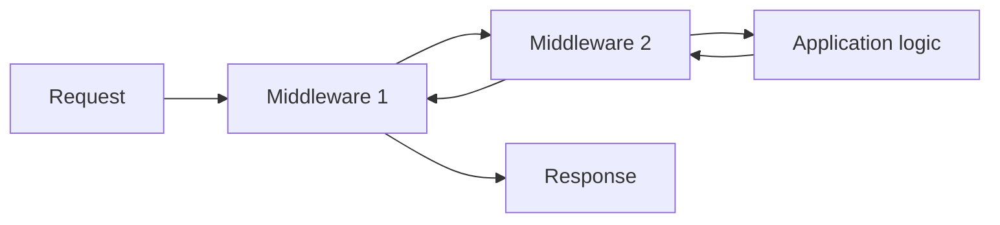

# Volume IX — Building Applications

## Chapter 14 — Middleware and the Request Pipeline

**Evidence:** `documentation/framework/middleware.md`, `spp/core/class.middlewarekernel.php`, `spp/core/class.pipeline.php`, middleware implementations, route/middleware attributes.

If you are new to SPP, middleware is easiest to understand as a set of **layers around request processing**.

A middleware can inspect a request before the application runs, stop the request, or inspect/change the result after the application runs.

---

## 14.1 The simplest mental model

Imagine a visitor entering an office building:

1. security checks the visitor;
2. reception checks the appointment;
3. the visitor reaches the office;
4. on the way out, the system records the visit.

SPP middleware follows the same broad idea.



The same layers surround the application on the way back out.

---

## 14.2 The middleware contract

Every normal SPP middleware implements:

```php
namespace SPP\Core;

interface MiddlewareInterface
{
    public function handle($request, \Closure $next);
}
```

There are only two things to understand initially:

- `$request` is the value being passed through the pipeline;
- `$next` represents the rest of the pipeline.

A middleware that wants processing to continue calls:

```php
return $next($request);
```

A middleware can also return a response immediately. That is the mechanism used for short-circuit behavior such as rejecting unauthorized or rate-limited requests.

---

## 14.3 A very small middleware

```php
<?php

namespace App\Myapp\Middleware;

class RequestMarker implements \SPP\Core\MiddlewareInterface
{
    public function handle($request, \Closure $next)
    {
        // Before the application.
        $request['myapp_checked'] = true;

        $response = $next($request);

        // After the application.
        return $response;
    }
}
```

The important idea is the position of `$next()`.

Everything before `$next()` is **inbound processing**.

Everything after `$next()` is **outbound processing**.

---

## 14.4 Short-circuiting a request

A middleware can decide that the request must not continue.

For example:

```php
public function handle($request, \Closure $next)
{
    if (! $this->isAllowed($request)) {
        http_response_code(403);
        return 'Forbidden';
    }

    return $next($request);
}
```

The next middleware and the application destination never run.

This is why middleware is a better home for broad request-level access rules than repeating the same check in every controller.

---

## 14.5 How the Pipeline works

SPP's `Pipeline` builds the middleware chain by reducing the middleware list in reverse order.

Conceptually:

```text
Destination
   ↑
Middleware C
   ↑
Middleware B
   ↑
Middleware A
   ↑
Request
```

The implementation supports three kinds of pipeline entries:

| Entry | Resolution |
|---|---|
| String class name | Resolved through `Registry::make()` |
| Middleware object | Calls `handle()` |
| Callable | Invoked directly with passable value and next stack |

This is important because SPP middleware is not limited to classes that implement one interface.

---

## 14.6 The Middleware Kernel

`MiddlewareKernel` is the application-facing coordinator for the global middleware stack.

Its boot process combines middleware from three main sources.

| Priority | Source |
|---|---|
| 1 | Hardcoded/Registry entries |
| 2 | Framework `spp/etc/middleware.yml` |
| 3 | Active application's `middleware.yml` |

The framework documentation gives this example:

```yaml
global:
  - SPP\Core\Middleware\CSRFMiddleware
  - SPPMod\SPPLogger\RequestLogger
```

An application can add its own global middleware:

```yaml
global:
  - App\Myapp\Middleware\TenantResolver
```

---

## 14.7 Programmatic registration

Global middleware can also be added programmatically:

```php
\SPP\Core\MiddlewareKernel::addGlobalMiddleware(
    \App\Myapp\Middleware\TenantResolver::class
);
```

That is useful when middleware registration depends on runtime configuration rather than static YAML alone.

---

## 14.8 Starting the middleware pipeline

The framework documentation shows the kernel wrapping the request destination:

```php
\SPP\Core\MiddlewareKernel::run(function ($request) {
    // Routing and request dispatch.
});
```

The kernel:

1. boots the middleware stack;
2. fires `event_spp_kernel_boot`;
3. sends the request through the pipeline; and
4. invokes the destination.

This makes `MiddlewareKernel` a request-processing boundary, not a replacement for routing or rendering.

---

## 14.9 Global middleware versus route middleware

SPP supports both global and route-scoped middleware.

### Global middleware

Runs for every request that enters the relevant kernel pipeline.

### Route middleware

Runs only when the selected route/controller carries the middleware declaration.

SPP uses PHP attributes for route-scoped middleware.

Example:

```php
use SPPMod\SPPView\Attributes\Middleware;
use SPPMod\SPPView\Attributes\Route;

#[Middleware(AuthMiddleware::class)]
class AdminController
{
    #[Route('/admin/settings')]
    #[Middleware(CsrfMiddleware::class)]
    public function settings()
    {
        // ...
    }
}
```

There is also route-level declaration through the `middleware` argument of `#[Route]`.

---

## 14.10 Middleware merging

For a route/controller, SPP combines middleware declared at different levels.

The framework guide describes the merge sources as:

```text
class-level Middleware
        +
method-level Middleware
        +
Route middleware parameter
```

The precise execution ordering should be read from the current route/middleware implementation when building security-sensitive stacks.

---

## 14.11 Middleware already supplied by SPP

The repository includes several concrete middleware implementations.

| Middleware | Role |
|---|---|
| `ApiAuthMiddleware` | API authentication path |
| `CSRFMiddleware` | CSRF validation |
| `RequestLogger` | Request logging |
| `RateLimiterMiddleware` | Rate limiting |
| `ThrottleMiddleware` | Throttling |
| `SecurityHeadersMiddleware` | Response security headers |

The exact configuration and scope belong to each implementation.

---

## 14.12 A beginner's security rule

Do not ask a controller to reinvent security for every request.

Prefer:

```text
HTTP request
   ↓
Middleware
   ↓
Authentication / security checks
   ↓
Route/controller/component
```

That gives your security controls a consistent entry point.

However, middleware is not a universal authorization substitute. Business authorization may still belong in application/domain services or other policy mechanisms.

---

## 14.13 Middleware and events are different

This distinction matters in SPP.

**Middleware** wraps request processing.

**Events** dispatch lifecycle/business/framework hooks.

| Question | Middleware | Event system |
|---|---|---|
| Does this code wrap the request? | Yes | Not necessarily |
| Can it stop request processing? | Yes | Event propagation can stop listener execution |
| Does it naturally model before/after request behavior? | Yes | Only when implemented as event stages |
| Is it selected by route/context middleware rules? | Yes | No |
| Is it a request pipeline layer? | Yes | No |

Keeping those concepts separate prevents architecture from becoming a collection of interchangeable hooks.

---

## 14.14 Debugging middleware

When a request suddenly stops working, inspect the pipeline in this order:

1. Did the global middleware kernel run?
2. Which global middleware was loaded?
3. Did one of them return early?
4. Did route-level middleware add another check?
5. Did the destination run at all?
6. Did an outbound middleware modify the response afterward?

A useful temporary technique is to add logging before and after `$next()` in one middleware layer.

---

## 14.15 Enterprise architecture

Middleware is especially valuable for cross-cutting concerns that affect many endpoints:

- authentication;
- CSRF protection;
- rate limiting;
- request tracing;
- tenant resolution;
- security headers;
- audit context; and
- API policy enforcement.

The goal is not to put business workflows into middleware. Keep middleware focused on the request boundary.

---

## Kernel Hacker note

The key implementation detail is that `Pipeline` composes nested closures from the middleware list. This gives the familiar onion behavior without requiring a special runtime object for every layer.

The `MiddlewareKernel` then becomes a configuration/assembly layer: it determines **which** middleware belongs in the request stack, while `Pipeline` determines **how** those middleware execute.

That separation is worth remembering when debugging or extending SPP:

```text
MiddlewareKernel
     │
     └── assembles stack
              │
              ▼
           Pipeline
              │
              └── executes stack
```

### Source map

- `spp/core/class.middlewarekernel.php`
- `spp/core/class.pipeline.php`
- `documentation/framework/middleware.md`
- `docs/tut/15_middleware.md`
