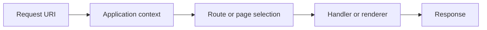
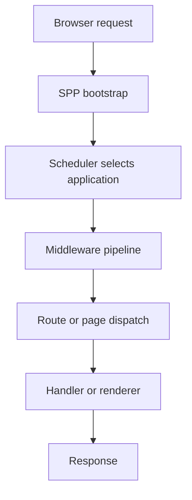
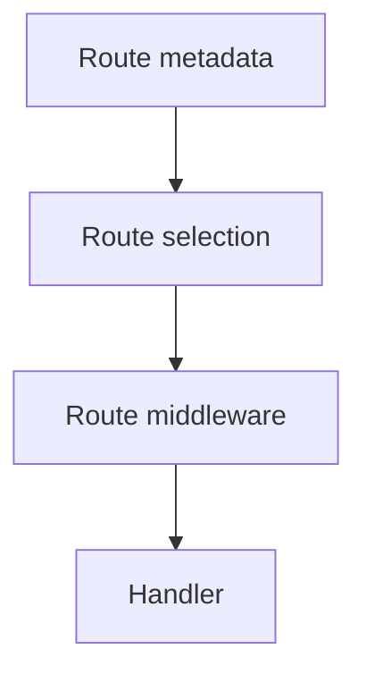
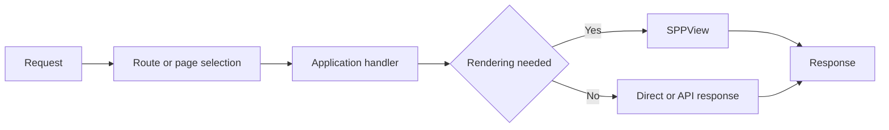
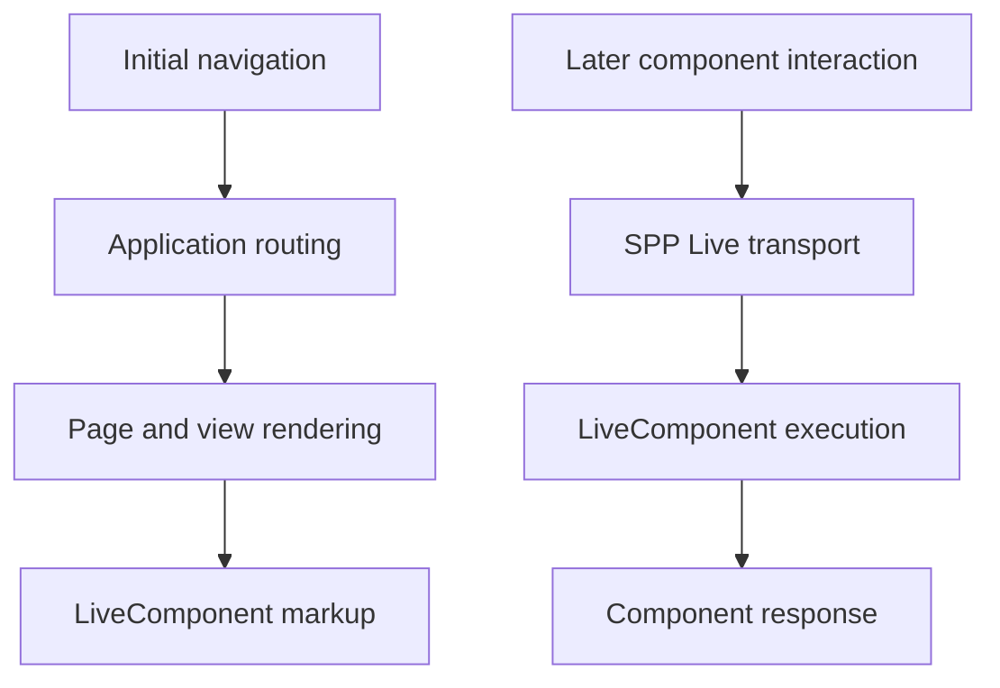

# Volume IX — Building Applications

## Chapter 15 — Routing and Request Dispatch

**Evidence:** `documentation/framework/booting-and-app-loading.md`, `documentation/framework/application-development.md`, `documentation/framework/middleware.md`, and the routing/rendering classes and route attributes present in the SPP source tree.

Routing answers a simple question:

> **A request has reached the correct SPP application. What code should handle it?**

For a beginner, it helps to separate three decisions that often get mixed together:

1. **Application selection** — which SPP application owns this URL?
2. **Route selection** — which endpoint/page/controller owns this request?
3. **Execution** — which method/service/renderer actually runs?

SPP has infrastructure for all three, but they are not the same subsystem.

---

## 15.1 Application selection is not routing

Suppose the browser requests:

```text
/myapp/admin/users
```

The Scheduler may first decide:

```text
Application context = myapp
```

Only after the application context is established does route/request dispatch determine which part of `myapp` handles `/admin/users`.

This distinction is central to SPP's multi-application architecture.



---

## 15.2 Where routing sits in the request lifecycle

The request lifecycle can be understood as a sequence of runtime stages:



The middleware documentation explicitly describes the destination of the middleware pipeline as the application routing/dispatch layer.

That means middleware and routing are related but not interchangeable:

- middleware prepares/protects the request;
- routing decides where the request goes.

---

## 15.3 A route is a mapping

Conceptually, a route maps an HTTP request to executable application behavior.

For example:

```text
GET /admin/users
        ↓
Users controller
        ↓
index()
```

The exact SPP route declaration can vary with the routing/rendering subsystem in use, so this handbook does not assume that every SPP application uses one universal route-file format.

That is deliberate. The repository supports multiple application and rendering conventions.

---

## 15.4 Attribute-based routes

SPP's middleware documentation shows route declarations using PHP attributes such as `#[Route(...)]` from the SPP View subsystem.

A simple conceptual example is:

```php
use SPPMod\SPPView\Attributes\Route;

class UsersController
{
    #[Route('/admin/users')]
    public function index()
    {
        // ...
    }
}
```

The attribute tells the routing layer that the method participates in route discovery.

Do not confuse this with the Scheduler's application `base_url`.

| Mechanism | Example | Meaning |
|---|---|---|
| Application context | `/myapp` | Which application is active |
| Route | `/admin/users` | Which endpoint handles the request |

A route normally exists **inside** an application context.

---

## 15.5 Route-level middleware

The same route attribute model can carry middleware declarations.

For example, the framework middleware guide documents:

```php
#[Route('/api/data', middleware: [RateLimiterMiddleware::class])]
public function getData()
{
    // ...
}
```

This is a useful example of SPP's subsystems composing:



The actual ordering is determined by the route/middleware implementation and should be checked there when building security-sensitive stacks.

---

## 15.6 Controller classes are optional architecture, not a rule of nature

New developers often assume:

> Every URL must map to a controller class.

SPP is broader than that.

Depending on the application and enabled modules, request dispatch can involve:

- controller methods;
- page definitions;
- service methods;
- API handlers;
- view/rendering pages; or
- LiveComponent paths.

The architecture therefore describes **request-facing behavior**, not one compulsory controller pattern.

---

## 15.7 Calling a handler through the application container

The application-development guide shows that application code can use the app container's `call()` helper to invoke a method with class-typed dependencies resolved by the container.

Example:

```php
$app = \SPP\App::getApp();

$result = $app->call([
    \App\Myapp\Serv\HomeController::class,
    'index',
]);
```

This is useful because route dispatch can remain focused on **which handler should run**, while the application container handles **how its dependencies are supplied**.

---

## 15.8 What happens when no route matches?

The exact fallback/error path is application and router dependent.

The important debugging distinction is:

```text
Correct application + wrong route
```

is different from:

```text
Wrong application context
```

For the first case, inspect route/page discovery.

For the second case, inspect `Scheduler::detectAndEnforceContext()` and the application's `base_url` configuration.

This distinction saves a lot of debugging time in multi-app SPP deployments.

---

## 15.9 Routing and SPPView

The SPPView subsystem contains dedicated view-location and routing/page classes as well as rendering infrastructure.

That does not mean "routing equals view rendering."

A useful mental model is:



A route may eventually lead to a rendered view, but API handlers and other direct-response paths are also possible.

---

## 15.10 Routing and LiveComponent

A LiveComponent is not simply another static page template.

There are two common situations:

### Initial page request

The application may render a normal page containing a LiveComponent.

### Later component interaction

The browser sends a live action through an SPP Live engine, and the LiveComponent runtime reconstructs and executes the component.

Therefore:



The route that produced the original page and the transport request that updates the component are related, but they are not necessarily the same dispatch path.

---

## 15.11 API requests

SPP's middleware documentation identifies `SPPAPI` and `AutoApiRouter` as possible destinations in the request pipeline.

This illustrates another important point:

> **The request pipeline can dispatch to different application subsystems after middleware has completed.**

A practical application can therefore have both:

```text
HTML/browser routes

and

API routes
```

without requiring a completely separate framework runtime.

---

## 15.12 Route design for enterprise applications

For large applications, keep route declarations close to the feature that owns them, while keeping application-level context in the application's configuration.

A useful ownership model is:

| Concern | Owner |
|---|---|
| Application URL prefix | App configuration |
| Feature route | Module/application feature |
| Authentication | Middleware/auth subsystem |
| Business authorization | Application/domain policy |
| Business logic | Services/domain layer |
| Rendering | SPPView or LiveComponent |
| Client reactivity | SPPUX |

This prevents the route table from becoming a giant place where all application logic is embedded.

---

## 15.13 Debugging route problems

When a URL fails, inspect it in this order:

### Step 1 — Confirm the application context

```php
\SPP\Scheduler::getContext();
```

Is the expected application active?

### Step 2 — Confirm middleware

Could a global or route-level middleware be stopping the request?

### Step 3 — Confirm route discovery

Does the selected application actually expose the route?

### Step 4 — Confirm handler resolution

Does the controller/service/page exist and can the application container resolve it?

### Step 5 — Confirm rendering

If the handler runs but the page is wrong, move your investigation into SPPView rather than continuing to debug routing.

This layered debugging method follows SPP's actual architecture.

---

## 15.14 Coming from other frameworks

### Laravel

Think of:

```text
routes → controller → middleware → Blade
```

but add SPP's separate **application-context selection** before route handling.

### Symfony

Think of Symfony's routing/controller model, but remember that SPP applications can share one runtime and Scheduler context.

### Django

Think of URL dispatch → view, but separate application-context selection from endpoint routing.

### React/Vue

Do not map client-side component routing directly onto SPP server routing. SPPUX is a client runtime; server routing remains a PHP/application concern.

---

## Kernel Hacker note

The key architectural distinction is that the SPP request path has **multiple selectors**:

1. Scheduler selects the application context.
2. Middleware determines whether request processing may continue.
3. Route/page/API infrastructure selects the request destination.
4. The selected destination invokes services, rendering, or another runtime subsystem.

When documentation collapses these into one generic "router," it becomes much harder to reason about SPP's multi-application runtime.

### Source map

- `spp/core/class.scheduler.php`
- `spp/core/class.middlewarekernel.php`
- `spp/core/class.pipeline.php`
- `documentation/framework/booting-and-app-loading.md`
- `documentation/framework/application-development.md`
- `documentation/framework/middleware.md`
- SPPView route and view-router classes/attributes in `spp/modules/spp/sppview/`
