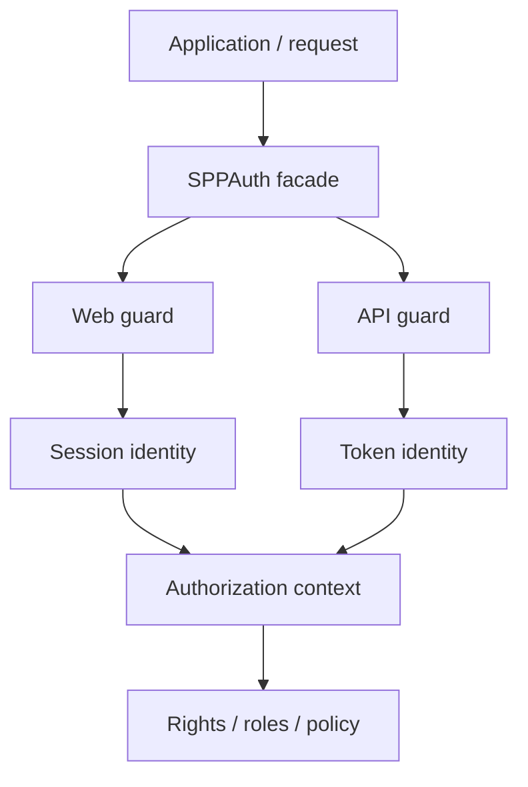
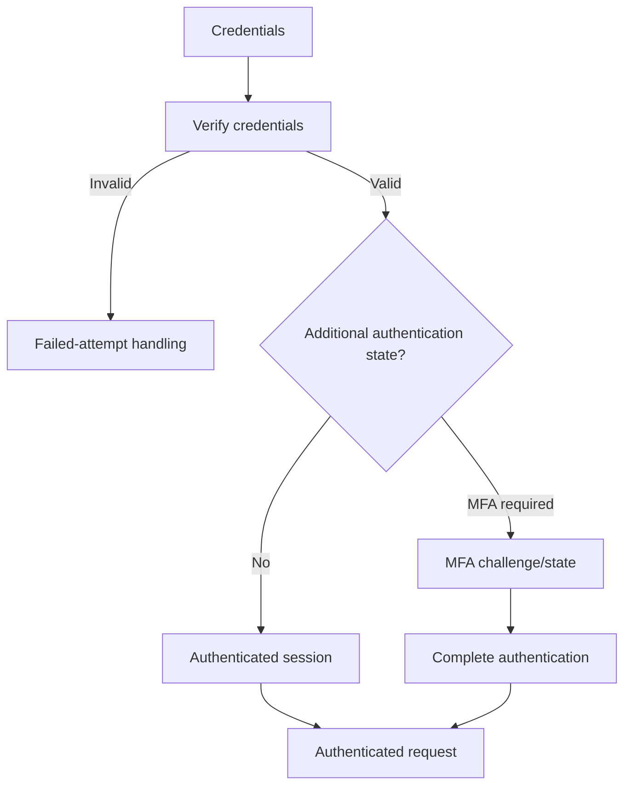
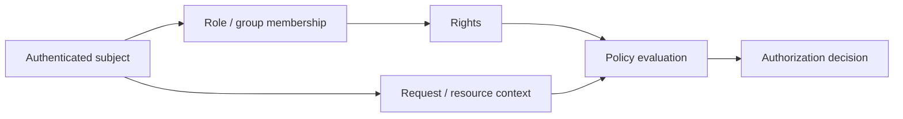
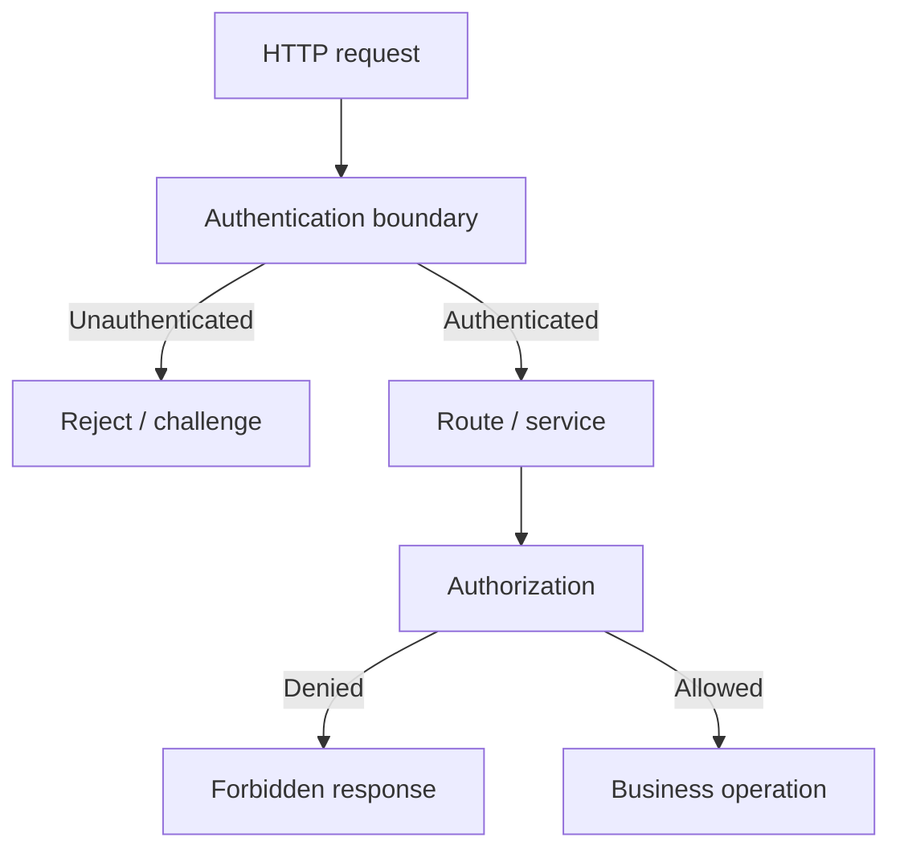

# Volume XI — Identity and Access

## Chapter 17 — Authentication and Authorization in SPP

**Evidence:** current SPPAuth source, guards, rights/roles, policy registry, security configuration, and related tests/documentation. Treat advertised capabilities as feature-specific claims requiring source/test verification.

This chapter starts from a simple distinction:

> **Authentication answers “Who are you?” Authorization answers “What are you allowed to do?”**

They are related, but they are not the same problem.

---

## 17.1 Why frameworks provide authentication infrastructure

In plain PHP, an application could inspect `$_SESSION`, read a cookie, compare a password, and decide whether a page should be shown. That becomes dangerous when every page implements its own version.

A framework can centralize:

- identity;
- session handling;
- authentication guards;
- permission checks;
- role management;
- policy/context evaluation;
- audit integration; and
- request middleware.

SPP's `sppauth` subsystem provides native authentication and authorization facilities. It should be understood as a platform security subsystem rather than as one login helper.

---

## 17.2 The SPPAuth mental model

SPPAuth exposes an authentication facade and named guards.



The facade is the application-facing entry point; the guard determines how identity is obtained and checked.

---

## 17.3 Authentication is more than credential verification

The implemented web path includes credential verification and can integrate rate limiting, audit logging, MFA state, and session authentication. A successful password check should therefore not be treated as the entire authentication decision.

Conceptually:



Use the guard/facade rather than reproducing these checks manually.

---

## 17.4 WebGuard

`WebGuard` is session-oriented and reconstructs the authenticated user from SPP session state. The current implementation also performs additional security checks around MFA state, request fingerprinting, session/device revocation, and activity tracking.

This leads to a useful rule:

> **Authentication state is a runtime decision, not merely the presence of one session variable.**

---

## 17.5 Remember-me authentication

The web guard contains a remember-me path that can use a browser token together with a server-side record in the `remember_tokens` table.

The important security principle is that the cookie is not itself the authoritative user record. The server-side token record participates in the trust decision.

---

## 17.6 API identity is a separate path

The API guard uses token-based identity rather than the browser session model.

| Context | Guard | Typical identity mechanism |
|---|---|---|
| Browser/web | `web` | SPP session/user identity |
| API | `api` | Token-based identity |

Do not assume that a browser session and an API bearer token have identical lifecycle, revocation, or authorization semantics without tracing the relevant implementation.

---

## 17.7 Authorization: rights, roles, and policy

After identity is established, authorization determines whether the subject may perform an operation.

SPP exposes rights and role mechanisms through the authentication subsystem. A right can represent a capability such as:

```text
students.read
students.edit
reports.export
admin.users.manage
```

Roles group rights. Policy/context evaluation can add conditions beyond a simple capability check.



The exact right names and business rules remain application/module-specific.

---

## 17.8 Permission persistence is part of the architecture

Permission data is not just presentation metadata. Current administrative paths use persisted permission/scope information, including SPPXDB-backed records in the inspected source path.

This matters when debugging authorization: investigate the identity, scope/context, stored permission data, cache state, and policy evaluation—not only the UI.

Some current development-oriented code paths have fallback behavior when an expected permission record is absent. **Do not document such fallback as a production authorization guarantee.** Production authorization should use explicit, configured policy and permission data.

---

## 17.9 Permission caching

The web authorization path can cache resolved permissions in session data and compare cache state with permission-update information before reusing it.

Therefore stale authorization can be a cache invalidation problem as well as a data problem.

A safe diagnostic sequence is:

1. establish the authenticated identity;
2. inspect the expected rights/roles/scopes;
3. inspect policy/context inputs;
4. inspect permission-cache state;
5. verify the protected operation performs a server-side check.

---

## 17.10 Authentication and middleware

Authentication and middleware have complementary responsibilities.



Authentication establishes identity. Authorization decides whether that identity can perform the requested operation. Middleware can enforce the boundary before the business layer is reached.

---

## 17.11 MFA and intermediate authentication state

The authentication subsystem contains explicit MFA state handling. Credentials can therefore be accepted while the request remains in an intermediate authentication state.

Application code should use the guard's authentication decision instead of assuming that successful credential verification alone means the user is fully authenticated.

---

## 17.12 Session fingerprinting and revocation

The web guard implements additional session checks, including a request fingerprint derived from IP/user-agent information and database-backed session/device state.

These mechanisms have operational trade-offs. Network changes or privacy tooling can make a fingerprint less stable, so deployments should test the actual behavior with their traffic patterns.

The broader architecture is:

```text
Browser
  ↓
WebGuard
  ↓
SPP session
  ↓
Persistent session/device record
```

The exact table/schema names are implementation details and should be verified against the current source before being copied into operational procedures.

---

## 17.13 Logout

Use the guard/facade that owns authentication state rather than manually deleting one session value. Logout may involve more than one piece of authentication state.

This illustrates a general framework rule:

> **Use the subsystem that owns a piece of state to change that state.**

---

## 17.14 Security mistakes beginners make

### Mistake 1 — Checking a session variable directly

This can bypass guard-level checks.

### Mistake 2 — Treating authentication as authorization

Being authenticated does not grant every capability.

### Mistake 3 — Trusting client-provided permissions

Authorization must be decided server-side.

### Mistake 4 — Treating a role name as the final decision

Roles organize rights; the protected operation still needs an authorization decision.

### Mistake 5 — Putting authorization only in the UI

Hiding a button is not authorization.

### Mistake 6 — Conflating API authentication with web authentication

Token and session paths can have different lifecycle and trust semantics.

---

## 17.15 Coming from other frameworks

### Laravel

The guard concept is familiar, while SPP's rights/role/entity mechanisms define its concrete authorization model.

### Symfony

The separation between authenticators, voters/policies, and request security is conceptually similar, but the APIs are framework-specific.

### Spring Security

The authentication/authorization separation maps naturally, but SPP integrates the concrete mechanisms with its own guards, Registry, data, middleware, and modules.

### Django

Session authentication and permission concepts map naturally, but SPP's facade/guard model is different.

---

## 17.16 Enterprise security architecture

Keep these concerns explicit:

| Concern | SPP layer |
|---|---|
| Credential verification | SPPAuth / user subsystem |
| Session identity | WebGuard / SPP session |
| API identity | TokenGuard / API authentication path |
| Permission definitions | Rights subsystem |
| Role grouping | Role subsystem |
| Request rejection | Middleware / request boundary |
| Business authorization | Application/domain policy |
| Permission persistence | Configured data/XDB paths where applicable |
| Audit | Audit/security logging subsystem |

SPP provides mechanisms; the application still defines what its business operations mean and which identities may perform them.

---

## 17.17 Evidence boundary

The repository's documentation may describe SPPAuth using broad terms such as zero-trust identity, MFA, passwordless authentication, ABAC, OAuth, or SCIM. Those should be treated as **feature-specific implementation claims**, not as evidence that every deployment automatically provides a complete zero-trust or compliance posture.

For high-impact security decisions, verify the exact source path, configuration, tests, threat model, and deployment topology.

Likewise, the presence of an authorization fallback in development-oriented code is not evidence that production should operate without an explicit permission record.

---

## Kernel Hacker note

The current security architecture is best understood as:

**facade → guard → identity → rights/roles/policy → protected operation**, with middleware providing request-boundary enforcement and persistence supporting session/permission state.

When diagnosing a security issue, trace the complete path rather than searching only for `SPPAuth::check()`.

### Source map

- `spp/modules/spp/sppauth/class.sppauth.php`
- `spp/modules/spp/sppauth/class.webguard.php`
- `spp/modules/spp/sppauth/class.tokenguard.php`
- `spp/modules/spp/sppauth/class.sppright.php`
- `spp/modules/spp/sppauth/class.spprole.php`
- `spp/modules/spp/sppauth/class.policyregistry.php`
- relevant SPPAPI authentication and middleware paths
- relevant SPPXDB permission persistence paths
