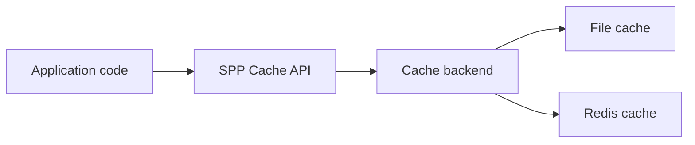
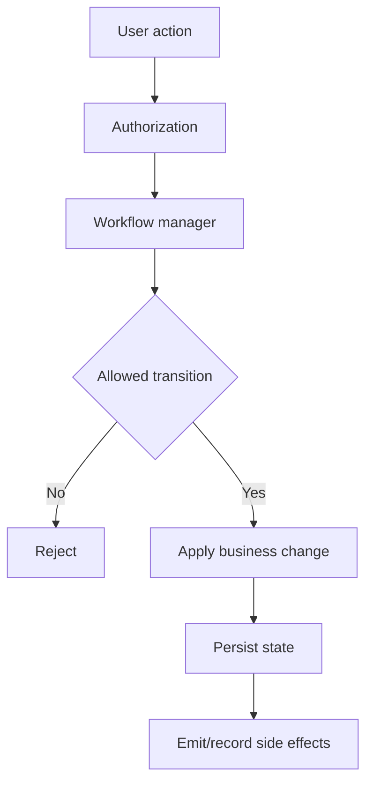
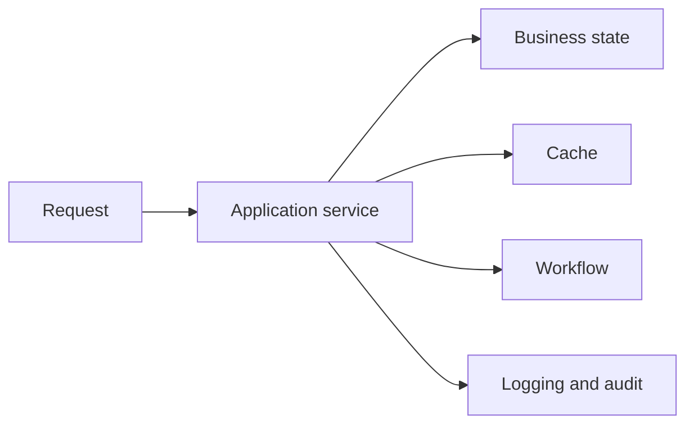

# Volume XII — Application Operations

## Chapter 18 — Cache, Logging, Workflow, and Cross-Cutting Operations

**Evidence:** `spp/modules/spp/sppcache/`, `spp/modules/spp/sppworkflow/`, `spp/core/` logging/debug facilities, related commands, and repository documentation.

A production application does more than answer HTTP requests. It also needs to remember useful temporary results, record what happened, run business processes through states, and provide enough diagnostic information to understand failures.

SPP contains separate subsystems for these concerns. They should be learned as separate tools rather than as one giant “framework utility” layer.

---

## 18.1 Cache: what problem does it solve?

A cache stores a result that is expensive to calculate so that it can be reused later.

For example, suppose a dashboard performs an expensive query:

```text
Database query: 800 ms

Same query from cache: much faster
```

The cache is not the source of truth. The database or service that produced the original result remains authoritative.

This distinction is fundamental:

> **Cache is an optimization, not permanent business state.**

---

## 18.2 SPP's cache model

The repository contains cache interfaces and concrete implementations such as file and Redis-backed cache facilities, along with the `SPPCacheManager` module.

A useful conceptual structure is:



The application should normally use the framework cache abstraction rather than embedding a backend-specific client in business code.

---

## 18.3 Cache lifetime

A cached item normally has at least three important properties:

| Property | Meaning |
|---|---|
| Key | How the cached item is identified |
| Value | The stored result |
| Lifetime | How long the value may be reused |

SPP code also uses cache tags in places such as XDB query caching. A tag groups related entries so they can be invalidated together.

That is more powerful than deleting a single key one at a time.

---

## 18.4 Why cache invalidation matters

Imagine:

```text
User changes profile
        ↓
Database contains new profile
        ↓
Old profile still exists in cache
```

The application could now show stale information.

That is why mutation paths must either invalidate affected entries or use an expiry policy that is acceptable for the domain.

For XDB, the database facade associates read-query cache entries with table tags and invalidates the tag after mutations. That is a concrete example of framework subsystems composing.

---

## 18.5 Logging: what it is for

Logging records events that are useful after the application has been deployed.

A beginner often uses `echo` for debugging:

```php
echo 'Reached here';
```

That is acceptable while experimenting, but it is poor production observability because it changes the response and disappears with the request.

Logging instead records information into a diagnostic channel.

The SPP source and modules include request/debug logging facilities, audit logging, and framework log paths.

---

## 18.6 Log levels and useful information

Good application logs answer:

- what happened;
- when it happened;
- which request or operation it belongs to;
- whether it succeeded or failed; and
- enough context to diagnose the problem.

Avoid logging secrets such as raw passwords, bearer tokens, or session cookies.

The exact log implementation should be documented from the active SPP logging classes/configuration rather than assuming one universal PSR logger configuration.

---

## 18.7 Workflow: a different kind of state machine

A workflow describes a business process that can move through named states.

For example:

```text
Draft → Submitted → Approved → Published
```

That is different from a simple database status string because a workflow can define:

- allowed transitions;
- who may perform them;
- side effects;
- events; and
- failure conditions.

The repository contains the `sppworkflow` module and `SPPWorkflowManager` source, so workflow is a first-class SPP subsystem.

---

## 18.8 Workflow and ordinary application code

A clean design keeps the workflow definition separate from the service that performs the underlying business operation.



The exact transition model and configuration are implementation-specific and should be traced from the current workflow source before documenting detailed syntax.

---

## 18.9 Cache, logging, and workflow are different concerns

These three features often appear together in production architecture, but they solve different problems.

| Subsystem | Primary question |
|---|---|
| Cache | “Can I avoid doing this expensive work again?” |
| Logging | “What happened, and how do I diagnose it?” |
| Workflow | “What business state transition is allowed next?” |

Keeping them separate makes application architecture easier to maintain.

---

## 18.10 Common beginner mistakes

### Treating the cache as the database

A cache can disappear or become invalid. Business truth should live in the authoritative storage layer.

### Logging everything

Excessive logs create cost and make important failures harder to find.

### Putting business rules into logging hooks

Logging should normally observe behavior, not become the place where the business transaction is implemented.

### Using a database status column as an undocumented workflow

When states and transitions become important, model the process deliberately rather than letting arbitrary code write status values.

---

## 18.11 Enterprise operation model

A production SPP application often looks conceptually like this:



The diagram is intentionally simple. It shows that these are cross-cutting supporting systems, not a single combined subsystem.

---

## Kernel Hacker note

The advanced question is not “Does SPP have caching?” but “Where does the cache boundary sit?”

The XDB implementation is a good example: query caching lives in the XDB facade rather than the storage engine alone, allowing the facade to construct cache keys, tag entries by table, and invalidate related entries after mutations.

Workflow has a different boundary: the manager governs business transitions rather than simply storing values.

### Source map

- `spp/modules/spp/sppcache/`
- `spp/modules/spp/sppworkflow/`
- `spp/core/` logging/debug infrastructure
- `spp/modules/spp/sppxdb/class.sppxdb.php`
- related SPP CLI and framework documentation
